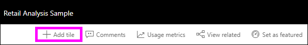

# Intro to dashboard tiles for Power BI designers

A tile is a snapshot of your data, pinned to the dashboard. A tile can be created from a report, dataset, dashboard, the Q&A box, Excel, SQL Server Reporting Services (SSRS) reports, and more.  This screenshot shows many different tiles pinned to a dashboard.

Dashboards and dashboard tiles are a feature of Power BI service, not Power BI Desktop. You can't create dashboards on mobile devices but you can [view and share](mobile-apps-view-dashboard.md) them there.

Besides pinning, you can create standalone tiles directly on the dashboard using [Add tile](service-dashboard-add-widget.md). Standalone tiles include: text boxes, images, videos, streaming data, and web content.

Need help understanding the building blocks that make up Power BI?  See [Power BI - Basic Concepts](service-basic-concepts.md).

> [!NOTE]
> If the original visualization used to create the tile changes, the tile doesn't change.  For example, if you pinned a line chart from a report and then you changed the line chart to a bar chart, the dashboard tile continues to show a line chart. The data refreshes, but the visualization type does not.
> 
> 

## Pin a tile from...
There are many different ways to add (pin) a tile to a dashboard. Tiles can be pinned from:

* [Power BI Q&A](service-dashboard-pin-tile-from-q-and-a.md)
* [a report](service-dashboard-pin-tile-from-report.md)
* [another dashboard](service-pin-tile-to-another-dashboard.md)
* [Excel workbook on OneDrive for Business](service-dashboard-pin-tile-from-excel.md)
* [Power BI Publisher for Excel](publisher-for-excel.md)
* [Quick Insights](service-insights.md)
* [Reporting Services](https://docs.microsoft.com/sql/reporting-services/pin-reporting-services-items-to-power-bi-dashboards)

And standalone tiles for images, text boxes, videos, streaming data, and web content can be created directly on the dashboard using [Add tile](service-dashboard-add-widget.md).

  

## Interacting with tiles on a dashboard
### Move and resize a tile
Grab a tile and [move it around on the dashboard](service-dashboard-edit-tile.md). Hover and select the handle  to resize the tile.

### Hover over a tile to change the appearance and behavior
1. Hover over the tile to display the ellipses.
   
    
2. Select the ellipses to open the tile action menu.
   
    
   
    From here you can:
   
   * [Open the report that was used to create this tile ](service-reports.md)   
   
   * [Open the worksheet that was used to create this tile ](service-reports.md)   
     
    * [View in focus mode ](service-focus-mode.md)   
     * [Export the data used in the tile](visuals/power-bi-visualization-export-data.md) 
     * [Edit title and subtitle, add a hyperlink](service-dashboard-edit-tile.md) 
     * [Run insights ](service-insights.md) 
     * [Pin the tile to another dashboard ](service-pin-tile-to-another-dashboard.md)
       
     * [Remove the tile](service-dashboard-edit-tile.md)
     
3. To close the action menu, select a blank area in the canvas.

### Select (click) a tile
When you select a tile, what happens next depends on how you created the tile. Also, if it has a [custom link](service-dashboard-edit-tile.md), selecting the tile takes you to that link. Otherwise, selecting the tile takes you to the report, Excel Online workbook, on-premises Reporting Services report, or Q&A question that was used to create the tile.

> [!NOTE]
> The exception to this is video tiles created directly on the dashbaord using **Add tile**. Selecting a video tile (that was created this way) causes the video to play right there on the dashboard.   
> 
> 

## Considerations and troubleshooting

* If the report that was used to create the visualization was not saved, then selecting the tile produces no action.
* If the tile was created from a workbook in Excel Online, you need at least Read permissions for that workbook. Otherwise, selecting the tile won't open the workbook in Excel Online.
* Say you create a tile directly on the dashboard using **Add tile** and set a custom hyperlink for it. If so, when you select the title, subtitle, or tile opens that URL. Otherwise, by default, when you select a tiles created directly on the dashboard for an image, web code, or text box, nothing happens.
* If you don't have permission to the report within Reporting Services, selecting a tile created from a Reporting Services report takes you to a page indicating you don't have access (rsAccessDenied).
* If you don't have access to the network where the Reporting Services server is located, selecting a tile created from Reporting Services takes you to a page that indicates it can't locate the server (HTTP 404). Your device needs network access to the report server to view the report.
* If the original visualization used to create the tile changes, the tile doesn't change.  For example, if you pin a line chart from a report and then you change the line chart to a bar chart, the dashboard tile continues to show a line chart. The data refreshes, but the visualization type does not.

## Next steps
[Create a Card (big number tile) for your dashboard](power-bi-visualization-card.md)

[Dashboards in Power BI](service-dashboards.md)  

[Data refresh](refresh-data.md)

[Power BI - Basic Concepts](service-basic-concepts.md)

[Export a tile to Power Point](http://blogs.msdn.com/b/powerbidev/archive/2015/09/28/integrating-power-bi-tiles-into-office-documents.aspx)

[Pin Reporting Services items to Power BI Dashboards](https://msdn.microsoft.com/library/mt604784.aspx)

More questions? [Try the Power BI Community](http://community.powerbi.com/)

