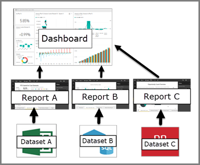

# Intro to dashboards for Power BI designers

A Power BI ***dashboard*** is a single page, often called a canvas, that tells a story through visualizations. Because it is limited to one page, a well-designed dashboard contains only the highlights of that story. Readers can view related reports for the details.

Dashboards are a feature of the Power BI service. They're not available in Power BI Desktop. You can't create dashboards on mobile devices but you can [view and share](mobile-apps-view-dashboard.md) them there.

## Dashboard basics 

The visualizations you see on the dashboard are called *tiles*. You *pin* tiles to a dashboard from reports. If you're new to Power BI, you can get a good foundation by reading [Power BI basic concepts](service-basic-concepts.md).

> [!IMPORTANT]
> You need a [Power BI Pro](service-free-vs-pro.md) license to create dashboards.

The visualizations on a dashboard come from reports and each report is based on a dataset. One way to think of a dashboard is as an entryway to the underlying reports and datasets. Selecting a visualization takes you to the report (and dataset) that it's based on.

## Advantages of dashboards
Dashboards are a wonderful way to monitor your business and see all of your most important metrics at a glance. The visualizations on a dashboard may come from one underlying dataset or many, and from one underlying report or many. A dashboard combines on-premises and cloud data, providing a consolidated view regardless of where the data lives.

A dashboard isn't just a pretty picture. It's highly interactive and the tiles update as the underlying data changes.

## Dashboards versus reports
[Reports](service-reports.md) and dashboards seem similar because they're both canvases filled with visualizations. But there are major differences.

| **Capability** | **Dashboards** | **Reports** |
| --- | --- | --- |
| Pages |One page |One or more pages |
| Data sources |One or more reports and one or more datasets per dashboard |A single dataset per report |
| Available in Power BI Desktop |No | Can build and view reports in Power BI Desktop |
| Subscribe |Can subscribe to a dashboard |Can subscribe to report pages |
| Filtering |Can't filter or slice |Many different ways to filter, highlight, and slice |
| Featured |Can set one dashboard as your "featured" dashboard |Can't create a featured report |
| Favorite | Can set dashboards as *favorites* | Can set reports as *favorites*
| Set alerts |Available for dashboard tiles in certain circumstances |Not available from reports |
| Natural language queries (Q&A) |Available in dashboards | Available in reports |
| Can see underlying dataset tables and fields |No. Can export data but can't see tables and fields in the dashboard itself. |Yes. Can see dataset tables and fields and values. |

## Next steps
* Get comfortable with dashboards by taking a tour of one of our [sample dashboards](sample-tutorial-connect-to-the-samples.md).
* Learn about [dashboard tiles](service-dashboard-tiles.md).
* Want to track an individual dashboard tile and receive an email when it reaches a certain threshold? [Create alerts on tiles](service-set-data-alerts.md).
* Learn how to use [Power BI Q&A](power-bi-tutorial-q-and-a.md) to ask a question about your data and get the answer in the form of a visualization.
