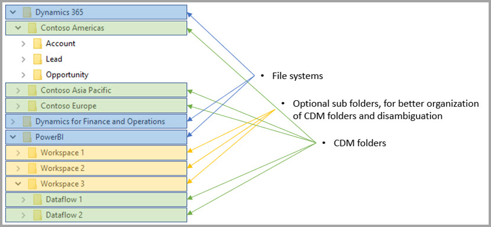

# Dataflows and Azure Data Lake integration (Preview)

By default, data used with Power BI is stored in internal storage provided by Power BI. With the integration of dataflows and Azure Data Lake Storage Gen2 (ADLS Gen2), you can store your dataflows in your organization's Azure Data Lake Storage Gen2 account. 

> [!NOTE]
> The dataflows functionality is in preview, and is subject to change and updates prior to general availability.

## How CDM folders relate to dataflows

With **dataflows**, users and organizations can unify data from disparate sources, and prepare it for modeling. With the Common Data Model (CDM), organizations can use a data format that provides semantic consistency across applications and deployments. And with Azure Data Lake Storage gen2 (ADLS Gen2), fine-grained access and authorization control can be applied to data lakes in Azure. When combined, these elements provide compelling centralized data, structured data, fine-grained access control, and semantic consistency for apps and initiaties across the enterprise.

Data stored in CDM format provides semantic consistency across applications and deployments in an organization. With CDM integration with ADLS Gen2, the same structural consistency and semantic meaning can be applied to data stored in (ADLS Gen2) by using CDM folders that contain schematized data in standard CDM format. The standardized metadata and self-describing data in an Azure Data Lake facilitate easy metadata discovery, and interoperation between data producers and consumers such as Power BI, Azure Data Factory, Azure Data Lake, Databricks and Azure Machine Learning (ML). 

Dataflows store their definition and data in CDM folders, in the following formats:

**Model.json**
* The **Model.json** metadata description file contains semantic information about entity records and attributes, and links to underlying data files. The existence of the model.json file indicates compliance with CDM metadata format, and may include standard entities which have additional rich out-of-box semantic metadata that applications can use.
* Power BI also stores each data source information along with the **query and transformations** generated by the Dataflow Editor experience in the Power BI service. Passwords to data sources are not stored in the model file.

**Data files**
* The data files are included in the CDM folder in well-defined structure and format (subfolders are optional, as described later in this article) and referenced in the model.json file. Currently, data files must be in .csv format, but additional formats may be supported in subsequent updates. 

The following diagram shows a sample CDM folder, created by a Power BI dataflow, that contains three entities:

The model.json or metadata file in the previous image would provide pointers to the entity data files throughout the CDM folder.

## Power BI organizes CDM folders in the data lake

With Power BI dataflows and its integration with ADLS Gen2, Power BI can produce data in a data lake. As a data producer, Power BI must create a CDM folder for each dataflow containing the model.json file and its associated data files. Power BI stores its data in isolation from other data producers in the data lake by using *file systems*. You can read more about Azure Data Lake Storage Gen2 file system and hierarchical namespace in [the article that describes them](https://docs.microsoft.com/azure/storage/data-lake-storage/namespace).

Power BI uses subfolders for disambiguation, and to provide improved organization of data when presented in the **Power BI service**. The folder naming and structure represent workspaces (Folders) and dataflows (CDM Folders). The following diagram shows how a data lake shared by Power BI and other data producers may be structured. Each service, in this case Dynamics 365, Dynamics for Finance and Operation, and Power BI, creates and maintains their own filesystem. Depending on the experience in each service, subfolders are created to better organize CDM folders within the file system. 

## Power BI protects data in the data lake

Power BI uses *Active Directory OAuth Bearer* tokens and *POSIX ACLs* functionality provided by Azure Data Lake Storage Gen2. These features enable scoping Power BI's access to the file system it manages in the data lake, and also scoping people's access only to dataflows or CDM folders that they create. 

To create and manage CDM folders within the Power BI file system, read, write and execute permissions to the file system is required. Each dataflow created in Power BI is stored in its own CDM folder, and the owner of the dataflow is granted read-only access to the CDM folder and its contents. This approach protects the integrity of the data Power BI generates, and provides administrators with the ability to monitor which users accessed the CDM folder using audit logs. 

### Authorizing users or services for CDM folders

Sharing CDM folders with data consumers, such as users or services that need to read the data, is simplified with Active Directory OAuth Bearer tokens and POSIX ACLs. Doing so provides administrators with the ability to monitor who accessed the CDM folder. The only action required is to grant access to an Active Directory object of your choice (such as a user group or service) to the CDM Folder. We recommend that all access to the CDM folder, for any identity other than the data producer, be granted as read-only. Doing so protects the integrity of the data that the producer generates.

To add CDM folders to Power BI, the user adding the CDM Folder should have *Read* Access ACLs on both CDM folder itself and any files or folders within it. In addition, *Execute* Access ACLs on both CDM folder itself and any folders within it. It is recommneded you review both [Access control lists on files and directory](https://docs.microsoft.com/en-us/azure/storage/blobs/data-lake-storage-access-control#access-control-lists-on-files-and-directories) and [Best practices for using Azure Data Lake Storage Gen2](https://docs.microsoft.com/azure/storage/blobs/data-lake-storage-best-practices) articles for more information.

### Alternative forms of authorization

People or services outside of Power BI can also leverage alternatives forms of authorization these alternatives permit holders of the key access to *all* resources in the account, full access to all resources in the lake, and cannot be scoped to file systems or CDM Folders. Those alternatives may be simple ways to grant access, but they limit the ability to share specific resources in the data lake, and do not provide users with auditing of who accessed the storage. Full details of available authorization schemes are provided in the [Access control in Azure Data Lake Storage Gen2 article](https://docs.microsoft.com/azure/storage/blobs/data-lake-storage-access-control
).

## Next Steps

This article provided an overview of the integration of Power BI dataflows, CDM folders, and Azure Data Lake Storage Gen2. For additional information, take a look at the following articles:

For more information about dataflows, CDM, and Azure Data Lake Storage Gen2, take a look at the following articles:

* [Configure workspace dataflow settings (Preview)](service-dataflows-configure-workspace-storage-settings.md)
* [Add a CDM folder to Power BI as a dataflow (Preview)](service-dataflows-add-cdm-folder.md)
* [Connect Azure Data Lake Storage Gen2 for dataflow storage (Preview)](service-dataflows-connect-azure-data-lake-storage-gen2.md)

For information about dataflows overall, check out these articles:

* [Create and use dataflows in Power BI](service-dataflows-create-use.md)
* [Using computed entities on Power BI Premium (Preview)](service-dataflows-computed-entities-premium.md)
* [Using dataflows with on-premises data sources (Preview)](service-dataflows-on-premises-gateways.md)
* [Developer resources for Power BI dataflows (Preview)](service-dataflows-developer-resources.md)

For more information about Azure storage, you can read these articles:
* [Azure Storage security guide](https://docs.microsoft.com/azure/storage/common/storage-security-guide)
* [Get started with github samples from Azure Data Services](https://aka.ms/cdmadstutorial)

For more information about the Common Data Model, you can read its overview article:
* [Common Data Model - overview ](https://docs.microsoft.com/powerapps/common-data-model/overview)
* [CDM folders](https://go.microsoft.com/fwlink/?linkid=2045304)
* [CDM model file definition](https://go.microsoft.com/fwlink/?linkid=2045521)

And you can always try [asking questions of the Power BI Community](http://community.powerbi.com/).
