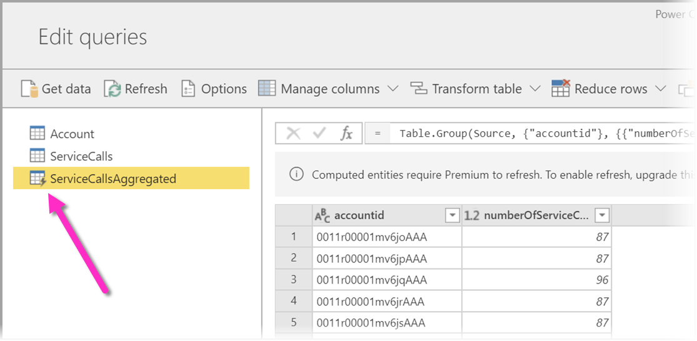
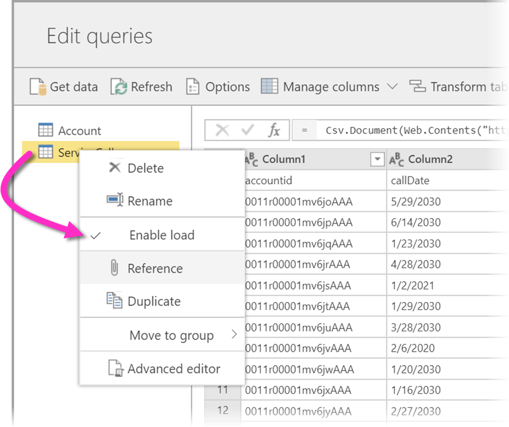
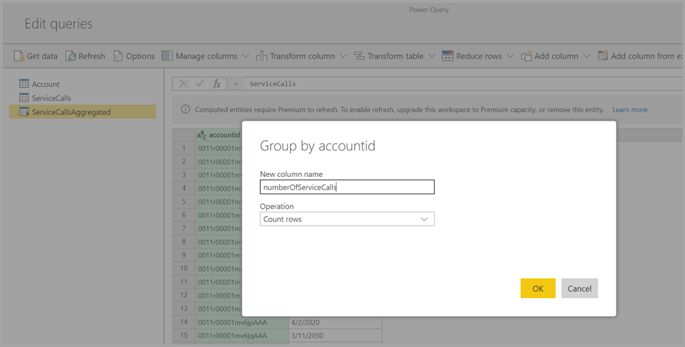
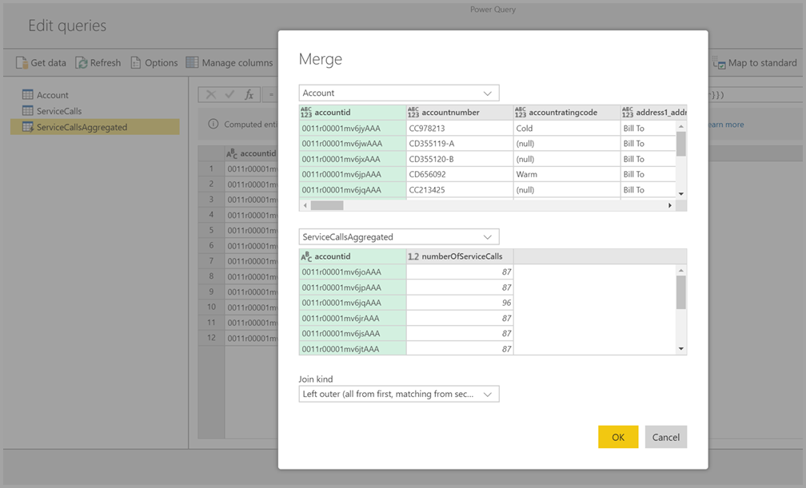
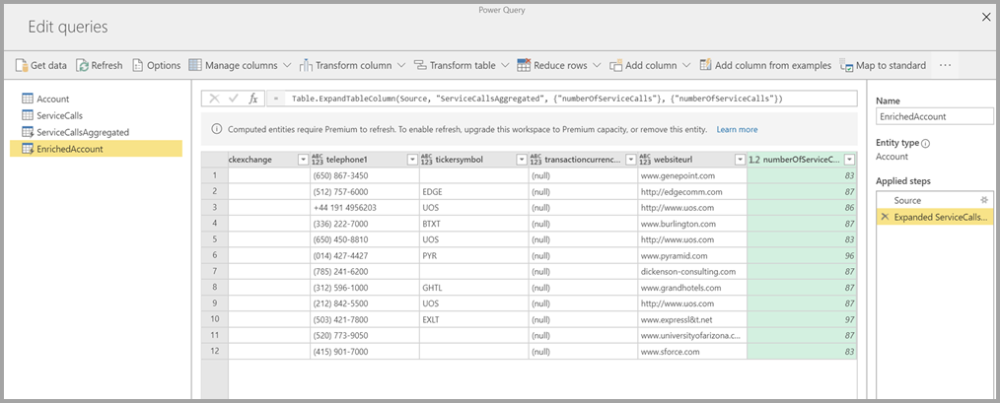

# Using computed entities on Power BI Premium (Preview)

You can perform **in-storage computations** when using **dataflows** with a Power BI Premium subscription. This lets you perform calculations on your existing dataflows, and return results that enable you to focus on report creation and analytics. 

To perform **in-storage computations**, you first must create the dataflow and bring data into that Power BI dataflow storage. Once you have a dataflow that contains data, you can create **computed entities**, which are entities that perform in-storage computations. 

There are two ways you can connect dataflow data to Power BI:

* [Using self-service authoring of a dataflow](service-dataflows-create-use.md)
* Using an external dataflow

The following sections describe how to create computed entities on your dataflow data.

> [!NOTE]
> The dataflows functionality is in preview, and is subject to change and updates prior to general availability.

## How to create computed entities 

Once you have a dataflow with a list of entities, you can perform calculations on those entities.

In the dataflow authoring tool in the Power BI service, select **Edit entities**, then right-click on the entity you want to use as the basis for your computed entity and on which you want to perform calculations. In the context menu, choose **Reference**.

For the entity to be eligible as a computed entity, the **Enable load** selection must be checked, as shown in the following image. Right-click on the entity to display this context menu.

By selecting **Enable load**, you create a new entity for which its source is the referenced entity. The icon changes, and shows the **computed** icon, as shown in the following image.

Any transformation you perform on this newly created entity will be run on the data that already resides in Power BI dataflow storage. That means that the query will not run against the external data source from which the data was imported (for example, the SQL database from which the data was pulled), but rather, is performed on the data that resides in the dataflow storage.

### Example use cases
What kind of transformations can be performed with computed entities? Any transformation that you usually specify using the transformation user interface in Power BI, or the M editor, are all supported when performing in-storage computation. 

Consider the following example: you have an *Account* entity that contains the raw data for all the customers from your Dynamics 365 subscription. You also have *ServiceCalls* raw data from the Service Center, with data from the support calls that were performed from the different account in each day of the year.

Imagine you want to enrich the *Account* entity with data from the *ServiceCalls*. 

First you would need to aggregate the data from the ServiceCalls to calculate the number of support calls that were done for each account in the last year. 

Next, you would want to merge the *Account* entity with the *ServiceCallsAggregated* entity to calculate the enriched **Account** table.

And then you can see the results, shown as *EnrichedAccount* in the following image.

And that's it - the transformation is performed on the data in the dataflow that resides in your Power BI Premium subscription, not on the source data.

## Considerations and limitations

It's important to note that if you remove the workspace from Power BI Premium capacity, the associated dataflow will no longer refresh. 

When working with dataflows specifically created in an organization's Azure Data Lake Storage Gen2 account, linked entities and computed entities only work properly when the entities reside in the same storage account. For more information, see [connect Azure Data Lake Storage Gen2 for dataflow storage (Preview)](service-dataflows-connect-azure-data-lake-storage-gen2.md).

In addition, linked entities is not available for dataflows that are created from CDM folders. See [add a CDM folder to Power BI as a dataflow (Preview)](service-dataflows-add-cdm-folder.md).

## Next Steps

This article described computed entities and dataflows available in the Power BI service. Here are some more articles that might be useful.

* [Self-service data prep with dataflows](service-dataflows-overview.md)
* [Create and use dataflows in Power BI](service-dataflows-create-use.md)
* [Using dataflows with on-premises data sources (Preview)](service-dataflows-on-premises-gateways.md)
* [Developer resources for Power BI dataflows (Preview)](service-dataflows-developer-resources.md)
* [Configure workspace dataflow settings (Preview)](service-dataflows-configure-workspace-storage-settings.md)
* [Add a CDM folder to Power BI as a dataflow (Preview)](service-dataflows-add-cdm-folder.md)
* [Connect Azure Data Lake Storage Gen2 for dataflow storage (Preview)](service-dataflows-connect-azure-data-lake-storage-gen2.md)

For more information about Power Query and scheduled refresh, you can read these articles:
* [Query overview in Power BI Desktop](desktop-query-overview.md)
* [Configuring scheduled refresh](refresh-scheduled-refresh.md)

For more information about the Common Data Model, you can read its overview article:
* [Common Data Model - overview ](https://docs.microsoft.com/powerapps/common-data-model/overview)

