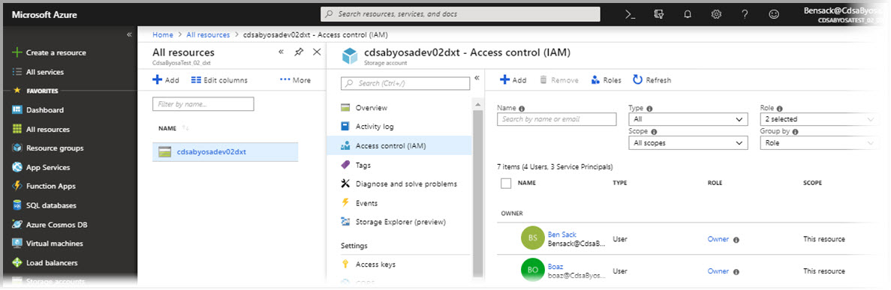
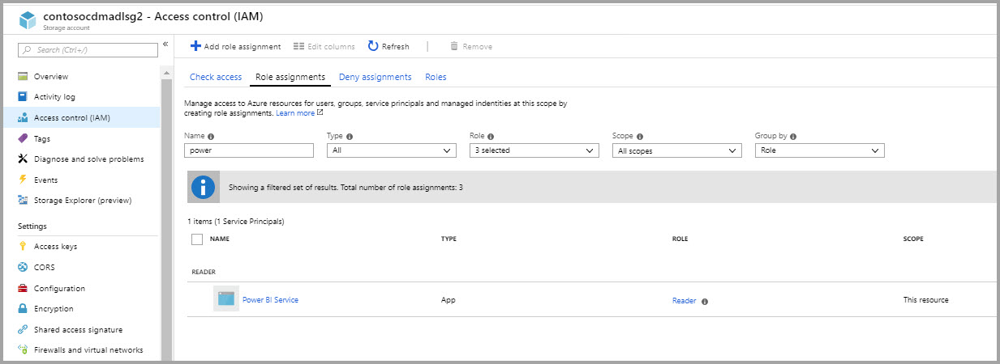
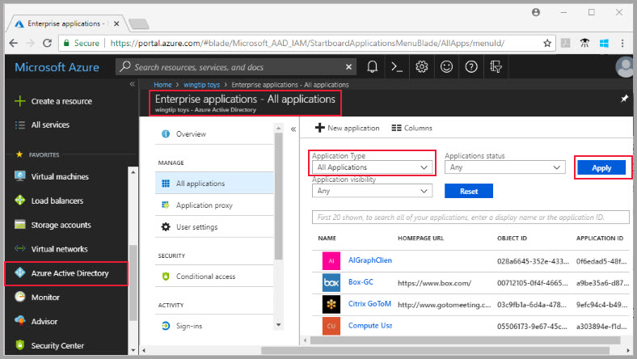
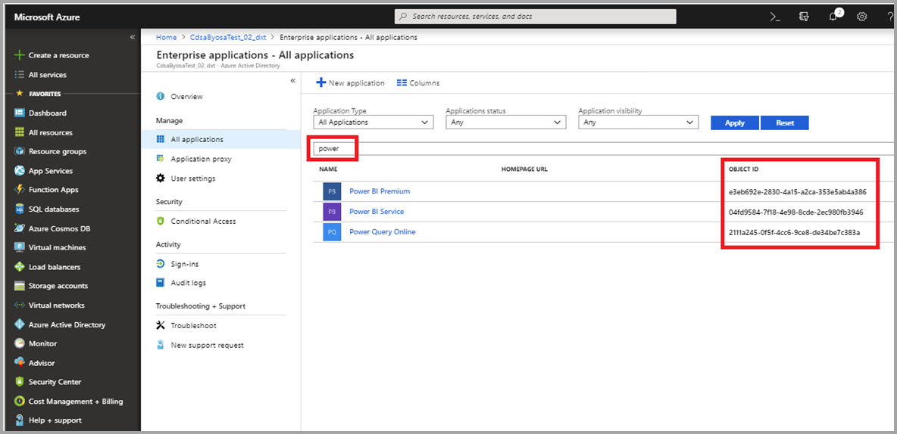
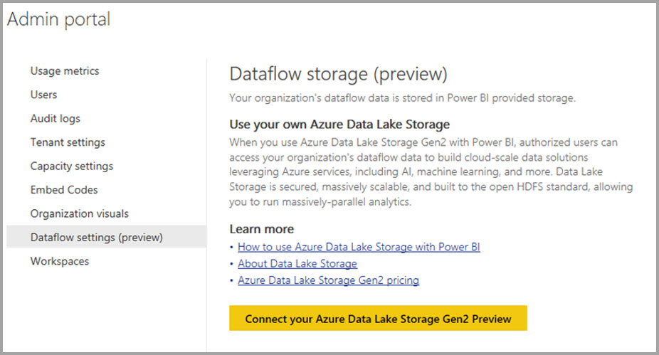
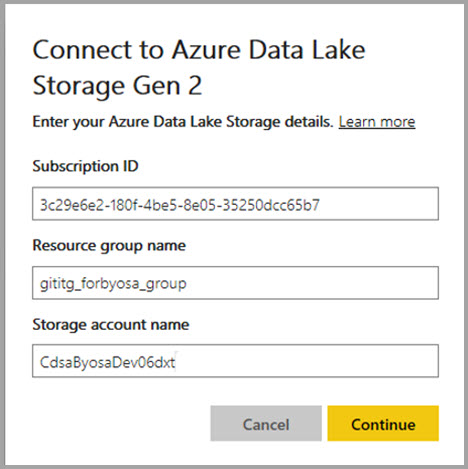

# Connect Azure Data Lake Storage Gen2 for dataflow storage (Preview)

You can configure Power BI workspaces to store dataflows in your organization’s Azure Data Lake Storage Gen2 account. This article describes the general steps necessary to do so, and provides guidance and best practices along the way. There are some advantages to configuring workspaces to store dataflow definitions and datafiles in your data lake, including the following:

* Azure Data Lake Storage Gen2 provides an enormously scalable storage facility for data
* Dataflow data and definition files can be leveraged by your IT department's developers to leverage Azure Data and artificial intelligence (AI) services
* Enables developers in your organization to integrate dataflow data into internal applications, and line of business solutions, using developer resources for dataflows and Azure

To use Azure Data Lake Storage Gen2 for dataflows, you need the following:

* **Power BI tenant** - at least one account in your Azure Active Directory (AAD) tenant must have signed up for Power BI
* **Power BI Pro account** - at least one Power BI Pro license must available to create a dataflow
* **A Global Administrator account** - this account is required to connect and configure Power BI to store the dataflow definition, and data, in your Azure Data Lake Storage Gen2 account
* **An Azure subscription** - you need an Azure subscription to use Azure Data Lake Storage Gen2
* **Resource group** - use a resource group you already have, or you can create a new one
* **An Azure Storage account with Data Lake Storage Gen2 (Preview) feature enabled** - to connect to Azure Data Lake Storage Gen2, you need to sign up for its public preview

> [!TIP]
> If you don't have an Azure subscription, create a [free account](https://azure.microsoft.com/free/) before you begin.

## Prepare your Azure Data Lake Storage Gen2 for Power BI

Before you can configure Power BI with an Azure Data Lake Storage Gen2 account, you must create and configure a storage account. Let's take a look at the requirements for Power BI:

1. The storage account must be created in the same AAD tenant as your Power BI tenant.
2. The storage account must be created in the same region as your Power BI tenant. To determine where you Power BI tenant is located, see [where is my Power BI tenant located].(service-admin-where-is-my-tenant-located.md).
3. The storage account must have the *Hierarchical Name Space* feature enabled.
4. Power BI service must be granted a *Reader* role on the storage account.
5. A Filesystem named **powerbi** must be created.
6. Power BI services must be authorized to the **powerbi** filesystem you create.

The following sections walk through the steps ncessary to configure your Azure Data Lake Storage Gen2 account in detail.

> [!NOTE]
> The dataflows functionality is in preview, and is subject to change and updates prior to general availability.

### Create the storage account

Following these steps to create your Azure Data Lake Storage Gen2 storage account:

1. Sign in to the [Azure portal](https://portal.azure.com).
2. Select **Create a resource > Storage**
3. In the search box, search for *Storage account - blob, data lake gen 2 (preview), file, table, queue*
4. Within *Storage account - blob, data lake gen 2 (preview), file, table, queue* select **Create**.
5. Fill in the required information. Make sure you select the same location as your Power BI tenant, and set your storage as **StorageV2 (general purpose v2)**, then select **Next: Advanced**

    

6. In the **Advanced** tab, make sure you enable the hierarchical namespace feature, as shown in the following image.

    

7. Select the **Review + Create** button, and then **Create**.

### Grant the Power BI service a reader role

Next, you need to grant the Power BI service a reader role in your created storage account. It's a built-in role, so the steps are straighforward. 

1. In the **Azure portal**, navigate to your storage account.
2. Select your storage account then select **Access Control (IAM)** to display access control settings for the account, as shown in the following image. Click **Add** to add a new role.

    

3. In the **Add role assignment** window, select the **Reader** role you to assign to the Power BI service. Then use search to locate **Power BI Service**. The following image shows the **Reader** role assigned to the Power BI service.

    

4. Select **Save**, and then the Power BI service appears listed under that role. The following image shows the Power BI service has Reader role access to the storage account:

    

### Create a file system for Power BI

You must create a file system named *powerbi* bfore your storage account can be added to Power BI. There are many ways to create such a file system, including using Azure Databricks, HDInsight or AZCopy. This section shows you a straightforward way to create a file system using AzCopy on Windows.

1. Download the latest version of [AzCopy on Windows](https://aka.ms/downloadazcopy) using the following download link: [AzCopy on Windows](https://aka.ms/downloadazcopy)

2. Once you've successfully installed AzCopy on Windows, open a command window and navigate to the AzCopy installation directory on your computer, which is where the *AzCopy.exe* executable is located. 

3. Create a file system called *powerbi* be executing the following script in the command window you opened in the previous step:

    `AzCopy https://[account-name].dfs.core.windows.net/powerbi`

When that script successfully runs, your *powerbi* file system is created. In the next section, you grant the Power BI family of services full access to the file system you created. 

### Grant Power BI permissions to the file system

To grant permissions to the file system, you apply Access Control List (ACL) settings that grant the Power BI service access. The first step in doing so is obtaining the Power BI services identity in your tenant. You can view your Azure Active Directory (AAD) applications in the **Enterprise apps** section of the Azure portal.

To find your tenant applications, follow these steps:

1. In the [Azure portal](https://portal.azure.com/), select **Azure Active Directory** from the left navigation panel.
2. In the Azure **Active Directory** blade, select **Enterprise applications**.
3. From the **Application Type** drop-down menu, select **All Applications** and then select **Apply**. A sample of your tenant applications appears, similar to the following image.

    

4. In the search bar, type *Power* and a collection of Object IDs for Power BI and Power Query applications appear.

    

5. Select and copy the Object ID for Power BI service from the results of your search. Be ready to paste that value in subsequent steps.

6. Download the latest version of **Azure Storage Explorer** using the following link: [Azure Storage Explorer](https://azure.microsoft.com/en-us/features/storage-explorer/). 

7. Once it's successfully installed, use **Azure Storage Explorer** to navigate to the *powerbi* file system you created in the previous section. 

8. Assign **Read** permissions to your *powerbi* file system, using **Azure Storage Explorer**, as described in **Manage Azure Data Lake Storage Gen2 resources by using Storage Explorer**.

## Connect your Azure Data Lake Storage Gen2 to Power BI

Once you've set up your Azure Data Lake Storage Gen2 account in the Azure Portal, you connect it to Power BI in the **Power BI admin portal**. You also manage Power BI dataflow storage in the **Dataflow storage (preview)** settings section of the Power BI admin portal. For guidance on launching and basic use, see [How to get to the admin portal](service-admin-portal.md) for detailed information.

You connect your **Azure Data Lake Storage Gen2** account with the following steps:

1. Navigate to the **Dataflow settings (preview)** tab of the **Power BI admin portal**

     

2. Select the **Connect your Azure Data Lake Storage Gen2 Preview** button. The following window appears.

     

3. Provide the **Subscription ID** of the Storage Account.
4. Provide the **Resource Group name** in which the storage account was created.
5. Provide the **Storage Account name**.
6. Select **Connect**.

Once those steps are successfully completed, your Azure Data Lake Storage Gen2 account is connected to Power BI. 

Next you need to enable people in your organization to configure their workspaces, which enables them to use this storage account for dataflow definition and data storage. Let's do that in the next section. 

## Allow admins to assign workspaces

By default, dataflow definition and data files are stored in the storage provided by Power BI. To access dataflow files in your own storage account, workspace admins must first configure the workspace to allow assignment and storage of dataflows in the new storage account. Before a workspace admin can configure dataflow storage settings, the admin must be granted storage assignment permissions in the **Power BI admin portal**.

To grant storage assignment permissions, go to the **Dataflow settings (Preview)** tab in the **Power BI admin portal**. There is a radio button to *Allow workspace admins to assign workspaces to this storage account* which must be set to **allow**. Once you enable that slider, selec the **Apply** button for the change to take effect. 

That's it. The Power BI workspace admins can now assign workflows to the file system you created.

## Considerations and limitations

This feature is a preview feature, and its behavior may change as it approaches release. There are a few considerations and limitations to keep in mind when working with your dataflow storage:

* Once a dataflow storage location is configured, it cannot be changed.
* Only owners of a dataflow stored in Azure Data Lake Storage Gen2 can access its data by default. To authorize additional people to the dataflows stored in Azure, you must add them to the dataflow’s CDM folder 
* Creating dataflows with linked entities is only possible when they are stored in the same storage account
* On-premises data sources, in Power BI shared capacities, are not supported in dataflows stored in your organization’s data lake

There are also a few known issues, as described in this section.

Power BI Desktop customers cannot access dataflows stored in an **Azure Data Lake Storage Account** unless they are the owner of the dataflow, or have been authorized to the CDM folder in the lake. The scenario is as follows:

1. Anna has created a new app workspace and configured it to store dataflows in the organization’s data lake. 
2. Ben, who is also a member of the workspace Anna created, would like to leverage Power BI Desktop and the dataflow connector to get data from the Dataflow Anna created.
3. Ben receives an error similar to the following image, because he was not added to the dataflow’s CDM folder in the lake

 

The workaround to this siuation is as follows: Ben must be granted **Reader** permissions to the CDM Folder and its files. The [Authorizing people or services to CDM folders](https://go.microsoft.com/fwlink/?linkid=2029121) article provides guidance on how to do so.

Common questions and answers include the following:

**Question:** What if I had previously created dataflows in a workspace and would like to change their storage location?

**Answer:** You cannot change the storage location of a dataflow after it was created. 

**Question:** When can I change the dataflow storage location of a workspace?

**Answer:** Changing the dataflow storage location of a workspace is only allowed if the workspace does not contain any dataflows.

## Next Steps

This article provided guidance on how to connect an Azure Data Lake Gen2 for dataflow storage. For additional information, take a look at the following articles:

For more information about dataflows, CDM, and Azure Data Lake Storage Gen2, take a look at the following articles:

* [Dataflows and Azure Data Lake integration (Preview)](service-dataflows-azure-data-lake-integration.md)
* [Configure workspace dataflow settings (Preview)](service-dataflows-configure-workspace-storage-settings.md)
* [Add a CDM folder to Power BI as a dataflow (Preview)](service-dataflows-add-cdm-folder.md)

For information about dataflows overall, check out these articles:

* [Create and use dataflows in Power BI](service-dataflows-create-use.md)
* [Using computed entities on Power BI Premium (Preview)](service-dataflows-computed-entities-premium.md)
* [Using dataflows with on-premises data sources (Preview)](service-dataflows-on-premises-gateways.md)
* [Developer resources for Power BI dataflows (Preview)](service-dataflows-developer-resources.md)

For more information about Azure storage, you can read these articles:
* [Azure Storage security guide](https://docs.microsoft.com/azure/storage/common/storage-security-guide)
* [Configuring scheduled refresh](refresh-scheduled-refresh.md)
* [Get started with github samples from Azure Data Services](https://aka.ms/cdmadstutorial)

For more information about the Common Data Model, you can read its overview article:
* [Common Data Model - overview ](https://docs.microsoft.com/powerapps/common-data-model/overview)
* [CDM folders](https://go.microsoft.com/fwlink/?linkid=2045304)
* [CDM model file definition](https://go.microsoft.com/fwlink/?linkid=2045521)

And you can always try [asking questions of the Power BI Community](http://community.powerbi.com/).