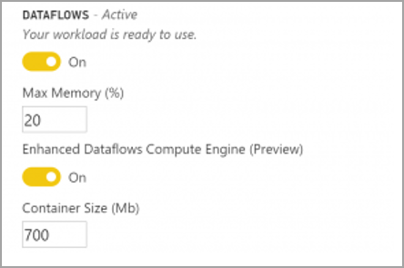

# The enhanced compute engine

The enhanced compute engine in Power BI enables Power BI Premium subscribers to use their capacity to optimize the use of dataflows. Using the enhanced compute engine provides the following advantages:

* Drastically reduces the refresh time required for long-running ETL steps over computed entities, such as performing *joins*, *distinct*, *filters,* and *group by*
* Perform DirectQuery queries over entities (in February 2020)

The following sections describe how to enable the enhanced compute engine, and answer common questions.

## Using the enhanced compute engine

The enhanced compute engine is enabled from the **Capacity Settings** page in the Power BI service, in the **dataflows** section. By default, the enhanced compute engine is **Off**. To turn it on switch the toggle to **On**, as shown in the following image, and save your settings. 

Once you turn on the enhanced compute engine, return to dataflows and you should see a performance improvement in any computed entity that performs complex operations, such as *joins* or *group by* operations for dataflows created from existing linked entities on the same capacity. 

To make best use of the compute engine, you should split the ETL stage into two separate dataflows in the following way:

* **Dataflow 1** - this dataflow should only be ingesting all of the required from a data source, and placing it into dataflow 2.
* **Dataflow 2** - perform all ETL operations in this second dataflow, but ensure you're referencing Dataflow 1, which should be on the same capacity. Also ensure you perform operations that can fold (filter, group by, distinct, join) first, before any other operation, to ensure the compute engine is utilized.

## Common questions and answers

**Question:** I've enabled the enhanced compute engine, but my refreshes are slower. Why?

**Answer:** If you enable the enhanced compute engine, there are two possible explanations that could lead to slower refresh times:

 1. When the enhanced compute engine is enabled, it requires some memory to function properly. As such, memory available to perform a refresh is reduced and therefore increases the likelihood of refreshes to be queued, which in turn reduces the number of dataflow dataflows that can refresh concurrently. To address this, when enabling enhanced compute, increase the memory assigned for dataflows to ensure the memory available for concurrent dataflow refreshes remains the same.

 2. Another reason you may encounter slower refreshes is that the compute engine only works on top of existing entities, if your dataflow references a data source that's not a dataflow you won't see an improvement. There will be no performance increase, since in some big data scenarios, the initial read from a data source would be slower because the data needs to be passed to the enhanced compute engine.  

**Question:** I cannot see the enhanced compute engine toggle. Why?

**Answer:** The enhanced compute engine is being released in stages to regions around the world. We anticipate all regions will supported by the end of 2020.

**Question:** What are the supported data types for the compute engine?

**Answer:** The enhanced compute engine and dataflows currently support the following data types. If your dataflow doesn't use one of the following data types, an error occurs during refresh:

* Date/Time
* Decimal Number
* Text
* Whole number
* Date/Time/Zone
* True/False
* Date
* Time

## Next Steps

This article provided information about using the enhanced compute engine for dataflows. The following articles may also be helpful:

* [Self-service data prep with dataflows](service-dataflows-overview.md)
* [Create and use dataflows in Power BI](service-dataflows-create-use.md)
* [Using computed entities on Power BI Premium](service-dataflows-computed-entities-premium.md)
* [Developer resources for Power BI dataflows](service-dataflows-developer-resources.md)

For more information about Power Query and scheduled refresh, you can read these articles:
* [Query overview in Power BI Desktop](desktop-query-overview.md)
* [Configuring scheduled refresh](refresh-scheduled-refresh.md)

For more information about the Common Data Model, you can read its overview article:
* [Common Data Model - overview ](https://docs.microsoft.com/powerapps/common-data-model/overview)

