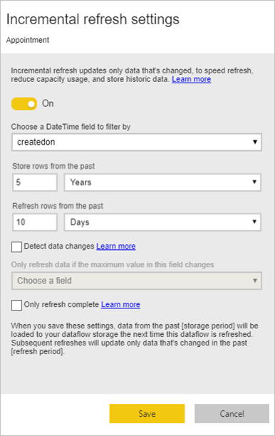

# Using incremental refresh with Power BI dataflows

With dataflows, you can bring large amounts of data into Power BI to create compelling reports and analytics. In some cases, however, it's not practical to update a full copy of source data in each refresh. A good alternative is **incremental refresh**, which provides the following benefits for dataflows:

* **Refresh occurs faster** - only data that's changed needs to be refreshed. For example, refresh only the last five days of a 10-year dataflow.
* **Refresh is more reliable** - for example, it is not necessary to maintain long-running connections to volatile source systems.
* **Resource consumption is reduced** - less data to refresh reduces overall consumption of memory and other resources.

Using incremental refresh for Power BI dataflows requires that the workspace where the dataflow resides be in [Premium capacity](service-premium.md) to run, and the data source ingested into the dataflow must have a *datetime* field on which incremental refresh can filter. 

## Configuring incremental refresh for dataflows

A dataflow can contain many entities. Incremental refresh is set up at the entity level, allowing one dataflow to hold both fully refreshed entities and incrementally refreshed entities.

To set up an incremental refreshed entity, start by configuring your entity as you would any other entity. To learn more about dataflow set up, see [Self-service data prep in Power BI](service-dataflows-overview.md).

Once the dataflow is created and saved, select the **incremental refresh** icon in the entity view, as shown in the following image:

When you click the icon, the **Incremental refresh settings** window appears. When you toggle incremental refresh to the **On** position, you can configure your incremental refresh.

The following list explains the settings in the **Incremental refresh settings** window. 

1. **Incremental refresh on/off toggle** – this slider toggles incremental refresh policy on/off for the entity
2. **Filter field drop down** – selects the query field on which the entity should be filtered for increments. This field only contains *datetime* fields. You cannot use incremental refresh if your entity doesn’t contain a *datetime* field.
3. **Store rows from the past** – the following example helps explain the next few settings.

    For this example, we define a refresh policy to store five years of data in total, and incrementally refresh 10 days of data. If the entity is refreshed daily, the following is carried out for each refresh operation:

    * Add a new day of data.
    * Refresh 10 days up to the current date.
    * Remove calendar years that are older than five years prior to the current date. For example, if the current date is January 1st 2019, the year 2013 is removed.

    The first dataflow refresh may take a while to import all five years, but subsequent refreshes are likely to complete in a small fraction of the initial refresh time.

4. **Detect data changes** - Incremental refresh of 10 days is much more efficient than full refresh of 5 years, but  we may be able to do even better. When you select the **Detect data changes** checkbox, you can select a date/time column to identify and refresh only the days where the data has changed. This assumes such a column exists in the source system, which is typically for auditing purposes. The maximum value of this column is evaluated for each of the periods in the incremental range. If that data has not changed since the last refresh, there is no need to refresh the period. In the example, this could further reduce the days incrementally refreshed from 10 to perhaps two.

> [!TIP]
> The current design requires that the column to detect data changes be persisted and cached into memory. You may want to consider one of the following techniques to reduce cardinality and memory consumption:
>
>    * Persist only the maximum value of this column at time of refresh, perhaps using a Power Query function.
>    * Reduce the precision to a level that is acceptable given your refresh-frequency requirements.

5. **Only refresh complete periods** - imagine your refresh is scheduled to run at 4:00 AM every morning. If data appears in the source system during those first four hours of that day, you may not want to account for it. Some business metrics, such as barrels per day in the oil and gas industry, are not practical or sensible to account for based on partial days.

    Another example where only refreshing complete periods is appropriate is refreshing data from a financial system. Imagine a financial system where data for the previous month is approved on the 12th calendar day of the month. You could set the incremental range to 1 month and schedule the refresh to run on the 12th day of the month. With this option checked, it would refresh January data (the most recent complete monthly period) on February 12th.

> [!NOTE]
> Dataflow incremental refresh determines dates according to the following logic: if a refresh is scheduled, incremental refresh for dataflows uses the time-zone defined in the refresh policy. If no schedule for refreshing exists, incremental refresh uses the time from the machine running the refresh.

## The incremental refresh query

Once incremental refresh is configured, the dataflow automatically alters your query to include filter by date. You can edit the auto-generated query using the **Advanced Power Query Editor** to fine-tune or customize your refresh. Read more about incremental refresh and how it works in the following section.

## Incremental refresh and linked versus computed entities

For *linked* entities, incremental refresh updates the source entity. Since linked entities are simply a pointer to the original entity, incremental refresh has no impact on the linked entity. When the source entity refreshes according to its defined refresh policy, any linked entity should assume the data in the source is refreshed.

*Computed* entities are based on queries running over a datastore, which may be another dataflow. 
As such, computed entities behave in the same way as linked entities.

Since computed entities and linked entities behave similarly, the requirements and configuration steps are the same for both. One difference is that for computed entities, in certain configurations, incremental refresh cannot run in an optimized fashion due to the way partitions are built. 

## Changing between incremental and full refresh

Dataflows support changing refresh policy between incremental and full refresh. When a change occurs in either direction (full to incremental, or incremental to full refresh), the change impacts the dataflow after the next refresh.

When moving a dataflow from full refresh to incremental, the new refresh logic updates the dataflow adhering to the refresh window and increment as defined in the incremental refresh settings.

When moving a dataflow from incremental to full refresh, all data accumulated in incremental refresh is overwritten by the policy defined in full refresh. You must approve this action.

## Dataflow incremental refresh and datasets

Dataflow incremental refresh and dataset incremental refresh are designed to work in tandem. It's is acceptable and supported to have an incrementally refreshing entity in a dataflow, fully loaded into a dataset, or a fully loaded entity in dataflow incrementally loaded to a dataset. 

Both approaches according to your specified definitions in the refresh settings.
You can read more about incremental refresh in [incremental refresh in Power BI Premium](service-premium-incremental-refresh.md).

## Time zone support in incremental refresh

Dataflow incremental refresh is dependent on the time in which it is run. The filtering of the query is dependent on the day it runs.

To accommodate those dependencies and to ensure data consistency, incremental refresh for dataflows implements the following heuristic for *refresh now* scenarios:

* In the case where a scheduled refresh is defined in the system – incremental refresh uses the timezone settings from the schedule refresh. This ensures that whatever timezone the person refreshing the dataflow is in, it will always be consistent with the system’s definition.

* If no schedule refresh is defined, dataflows use the timezone of the refreshing user’s computer.

Incremental refresh may also be invoked using APIs. in this case, the API call may hold a timezone setting that is used in the refresh. Using APIs can be helpful for testing and validation purposes.

## Incremental refresh implementation details

Dataflows use partitioning for incremental refresh. Once XMLA-endpoints for Power BI Premium are available, the partitions become visible. Incremental refresh in dataflows retains the minimum number of partitions to meet refresh policy requirements. Old partitions that go out of range are dropped, maintaining a rolling window. Partitions are opportunistically merged, reducing the total number of partitions required. This improves compression and, in some cases, can improve query performance.

The examples in this section share the following refresh policy:

* Store rows in the last 1 Quarter
* Refresh rows in the last 10 Days
* Detect data changes = False
* Only refresh complete days = True

### Merge partitions

In this example, day partitions are automatically merged to the month level once they go outside the incremental range. Partitions in the incremental range need to be maintained at daily granularity to allow only those days to be refreshed.
The refresh operation with *Run Date 12/11/2016* merges the days in November, because they fall outside the incremental range.

### Drop old partitions

Old partitions that fall outside the total range are removed. The refresh operation with *Run Date 1/2/2017* drops the partition for Q3 2016 because it falls outside the total range.

### Recovery from prolonged failure

This example simulates how the system recovers gracefully from prolonged failure. Let's say refresh doesn't run successfully because data source credentials expired, and the issue takes 13 days to resolve. The incremental range is only 10 days.

The next successful refresh operation, with *Run Date 1/15/2017*, needs to backfill the missing 13 days and refresh them. It also needs to refresh the previous 9 days because they were not refreshed on the normal schedule. In other words, the incremental range is increased from 10 to 22 days.

The next refresh operation, with *Run Date 1/16/2017*, takes the opportunity to merge the days in December and the months in the Q4 2016.

## Next Steps

This article described incremental refresh for dataflows. Here are some more articles that might be useful.

* [Self-service data prep with dataflows](service-dataflows-overview.md)
* [Create and use dataflows in Power BI](service-dataflows-create-use.md)
* [Using dataflows with on-premises data sources](service-dataflows-on-premises-gateways.md)
* [Developer resources for Power BI dataflows](service-dataflows-developer-resources.md)

For more information about Power Query and scheduled refresh, you can read these articles:
* [Query overview in Power BI Desktop](desktop-query-overview.md)
* [Configuring scheduled refresh](refresh-scheduled-refresh.md)

For more information about the Common Data Model, you can read its overview article:
* [Common Data Model - overview ](https://docs.microsoft.com/powerapps/common-data-model/overview)

