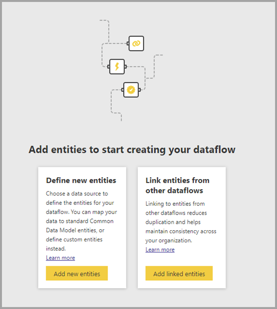
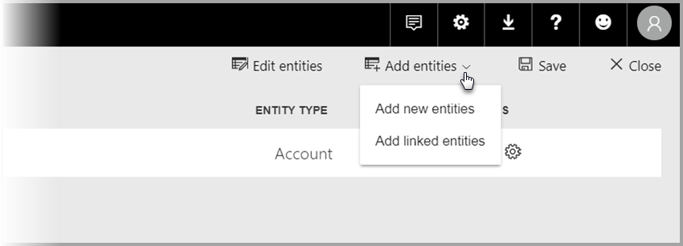

# Link entities between dataflows in Power BI (Preview)

With dataflows in Power BI, you can have a single organizational data storage source where business analysts can prep and manage their data once, and then reuse it between different analytics apps in the organization. 

When you link entities between dataflows, you can reuse entities that have already been ingested, cleansed and transformed by other dataflows owned by others without the need to maintain that data. The linked entities simply point to the entities in other dataflows, and do *not* copy or duplicate the data.

Linked entities are **read only**. If you want to create transformations for a linked entity, you must create a new computed entity with a reference to the linked entity.

## Linked entity availability

Linked entities require a [Power BI Premium](service-premium.md) subscription to refresh. Linked entities are available in any dataflow on a workspace that is hosted on Power BI Premium capacity. There are no limitations on the source dataflow.

Linked entities only work properly in new Power BI workspaces. You can learn more about [new Power BI workspaces](service-create-the-new-workspaces.md). All linked dataflows must be located in new workspaces to work properly.

> [!NOTE]
> Entities differ based on whether they’re standard entities or computed entities. Standard entities (often simply referred to as entities) query an external data source, such as a SQL database. Computed entities require Premium capacity on Power BI and run their transformations on data that’s already in Power BI storage. 
>
>If your dataflow isn’t in a Premium capacity workspace, you can still reference a single query or combine two or more queries as long as the transformations aren’t defined as in-storage transformations. Such references are considered standard entities. To do so, turn off the **Enable load** option for the referenced queries to prevent the data from being materialized and from being ingested into storage. From there, you can reference those **Enable load = false** queries, and set **Enable load** to **On** only for the resulted queries that you want to materialize.

## How to link entities between dataflows

There are a few ways to link entities between dataflows in Power BI. You can select **Add linked entities** from the Dataflows authoring tool, as shown in the following image. 

You can also select **Add linked entities** from the **Add entities** menu item in the Power BI service.

To link entities, you must sign in with your Power BI credentials.

A **Navigator** window opens and lets you choose a set of entities to which you can connect. The entities displayed are entities for which you have permissions, across all workspaces in your Power BI tenant. 

Once your linked entities are selected, they appear in the list of entities for your dataflow in the authoring tool, with a special icon identifying them as Linked entities.

You can also view the source dataflow from the dataflow settings of your linked entity.

## Refresh logic of linked entities
The default refresh logic of linked entities changes, based on whether the source dataflow resides in the same workspace as the destination dataflow. The following sections describe the behavior of each.

### Links between workspaces

Refresh for links from entities in different workspaces behave like an external data source. When the dataflow refreshes, it takes the latest data for the entity from the source dataflow. If the source dataflow refreshes, it doesn’t automatically impact the data in the destination dataflow.

### Links in the same workspace

When refresh of the data for a source dataflow occurs, that event automatically triggers a refresh process for dependent entities in all destination dataflows in the same workspace, including any calculated entities based on them. All other entities in the destination dataflow are refreshed according to dataflow schedule. Entities that depend on more than one source update their data whenever any of their sources updates successfully.

It's useful to note that the entire refresh process commits at once. Because of this, if the destination dataflow refresh fails to refresh, the source dataflow will fail its refresh as well.

## Permissions when viewing reports from dataflows

When creating a Power BI report that includes data based on a dataflow, users can see any linked entities only when the user has access to the source dataflow.

## Limitations and considerations

There are a few limitations to keep in mind when working with linked entities:

* There is a maximum of five referencing hops
* Cyclic dependencies of linked entities are not allowed
* The dataflow must reside in a [new Power BI workspace](service-create-the-new-workspaces.md)
* Linked entity cannot be joined with a regular entity that gets data from on-prem data source

## Next Steps

The following articles may be useful as you create or work with dataflows. 

* [Self-service data prep in Power BI (Preview)](service-dataflows-overview.md)
* [Create and use dataflows in Power BI](service-dataflows-create-use.md)
* [Using computed entities on Power BI Premium (Preview)](service-dataflows-computed-entities-premium.md)
* [Using dataflows with on-premises data sources (Preview)](service-dataflows-on-premises-gateways.md)
* [Developer resources for Power BI dataflows (Preview)](service-dataflows-developer-resources.md)

For more information about Power Query and scheduled refresh, you can read these articles:
* [Query overview in Power BI Desktop](desktop-query-overview.md)
* [Configuring scheduled refresh](refresh-scheduled-refresh.md)

For more information about the Common Data Model, you can read its overview article:
* [Common Data Model - overview ](https://docs.microsoft.com/powerapps/common-data-model/overview)

