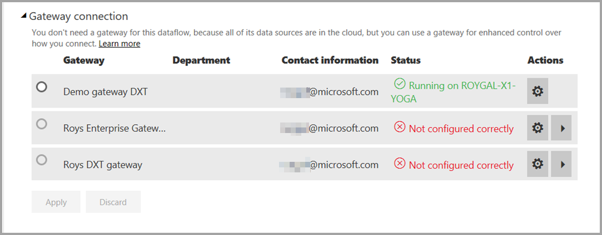
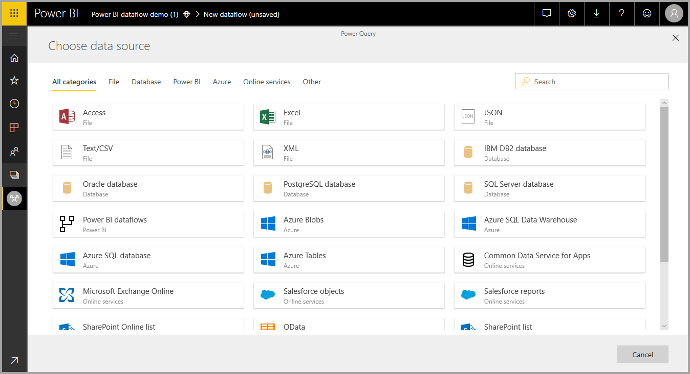
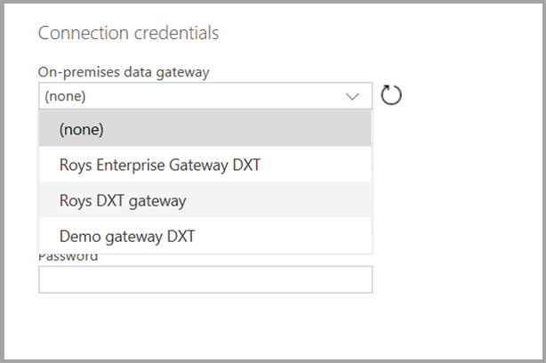

# Using dataflows with on-premises data sources (Preview)

With **dataflows**, you can create a collection of data from various sources, clean the data, transform it, and then load it to Power BI storage. When creating dataflow you may want to use on-premises data sources. This article clarifies requirement associated with creating dataflows and how your **Enterprise Gateway** needs to be configured to enabled those connections.

> [!NOTE]
> The dataflows functionality is in preview, and is subject to change and updates prior to general availability.
 
## Configuring an Enterprise Gateway for use with dataflows

To use an on-premises data source in a dataflow, any user creating the dataflow must have an **Enterprise Gateway** installed and configured. The user creating the dataflow also must be the Enterprise Gateway's administrator in order to use that gateway for a dataflow.

> [!NOTE]
> Dataflows are only supported using Enterprise Gateways.

## Using an on-premises data source in a dataflow

When creating a dataflow, select an on-premises data source from the data sources list, as shown in the following image.

Once you make your selection, you're prompted to provide the connection details for the Enterprise Gateway that will be used to access the on-premises data. You must select the gateway itself, and provide credentials for the selected gateway. Only gateways for which the user is an administrator appear in the drop-down list.

## Monitoring your gateway

You can monitor your Enterprise Gateway for a dataflow in the same way you monitor gateways for a dataset.

In the dataflow’s settings screen in Power BI, you can monitor a dataflow’s gateway status and assign a gateway to the dataflow, as shown in the following image.

## Changing a gateway

You can change the Enterprise Gateway used for a given dataflow in two ways:

1. **From the authoring tool** – you can change the gateway assigned to all of your queries using the dataflow authoring tool.

    > [!NOTE]
    > The dataflow will try to find or create the required datasources using the new gateway. If it cannot do so, you will not be able to change the gateway until all needed dataflows are available from the selected gateway.

2. **From the settings screen** - you can change the assigned gateway using the settings screen for the dataflow in the Power BI service.

To learn more about Enterprise Gateways, see [On-premises data gateway](service-gateway-onprem.md).

## Considerations and limitations

There are a few known limitations to using Enterprise Gateways and dataflows:

* Each dataflow may use only one gateway. As such, all queries should be configured using the same gateway.
* Changing the gateway impact the entire dataflow.
* If several gateways are needed, the best practice is to build several dataflows (one for each gateway) and use the compute or entity reference capabilities to unify the data.
* Dataflows are only supported using enterprise gateways. Personal gateways will not be available for selection in the drop down lists and settings screens.

## Next Steps

This article provided information about using on-premises data source for dataflows, and how to use and configure gateways to access such data. The following articles may also be helpful

* [Self-service data prep with dataflows](service-dataflows-overview.md)
* [Create and use dataflows in Power BI](service-dataflows-create-use.md)
* [Using computed entities on Power BI Premium (Preview)](service-dataflows-computed-entities-premium.md)
* [Developer resources for Power BI dataflows (Preview)](service-dataflows-developer-resources.md)

For more information about Power Query and scheduled refresh, you can read these articles:
* [Query overview in Power BI Desktop](desktop-query-overview.md)
* [Configuring scheduled refresh](refresh-scheduled-refresh.md)

For more information about the Common Data Model, you can read its overview article:
* [Common Data Model - overview ](https://docs.microsoft.com/powerapps/common-data-model/overview)

