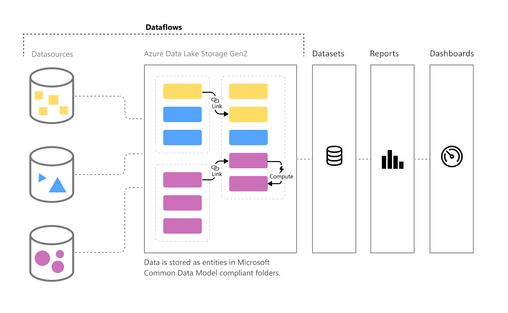

# Self-service data prep in Power BI (Preview)

As data volume continues to grow, so does the challenge of wrangling that data into well-formed, actionable information. We want data that’s ready for analytics, to populate visuals, reports, and dashboards, so we can quickly turn our volumes of data into actionable insights. With **self-service data prep** for big data in Power BI, you can go from data to Power BI insights with just a few clicks.

Power BI introduces **dataflows** to help organizations unify data from disparate sources and prepare it for modeling. Analysts can easily create dataflows, using familiar, self-service tools. Dataflows are used to ingest, transform, integrate, and enrich big data by defining data source connections, ETL logic, refresh schedules, and more. In addition, the new model-driven calculation engine that's part of dataflows makes the process of data preparation more manageable, more deterministric, and less cumbersome for data analysts and report creators alike. Similar to how spreadsheets handle recalculations for all affected formulas, dataflows manage changes for an entity or data element on your behalf, automating updates, and alleviating what used to be tedious and time consuming logic checks for even a basic data refresh. With dataflows, tasks that once required data scientists to oversee (and many hours or days to complete) can now be handled with a few clicks by analysts and report creators. 

Data is stored as entities in the [**Common Data Model**](https://docs.microsoft.com/powerapps/common-data-model/overview) in Azure Data Lake Storage Gen2. Dataflows are created and managed in app workspaces by using the Power BI service.  

> [!NOTE]
> The dataflows functionality is in preview, and is subject to change and updates prior to general availability.

 
**Dataflows** are designed to use the **Common Data Model**, a standardized, modular, extensible collection of data schemas published by Microsoft that are designed to make it easier for you to build, use, and analyze data. With this model, you can go from data sources to Power BI dashboards with nearly zero friction.

You can use dataflows to ingest data from a large and growing set of supported on-premises and cloud- based data sources including Dynamics 365, Salesforce, Azure SQL Database, Excel, SharePoint, and more.

You can then map data to standard entities in the Common Data Model, modify and extend existing entities, and create custom entities. Advanced users can create fully customized dataflows, using a self-service, low- code/no-code, built-in Power Query authoring experience, similar to the Power Query experience that millions of Power BI Desktop and Excel users already know.  

Once you’ve created a dataflow, you can use Power BI Desktop and the Power BI service to create datasets, reports, dashboards, and apps that leverage the power of the Common Data Model to drive deep insights into your business activities. 

Dataflow refresh scheduling is managed directly from the workspace in which your dataflow was created, just like your datasets. 

## How dataflows work

Here are some examples of how dataflows can work for you:

* Organizations can map their data to standard entities in the Common Data Model or create their own custom entities. These entities can then be used as building blocks to create reports, dashboards, and apps that work out of the box, and distribute them to users across their organization. 

* Using the extensive collection of Microsoft data connectors, organizations can connect their own data sources to dataflows, using Power Query to map the data from its origin and bring it into Power BI. Once that data is imported by a dataflow (and refreshed at a specified frequency), those dataflow entities may be used in the Power BI Desktop application to create compelling reports and dashboards. 

## How to use dataflows

The previous section described a handful of ways dataflows can be used to quickly create powerful analytics in Power BI. In this section, you get a tour of how quickly you can create insights using dataflows in an organization, get a quick view into how BI Pros can create their own dataflows, and customize insights for their own organization.

### Extend the common data model for your business needs
For organizations that want to extend the Common Data Model (CDM), dataflows enable business intelligence professionals to customize the standard entities, or create new ones. This self-service approach to customizing the data model can then be used with dataflows to build apps and Power BI dashboards that are tailored to an organization.

### Define dataflows programmatically
You might also want to develop your own programmatic solutions to create dataflows. With public APIs and the capability to programmatically create custom dataflow definition files (model.json), you create a custom solution that fits your organization’s unique data and analytics needs. 

Public APIs allow developers simple and easy ways to interact with Power BI and dataflows.

### Extend your capabilities with Azure
Azure Data Lake Storage Gen2 is included with every paid Power BI subscription (10 GB per user, 100 TB per P1 node). So, you can easily get started with self-service data prep on Azure Data Lake. 

Power BI can be configured to store dataflow data in your organization’s Azure Data Lake Storage Gen2 account. When Power BI is connected to your Azure subscription, data developers and data scientists can leverage powerful Azure products such as Azure Machine Learning, Azure Databricks, Azure Data Factory, and more.

Power BI can also connect to folders with schematized data in the Common Data Model format, which are stored your organization’s Azure Data Lake Storage account. These folders can be created by services such as Azure data services. By connecting to these folders, analysts can work seamlessly with this data in Power BI. 

For more information about Azure Data Lake Storage Gen2 and dataflows integration, including how to create dataflows that reside in your organization's Azure Data Lake, see [dataflows and Azure Data Lake integration (Preview)](service-dataflows-azure-data-lake-integration.md).

## Dataflow capabilities on Power BI Premium

For dataflow features and workloads to operate on a Power BI Premium subscription, the dataflow workload for that Premium capacity must be turned on. You can learn more about Power BI Premium in the [what is Power BI Premium](service-premium.md) article. 

The following table describes dataflow features and their capacities when using a Power BI Pro account, and how that compares to using Power BI Premium.

|Dataflow capability | Power BI Pro |	Power BI Premium |
|---------|---------|---------|
|Scheduled refresh|	8 per day|	48|
|Total Storage|	10 GB/user	|100 TB/node|
|Dataflow Authoring with Power Query Online| 	+	|+|
|Dataflow Management within Power BI| 	+|	+|
|Dataflows Data Connector in the Power BI Desktop| 	+|	+|
|Integration with Azure|  	+|	+|
|Computed Entities (in-storage transformations via M) |	|	+|
|New connectors|	+|	+|
|Dataflow incremental refresh|	|	+|
|Running on Power BI Premium capacity / Parallel execution of transforms|	|	+|
|Dataflow linked entities| |		+|
|Standardized Schema / Built-In Support for the Common Data Model| 	+|	+|

For more information about how to enable dataflows workloads on premium capacity, see the [configure workloads](service-admin-premium-manage.md#configure-workloads) article for Power BI premium. Dataflow workloads are not currently available in muti-geo capacities.

## Summary of self-service data prep for big data in Power BI
As mentioned previously in this article, there are multiple scenarios and examples where **dataflows** can enable you to get better control – and faster insights – from your business data. Using a standard data model (schema) defined by the Common Data Model, dataflows can import your valuable business data, and have the data ready for modeling and creation of BI insights in a very short period... in what used to take months, or longer, to create. 

By storing business data in the standardized format of the **Common Data Model**, your BI Pros (or developers) can create apps that generate quick, easy, and automatic visuals and reports. Those include, but aren’t limited to:

* Mapping your data to standard entities in the Common Data Model to unify data and leverage the known schema to drive out-of-the-box insights
* Creating your own custom entities to unify data across your organization 
* Use and refresh **external data** as part of a dataflow, and enable import of that data to drive insights
* Getting started with dataflows for developers

## Next Steps

This article provided an overview of self service data prep for big data in Power BI, and the many ways you can use it. The following articles go into more detail about common usage scenarios for dataflows. 

* [Create and use dataflows in Power BI](service-dataflows-create-use.md)
* [Using computed entities on Power BI Premium (Preview)](service-dataflows-computed-entities-premium.md)
* [Using dataflows with on-premises data sources (Preview)](service-dataflows-on-premises-gateways.md)
* [Developer resources for Power BI dataflows (Preview)](service-dataflows-developer-resources.md)
* [Dataflows and Azure Data Lake integration (Preview)](service-dataflows-azure-data-lake-integration.md)

For more information about Power Query and scheduled refresh, you can read these articles:
* [Query overview in Power BI Desktop](desktop-query-overview.md)
* [Configuring scheduled refresh](refresh-scheduled-refresh.md)

For more information about the Common Data Model, you can read its overview article:
* [Common Data Model - overview ](https://docs.microsoft.com/powerapps/common-data-model/overview)

