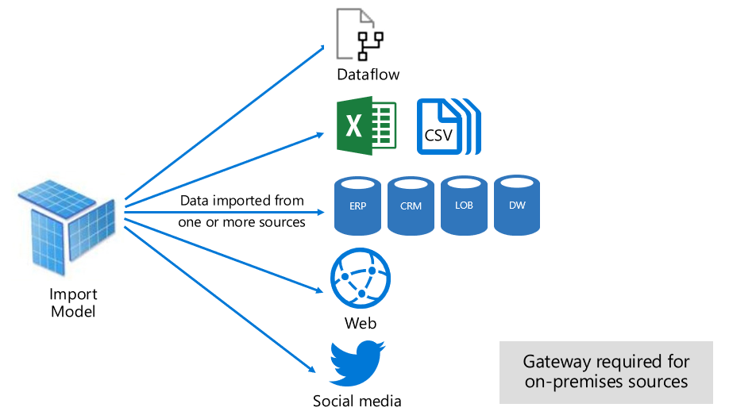
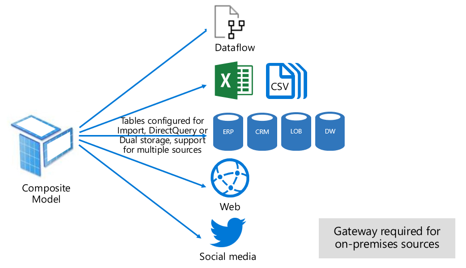

# Dataset modes in the Power BI service

This article provides a technical explanation of Power BI dataset modes. It applies to datasets that represent a live connection to an external-hosted Analysis Services model, and also to models developed in Power BI Desktop. the article emphasizes the rationale for each mode, and possible impacts on Power BI capacity resources.

The three dataset modes are:

- [Import](#import-mode)
- [DirectQuery](#directquery-mode)
- [Composite](#composite-mode)

## Import mode

_Import_ mode is the most common mode used to develop models. This mode delivers extremely fast performance thanks to in-memory querying. It also offers design flexibility to modelers, and support for specific Power BI service features (Q&A, Quick Insights, etc.). Because of these strengths, it's the default mode when creating a new Power BI Desktop solution.

It's important to understand that imported data is always stored to disk. When queried or refreshed, the data must be fully loaded into memory of the Power BI capacity. Once in memory, Import models can then achieve blazingly fast query results. It's also important to understand that there's no concept of an Import model being partially loaded into memory.

When refreshed, data is compressed and optimized and then stored to disk by the VertiPaq storage engine. When loaded from disk into memory, it's possible to see 10x compression. So, it's reasonable to expect that 10 GB of source data can compress to about 1 GB in size. Storage size on disk can achieve a 20% reduction on top this size. (The difference in size can be determined by comparing the Power BI Desktop file size with the Task Manager memory usage of the file.)

Design flexibility can be achieved in three ways. Data modelers can:

- Integrate data by caching data from dataflows, and external data sources—whatever the data source type or format
- Leverage the entire set of [Power Query Formula Language](/powerquery-m/) (informally referred to as M) functions when creating data preparation queries
- Leverage the entire set of [Data Analysis Expressions (DAX)](/dax/) functions when enhancing the model with business logic. There's support for calculated columns, calculated tables, and measures.

As shown in the following image, an Import model can integrate data from any number of supported data source types.

However, while there are compelling advantages associated with Import models, there are disadvantages, too:

- The entire model must be loaded to memory before Power BI can query the model, which can place pressure on available capacity resources—especially as the number and size of Import models grow
- Model data is only as current as the latest refresh, and so Import models need to be refreshed, usually on a scheduled basis
- A full refresh will remove all data from all tables and reload it from the data source. This operation can be very expensive in terms of time and resources for the Power BI service, and the data source(s).

    > [!NOTE]
    > Power BI can achieve incremental refresh to avoid truncating and reloading entire tables. However, this feature is only supported when the dataset is hosted in workspaces on Premium capacities. For more information, see the [Incremental refresh in Power BI Premium](service-premium-incremental-refresh.md) article.

From a Power BI service resource perspective, Import models require:

- Sufficient memory to load the model when it's queried or refreshed
- Processing resources and additional memory resources to refresh data

## DirectQuery mode

_DirectQuery_ mode is an alternative to Import mode. Models developed in DirectQuery mode don't import data. Instead, they consist only of metadata defining the model structure. When the model is queried, native queries are used to retrieve data from the underlying data source.

There are two main reasons to consider developing a DirectQuery model:

- When data volumes are too large—even when [data reduction methods](guidance/import-modeling-data-reduction.md) are applied—to load into a model, or practically refresh
- When reports and dashboards need to deliver "near real-time" data, beyond what can be achieved within scheduled refresh limits. (Scheduled refresh limits are eight times a day for shared capacity, and 48 times a day for a Premium capacity.)

There are several advantages associated with DirectQuery models:

- Import model size limits don't apply
- Models don't require refresh
- Report users will see the latest data when interacting with report filters and slicers. Also, report users can refresh the entire report to retrieve current data.
- Real-time reports can be developed by using the [Automatic page refresh](desktop-automatic-page-refresh.md) feature
- Dashboard tiles, when based on DirectQuery models, can update automatically as frequently as every 15 minutes

However, there are many disadvantages and limitations associated with DirectQuery models:

- The model must be based on a single supported data source. That's why any data integration must already be achieved in the data source. Supported data sources are relational and analytic systems, with support for many popular data stores.

    > [!TIP]
    > Many Microsoft data sources are supported. Microsoft data sources include SQL Server, Azure Data Bricks, Azure HDInsight Spark (Beta), Azure SQL Database and Azure SQL Data Warehouse. For more information, see the [Data sources supported by Direct Query in Power BI](desktop-directquery-data-sources.md) article.

- Performance can be slow, potentially negatively impacting on the Power BI service. This could be because some queries can be very CPU-intensive for the Power BI service. It could also be because the data source is not optimized for the queries that Power BI sends.
- Power Query queries must be fold-able. This requirement means that Power Query logic can't be overly complex. Further, the logic must be limited to use M expressions and functions that can be transposed to native SQL queries understood by the data source.
- DAX formula are limited to use only functions that can be transposed to native SQL queries understood by the data source. Also, there's no support for calculated tables or DAX Time Intelligence functions.
- Model queries that require retrieval of more than one million rows will fail
- Reports and dashboards with multiple visuals can display inconsistent results, especially when the data source is volatile
- The Q&A and Quick Insights features aren't supported

From a Power BI service resource perspective, DirectQuery models require:

- Minimal memory to load the model (metadata only) when it's queried
- Sometimes the Power BI service must use significant processor resources to generate and process queries sent to the data source. When this happens, it can impact on throughput, especially when concurrent users are querying the model.

For more information, see the [Use Direct Query in Power BI Desktop](desktop-use-directquery.md) article.

## Composite mode

_Composite_ mode can mix Import and DirectQuery modes, or integrate multiple DirectQuery data sources. Models developed in Composite mode support configuring the storing mode for each model table. This mode also supports calculated tables (defined with DAX) and integrating multiple DirectQuery data sources.

The table storage mode can be configured as Import, DirectQuery, or Dual. A table configured as Dual storage mode is both Import and DirectQuery, and this setting allows the Power BI service to determine the most efficient mode to use on a query-by-query basis.

Composite models strive to deliver the best of Import and DirectQuery modes. When configured appropriately they can combine high query performance of in-memory models with the ability to retrieve near real-time data from data sources.

Data modelers who develop Composite models are likely to configure dimension-type tables in Import or Dual storage mode, and fact-type tables in DirectQuery mode. For more information about model table roles, see the [Understand star schema and the importance for Power BI](guidance/star-schema.md) article.

For example, consider a model with a **Product** dimension-type table in Dual mode, and a **Sales** fact-type table in DirectQuery mode. The **Product** table could be efficiently and quickly queried from in-memory to render a report slicer. The **Sales** table could also be queried in DirectQuery mode with the related **Product** table. The latter query could enable the generation of a single efficient native SQL query that joins **Product** and **Sales** tables, and filters by the slicer values.

In general, for Composite models, the advantages and disadvantages associated with each model mode apply to table storage mode.

For more information, see the [Use composite models in Power BI Desktop](desktop-composite-models.md) article.

## Next steps

- [Datasets in the Power BI service](service-datasets-understand.md)
- [Storage mode in Power BI Desktop](desktop-storage-mode.md)
- [Using DirectQuery in Power BI](desktop-directquery-about.md)
- [Use composite models in Power BI Desktop](desktop-composite-models.md)
- More questions? [Try asking the Power BI Community](https://community.powerbi.com/)
