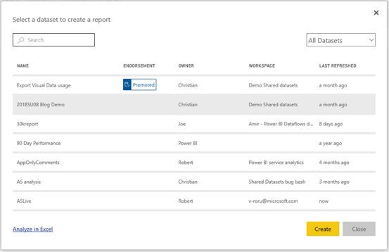

# Use datasets across workspaces

Learn how you can share a dataset with users across the org and enable them to build reports based on it in their own workspaces.

Business Intelligence is a collaborative activity. It is important to establish standardized dataset that can be the 'one source of truth.' Discovering and reusing existing data models is a key part of this. When users use the official datasets to build reports, the organization can use consistent data for decisions and a healthy data culture.

Power BI makes it easy for report authors to find and use high-quality, official datasets they can use wherever they are in Power BI, using a powerful dataset discovery experience. Dataset owners can certify or promote their datasets to enable others to discover it easily, while keeping in full control of who has access to the data using the Build permission. You can also make it easier to discover your dataset by using the Endorsement feature. Tenant administrators can govern this flow of data within the organization by using a new tenant setting.

## Discovering datasets (Preview)

When building a report on top of an existing dataset, the author needs to connect to the dataset in the first step. This is possible in both, the Power Service and the Power BI Desktop:

In both cases the user lands in the dataset discovery experience which shows all datasets the user has access to, independent of the workspace the user is currently in:

A dataset shows up in this list if it meets at least one of the following conditions:

- The dataset is part of a new workspace experience where the user is a member (see [Considerations and limitations](#considerations-and-limitations)).
- The user has Build permission for the dataset residing in a new workspace experience.
- The dataset is part of the user's My Workspace

> [!NOTE]
> Free users only see datasets from My Workspace or datasets with Build permission from Premium-capacity workspaces.

Once they click **Create** a Live Connection to the dataset is created and the report creation experience opens with the full dataset available. In this state authors can use all tables and measures in the dataset to build their own reports. Row-level security (RLS) restrictions on the dataset are in effect in this experience, so report authors can only see data they have permissions to see based on their RLS role(s).

When saving the report to the current workspace (working in the service) or publishing the report to a workspace (working in the Desktop) Power BI will automatically create a new entry in the list of datasets if the report is based on a dataset outside of the workspace. This entry is a reference to the dataset, as indicated by the different icon, so members of the workspace know which datasets are being used by reports and dashboards in the workspace. The entry shows meta-information about the dataset and a few select actions.

## Using the Build permission

The Build permission is a permission type that is only relevant for datasets. It grants users the permission to build new content on top of a dataset, within Power BI (reports, dashboards, pinned tiles from Q&A and Insights Discovery) and outside of Power BI (Excel sheets via Analyze in Excel, XMLA, export).

Users can get the permission in different ways:

- A member of the workspace where the dataset resides can assign the permission to specific users or security groups in the Permission Center (click the ellipsis (…) next to a dataset > **Manage Permissions** ).
- An admin or member of the workspace where the dataset resides can decide during app publishing that all users with permission for the app should also get the Build permission for the underlying datasets.
- A user with Reshare permission on the dataset who also has the Build permission can specify during sharing a report or dashboard built on top of that dataset that the sharing recipients should get the Build permission for the underlying dataset.

Note that this permission was introduced in April 2019 as a complement to the existing permissions Read and Reshare. When introduced, all users who had Read permission for datasets via app permissions, sharing, or workspace access also got Build permissions for the datasets contained in those apps or used by the content they could access. This is reflective of the fact that the Read permission already granted users the right to build new content on top of the dataset, by using Analyze in Excel, or Export. Now, with more this new more granular Build permission, you can choose who can only view the content in the existing report or dashboard and which users can create new content connected to the underlying datasets.

Read about [Certifying and promoting datasets].

Read about [Governing the use of datasets across workspaces].

## Considerations and limitations

- Building a report on top of a dataset that is in a different workspace requires the new workspace experience at both ends: the report needs to be in the new workspace experience and the dataset needs to be in the new workspace experience.
- In a classic workspace the dataset discovery experience only shows the datasets in that workspace.
- Reports based on datasets in different workspaces can't be added to apps.
- Free users in Desktop only see datasets from My Workspace and from Premium-based workspaces.
- If a dataset is being used by a report outside of the dataset workspace, you can't delete that dataset. Instead, you see an error message.

## Next steps

* Questions? [Try asking the Power BI Community](http://community.powerbi.com/)
