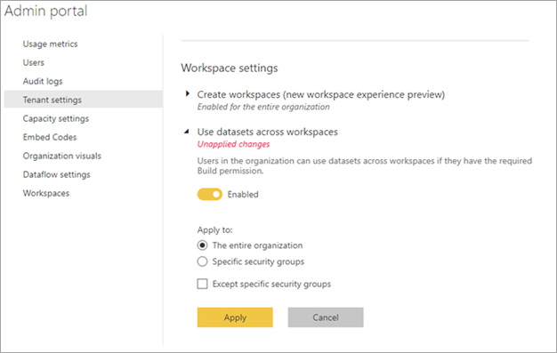

# Control the use of datasets across workspaces

While using datasets across workspaces is a powerful way to drive data culture and data democratization within an organization, there are also cases where customers want to restrict the flow of information with their Power BI tenant. They can do this using the tenant setting **Use datasets across workspaces**. If this setting is disabled (completely or partially per security groups) then users can't produce new context within Power BI across different workspaces:

- The dataset discovery experience only shows datasets within the current workspace (when working in the service) or datasets from workspaces where the user is a member (when working in the service).
- When working in Desktop, the report can only be published into the same workspace that also holds the dataset.
- The **Create Report** button is blocked for existing reference items.
- The **Make a copy** button is blocked for existing content packs.
- The **Save As** button is not available for reports that are based on a dataset in a different workspace.

## Next steps

* Questions? [Try asking the Power BI Community](http://community.powerbi.com/)
