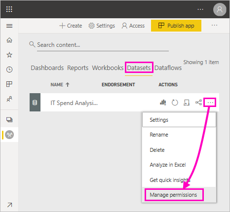
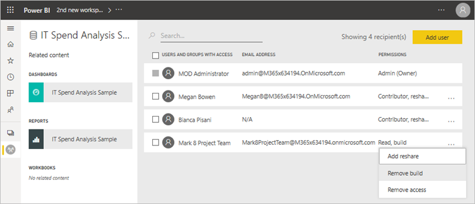
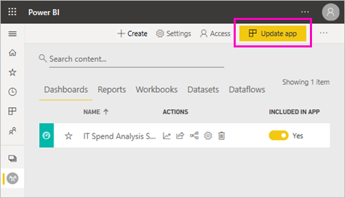
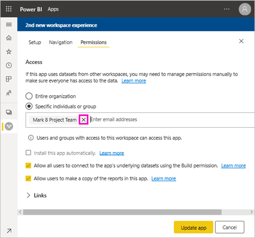
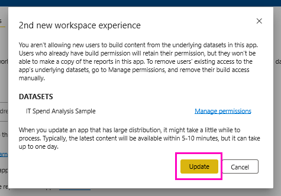
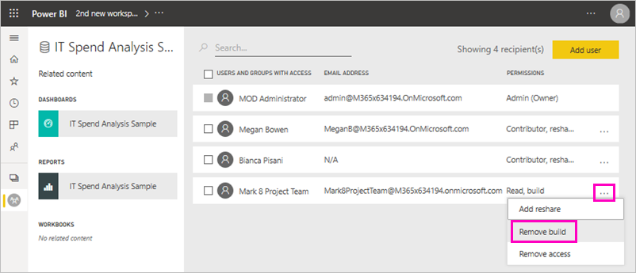

# Build permission for shared datasets (preview)

As a creator of *data models* in Power BI Desktop, you can share them as *datasets* in the Power BI service. Then report creators can easily discover and reuse the datasets you've shared. Learn how you control who has access to the data by using Build permission.

The Build permission type is only relevant for datasets. With it, users can build new content on a dataset, such as reports, dashboards, pinned tiles from Q&A, and Insights Discovery. They can also build new content on the dataset outside Power BI, such as Excel sheets via Analyze in Excel, XMLA, and export underlying data.

Users get Build permission in different ways:

- If you're a member of a workspace with at least a Contributor role, you automatically have Build permission for a dataset, and permission to copy a report.
 
- A member of the workspace where the dataset resides can assign the permission to specific users or security groups in the Permission center. Select the ellipsis (…) next to a dataset > **Manage Permissions**.

    

    That opens the Permission center for that dataset, where you can set and change permissions.

    

- An admin or member of the workspace where the dataset resides can decide during app publishing that users with permission for the app also get Build permission for the underlying datasets. See [Share a dataset](service-datasets-share.md) for details.

- Say you have Reshare and Build permission on a dataset. When you share a report or dashboard built on that dataset, you can specify that the recipients also get Build permission for the underlying dataset.

    

You can remove a person's Build permission for a dataset. If you do, they can still see the report built on the shared dataset, but they can no longer edit it. See the next section for details.

## Remove Build permission

Say you've distributed an app to a group of people. Later, you decide to remove access to the app for some people. Removing their access to the app doesn't automatically remove their build and reshare permissions.  

1. In the workspace list page, select **Update app**. 

    

1. On the **Permissions** tab, select the **X** to delete the person or group. 

    

1. Select **Update app**.

    You see a message explaining that you need to go to **Manage permissions** to remove Build permission for users with existing access. 

    

1. Select **Update**.

1. In the workspace, go to the **Datasets** list page. 
1. Select the ellipsis (...) next to the dataset > **Manage permission**.

    

1. Select the ellipsis (...) next to their name > **Remove build**.

    

    They can still see the report built on the shared dataset, but they can no longer edit it.

## More granular permissions

Power BI introduced Build permission in June 2019 as a complement to the existing permissions, Read and Reshare. All users who already had Read permission for datasets via app permissions, sharing, or workspace access at that time also got Build permission for those same datasets. They got Build permission automatically because Read permission already granted them the right to build new content on top of the dataset, by using Analyze in Excel or Export.

With this more granular Build permission, you can choose who can only view the content in the existing report or dashboard and who can create content connected to the underlying datasets.

If your dataset is being used by a report outside the dataset workspace, you can't delete that dataset. Instead, you see an error message.

You can remove Build permission. If you do, the people whose permissions you have revoked can still see the report, but can no longer edit the report or export underlying data. Users with only read permission can still export summarized data. 

## Next steps

- [Use datasets across workspaces (Preview)](service-datasets-across-workspaces.md)
- Questions? [Try asking the Power BI Community](http://community.powerbi.com/)
