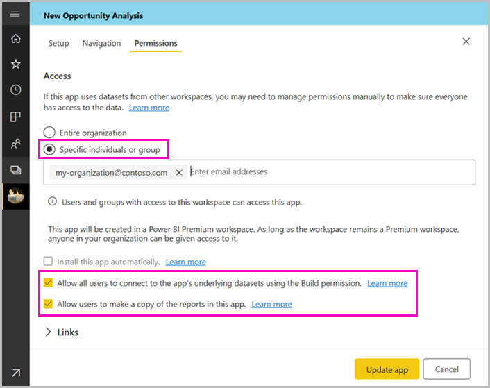
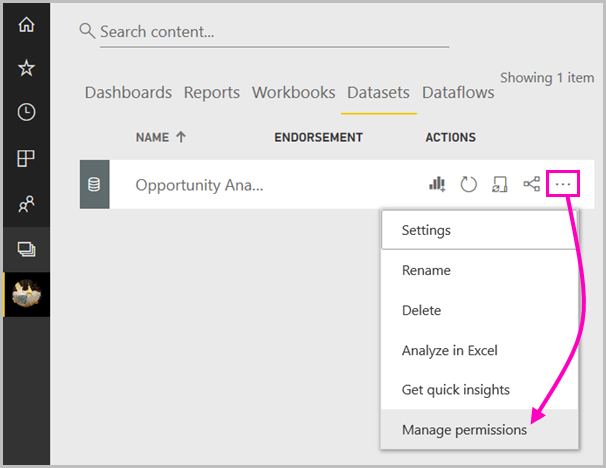
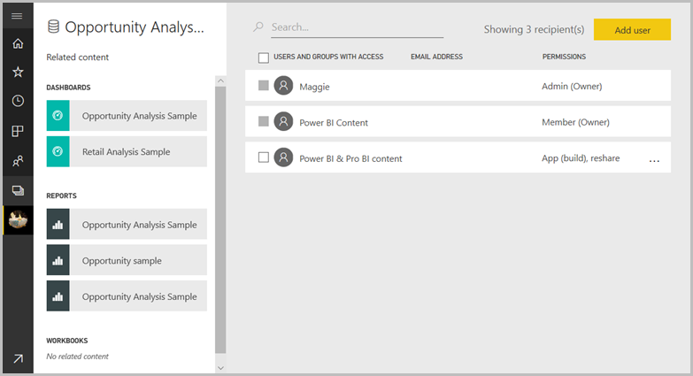
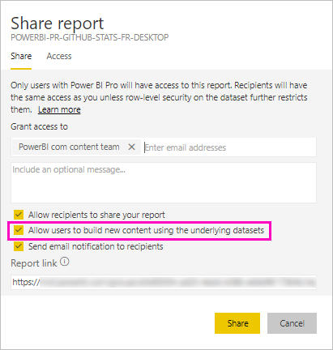
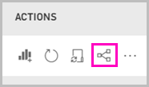
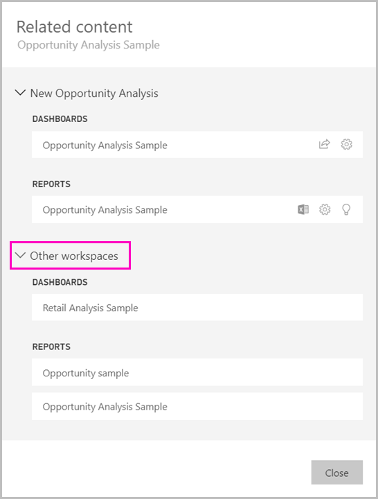

# Create and share datasets (Preview)

As a *dataset*, or *data model*, creator, you can create datasets for others to easily discover and reuse. Learn how to share them, and how you control who has access to the data by using the Build permission.

## Steps to sharing your dataset

1. You start by creating a .pbix file with a data model in Power BI Desktop. If you're planning to offer this dataset for others to build reports, you may not even design a report in the .pbix file.

    A best practice is to save the .pbix file to an Office 365 group.

1. Publish the .pbix file to a [new experience workspace](service-create-the-new-workspaces.md) in the Power BI service.
    
    Already, other members of this workspace can create reports in other workspaces based on this dataset.

1. Now you can [create an app](service-create-distribute-apps.md) from this workspace. When you do, on the **Permissions** page, you specify who has permissions and what they can do.

    > [!NOTE]
    > If you select **Entire organization**, then no one in the organization will have Build permissions. This issue is already known. Instead, specify email addresses in **Specific individuals or groups**.  If you want your entire organization to have Build permissions, specify an email alias for the entire organization.

    

1. Select **Publish app**, or **Update app** if it's already published.

## Build permissions for shared datasets

The Build permission type is only relevant for datasets. With it, users can build new content on a dataset, such as reports, dashboards, pinned tiles from Q&A, and Insights Discovery. They can also build new content on the dataset outside Power BI, such as Excel sheets via Analyze in Excel, XMLA, and export.

Users get Build permission in different ways:

- A member of the workspace where the dataset resides can assign the permission to specific users or security groups in the Permission center. Select the ellipsis (…) next to a dataset > **Manage Permissions**.

    

    That opens the Permission center for that dataset, where you can set and change permissions.

    

- An admin or member of the workspace where the dataset resides can decide during app publishing that users with permission for the app also get Build permission for the underlying datasets. See [Steps to sharing your dataset](#steps-to-sharing-your-dataset) for details.

- Say you have Reshare and Build permissions on a dataset. When you share a report or dashboard built on top of that dataset you can specify that the recipients also get Build permission for the underlying dataset.

    

You can remove people's Build permissions for a dataset. If you do, they can still see the report built on the shared dataset, but they can no longer edit it.

## More granular permissions

Power BI introduced the Build permission in June 2019 as a complement to the existing permissions, Read and Reshare. All users who already had Read permission for datasets via app permissions, sharing, or workspace access at that time also got Build permissions for those same datasets. They got Build permission automatically because Read permission already granted them the right to build new content on top of the dataset, by using Analyze in Excel or Export.

With this more granular Build permission, you can choose who can only view the content in the existing report or dashboard and who can create content connected to the underlying datasets.

If your dataset is being used by a report outside the dataset workspace, you can't delete that dataset. Instead, you see an error message.

You can remove build permissions. If you do, the people whose permissions you have revoked can still see the report, but can no longer edit the report.

## Track your dataset usage

When you have a shared dataset in your workspace, you may need to know what reports in other workspaces are based on it.

1. In the Datasets list view, select **View related**.

    

1. The **Related content** dialog box shows all related items. In this list, you see the related items in this workspace and in **Other workspaces**.
 
    

## Next steps

- [Promote datasets](service-datasets-promote.md)
- [Certify datasets](service-datasets-certify.md)
- [Govern the use of datasets across workspaces](service-datasets-admin-across-workspaces.md)
- Questions? [Try asking the Power BI Community](http://community.powerbi.com/)
