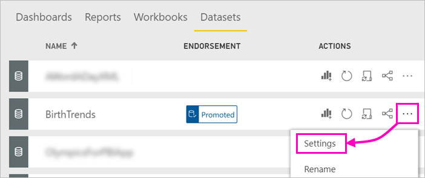
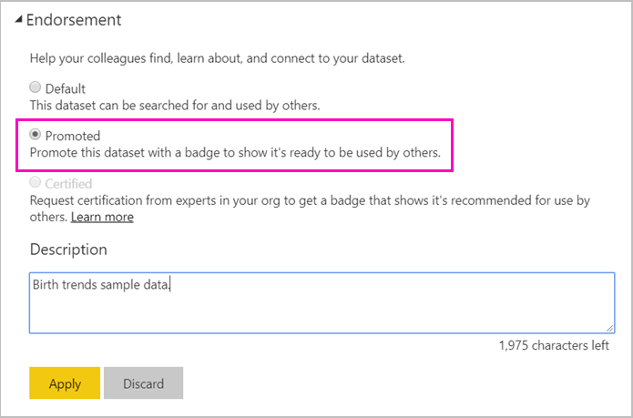

# Promote your dataset (Preview)

Your Power BI report creators may now have access to many different datasets, so enterprises need to guide them to the reliable, high-quality datasets. Power BI provides two ways to *endorse* datasets:

- **Promotion**: As a dataset owner, you can promote your own datasets when they're ready for wide-spread usage. Promotion supports the collaborative spread of datasets within organizations. This article is about promoting your dataset.
- **Certification**: You can request certification for a promoted dataset. A select group of users defined in the **Dataset Certification** tenant admin setting decides which datasets to certify. See [Certify datasets (Preview)](service-datasets-certify.md) for details.

## Promote a dataset

Your dataset needs to be in a new workspace experience workspace in the Power BI service when you're ready to promote it.

1. Go to the list of datasets in the workspace.
 
3. Select the ellipsis (...), then select **Settings**.

    

4. Expand **Endorsement** > select **Promoted**.

    

5. Select **Apply**.

## Request dataset certification

Your tenant admin has identified people in your organization who can certify datasets. You can ask that they certify your dataset.

1. Give the certifier member permissions for the workspace where the dataset resides.

1. In the **Endorsement** section of **Settings**, **Certified** is grayed out.

2. Select the **Learn more** link.

    Your Power BI tenant admin can configure the **Learn more** link to go to a specified location with details about the certification process in your tenant.   If they haven't customized the **Learn more** link, by default it points to the [dataset certification](service-datasets-certify.md) article.

## Next steps

* Read about [Using datasets across workspaces](service-datasets-across-workspaces.md)
* Questions? [Try asking the Power BI Community](http://community.powerbi.com/)
