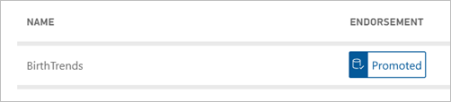

# Certify and promote datasets

Power BI users may now have access to many different datasets, so enterprises need to guide them to the reliable, high-quality datasets. Power BI provides two ways to *endorse* datasets:

- **Promotion**: Dataset owners can promote their own datasets when they feel they're good enough for wide-spread usage. Promotion supports the collaborative spread of datasets within organizations.
- **Certification**: A select group of users defined in the **Dataset Certification** tenant admin setting can certify datasets.

## Find an endorsed dataset

Promoted and certified datasets display *badges* that you see both when looking for a dataset and in the list of datasets in a workspace. 

- In the Power BI service: **Get data** > **Published datasets**.
- In Power BI Desktop: **Get data** > **Power BI datasets**.

    In the **Select a dataset** dialog box, endorsed datasets top the list by default. 

    

## Promote a dataset

Your dataset needs to be in a workspace in the Power BI service when you're ready to promote it.

1. Go to the list of datasets in the workspace.
 
3. Select the ellipsis (...) > **Settings**. 

    

4. Expand **Endorsement** > select **Promoted**.

    

5. Add a description > **Apply**.

## Request dataset certification

If your tenant admin names you as someone who can create certified datasets, the **Certified** option in the **Endorsement** section of **Settings** is available. 

1. Select **Certified**.
2. Add a description > **Apply**.

Tenant admins can provide a URL for the **Learn more** link on the **Endorsement** setting page.  They can link to documentation about their certification process. By default, the **Learn more** link points to this article.

Read more about how tenant admins [control the use of datasets across workspaces](service-datasets-admin-across-workspaces.md).

## Next steps

* Read about [Using datasets across workspaces](service-datasets-across-workspaces.md)
* Questions? [Try asking the Power BI Community](http://community.powerbi.com/)
