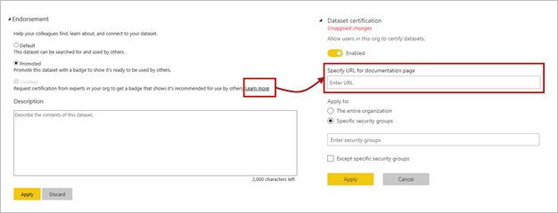

# Certify and promote datasets

With Power BI users having easy access to a plethora of datasets to work with, it is imperative for enterprises to guide their users to reliable, high-quality datasets. To this end, Power BI provides a way to endorse datasets. Endorsement comes in two flavors:

- **Promotion** : dataset owners can promote their datasets at any point when they feel they&#39;re good enough for wide-spread usage. This endorsement type is designed to support the viral, collaborative spreading of datasets within orgs.
- **Certification** : a dataset can only be certified by a select group of users which are defined in the **Dataset Certification** tenant admin setting.

In both cases, datasets are shown with badges in the discovery experience as well as the list of datasets in a workspace. In the discovery experience, endorsed datasets are shown on top of the list by default. The endorsement values can be set on a dataset&#39;s Settings page.

The **Dataset Certification** setting also allows a tenant admin to provide a URL. This URL is used in the **Learn more** link on the Endorsement setting page and allows organizations to set up documentation about the certification process. By default, the **Learn more** link points to this documentation page.

## Next steps
* Read about [organizing work in the new workspaces (preview) in Power BI](service-new-workspaces.md)
* [Create the current workspaces](service-create-workspaces.md)
* [Install and use apps in Power BI](service-create-distribute-apps.md)
* Questions? [Try asking the Power BI Community](http://community.powerbi.com/)
