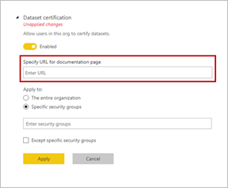

# Certify datasets (Preview)

Your organization can certify datasets that are the authoritative source for critical information. These datasets are featured prominently when report designers start creating a report and looking for reliable data. Certification can be a highly selective process, with only the most valuable datasets getting certified. Power BI tenant admins have a new setting, so they can tightly control who can certify datasets. Thus, admins can ensure that dataset certification results in truly reliable and authoritative datasets designed for use across the organization.

Power BI users may now have access to many different datasets, so enterprises need to guide them to the reliable, high-quality datasets. Power BI provides two ways to *endorse* datasets:

- **Promotion**: Dataset owners and others in a workspace can promote their datasets when they're ready for wide-spread usage. See [Promote your dataset](service-datasets-promote.md) for details. 
- **Certification**: Dataset owners can request certification of a promoted dataset. A select group of users defined in the **Dataset Certification** tenant admin setting decides which datasets to certify. The name of the person who certified a dataset is displayed in a tooltip during the dataset discovery experience; hover over the **Certified** label and you see it.

## Certify a dataset

Your tenant admin can provide a URL for the **Learn more** link on the **Endorsement** setting page.  They can link to documentation about your certification process. If they don't provide a destination for the **Learn more** link, by default it points to this article.

Being named someone who can certify datasets is clearly a big responsibility. When a dataset creator contacts you about certifying a dataset, that's the beginning of your vetting process. When you're satisfied that a dataset merits certification, here are your last steps.

1. The dataset owner needs to give you member permissions for the workspace where the dataset resides.
1. If your tenant admin has named you as someone who can certify datasets, the **Certified** option in the **Endorsement** section of **Settings** for the dataset is available. Select **Certified**.
1. Select **Apply**.

Read more about how tenant admins [control the use of datasets across workspaces](service-datasets-admin-across-workspaces.md).

## Next steps

* Read about [Using datasets across workspaces](service-datasets-across-workspaces.md)
* Questions? [Try asking the Power BI Community](http://community.powerbi.com/)
