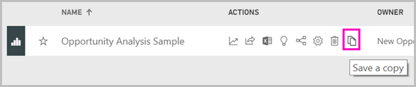
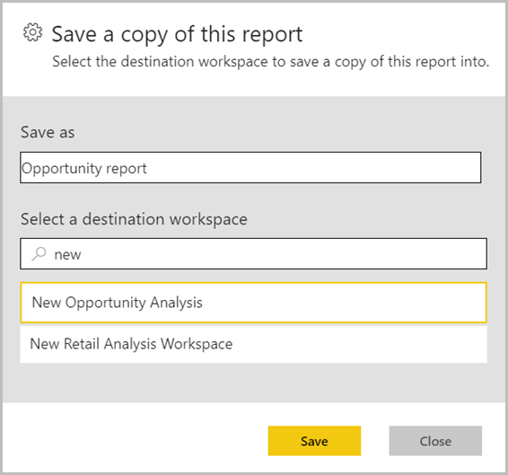
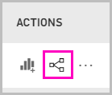
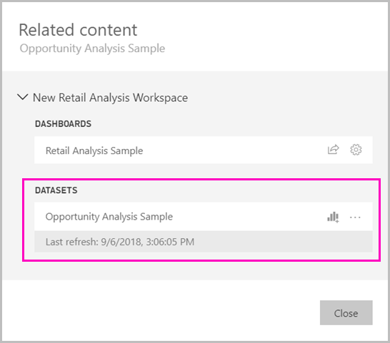

# Copy reports from other workspaces (Preview)

Learn how you can copy a report from one workspace and save it to a different workspace. Then you can modify that report, adding or deleting visuals and other elements.

When you find a report you like, in a workspace or an app, you can make a copy of it, and then modify it to fit your needs. You don't have to worry about creating the data model. It's already created for you. And it's much easier to modify an existing report than it is to start from scratch.

## Save a copy of a report

1. In an app or a workspace, go to the Reports list view.

1. Under **Actions**, select **Save a copy**.

    

    You only see the **Save a copy** icon if the report is in a new experience workspace, and you have [Build permissions](service-datasets-build-permissions.md#build-permissions-for-shared-datasets). Even if you have access to the workspace, you have to have Build permissions for the dataset.

3. In **Save a copy of this report**, give the report a name and select the destination workspace.

    

    You can save the report to the current workspace or a different one in the Power BI service. You only see workspaces that are new experience workspaces, in which you're a member.
  
4. Select **Save**.

    When you save a copy of the report, you create a live connection to the dataset, and you can open the report creation experience with the full dataset available. You haven't made a copy of the dataset. The dataset still resides in its original location. You can use all tables and measures in the dataset in your own report. Row-level security (RLS) restrictions on the dataset are in effect, so you only see data you have permissions to see based on your RLS role.

    Power BI automatically creates an entry in the list of datasets if the report is based on a dataset outside of the workspace. The icon for this dataset is different from the icon for datasets in the workspace: 

    That way, members of the workspace can tell which reports and dashboards use datasets that are outside the workspace. The entry shows information about the dataset, and a few select actions.

    

## View related datasets

When you have a report in your workspace, you may need to know what dataset it's based on.

1. In the Reports list view, select **View related**.

    

1. The **Related content** dialog box shows all related items. In this list, the dataset looks like any other. You can't tell it resides in a different workspace.
 
    

## Next steps

- [Promote datasets](service-datasets-promote.md)
- [Certify datasets](service-datasets-certify.md)
- [Govern the use of datasets across workspaces](service-datasets-admin-across-workspaces.md)
- Questions? [Try asking the Power BI Community](http://community.powerbi.com/)
