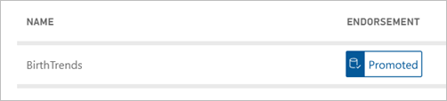

# Discover datasets from different workspaces (Preview)

Learn how you can find and use datasets from other workspaces to build reports in your own workspaces. To build a report on top of an existing dataset, the first step is to find the dataset, either in the Power service or Power BI Desktop.

- In the Power BI service: **Get data** > **Published datasets**.
- In Power BI Desktop: **Get data** > **Power BI datasets**.

    
   
In either case, the dataset discovery experience starts in this dialog box, **Select a dataset to create a report**. You see all the datasets you have access to, regardless of the workspace you are in currently:

The datasets you see in this list meet at least one of the following conditions:

- The dataset is in one of the new workspace experience workspaces, and you're a member of that workspace. See [Considerations and limitations](service-datasets-across-workspaces.md#considerations-and-limitations).
- You have Build permission for the dataset, which is in a new workspace experience workspace.
- The dataset is in your My Workspace.

> [!NOTE]
> Free users only see datasets in their My Workspace, or datasets for which they have Build permission that are in Premium-capacity workspaces.

When you click **Create**, you create a Live Connection to the dataset, and the report creation experience opens with the full dataset available. You can use all tables and measures in the dataset to build your own reports. Row-level security (RLS) restrictions on the dataset are in effect, so you only see data you have permissions to see based on your RLS role.

You can save the report to the current workspace in the Power BI service, or publish the report to a workspace from Power BI Desktop. Power BI automatically creates an entry in the list of datasets if the report is based on a dataset outside of the workspace. The icon for this entry is different from the icon for datasets in the workspace. That way, members of the workspace can tell which reports and dashboards use datasets that are outside the workspace. The entry shows meta-information about the dataset, and a few select actions.

## Find an endorsed dataset

Promoted and certified datasets display *badges* that you see both when looking for a dataset and in the list of datasets in a workspace. 

- In the Power BI service: **Get data** > **Published datasets**.
- In Power BI Desktop: **Get data** > **Power BI datasets**.

    In the **Select a dataset** dialog box, endorsed datasets top the list by default. 

    

## Next steps

- [Promote datasets](service-datasets-promote.md)
- [Certify datasets](service-datasets-certify.md)
- [Govern the use of datasets across workspaces](service-datasets-admin-across-workspaces.md)
- Questions? [Try asking the Power BI Community](http://community.powerbi.com/)
