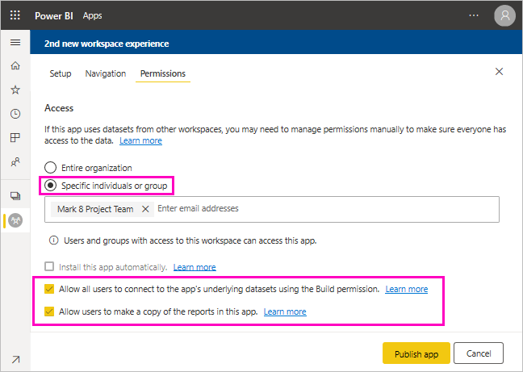

# Share a dataset (preview)

As a creator of *data models* in Power BI Desktop, you're creating *datasets* that you can distribute in the Power BI service. Then other report creators can use your datasets as a basis for their own reports. In this article, you learn how to share your datasets. To learn how to give and remove access to your shared datasets, read about the [Build permission](service-datasets-build-permissions.md).

## Steps to sharing your dataset

1. You start by creating a .pbix file with a data model in Power BI Desktop. If you're planning to offer this dataset for others to build reports, you may not even design a report in the .pbix file.

    A best practice is to save the .pbix file to an Office 365 group.

1. Publish the .pbix file to a [new experience workspace](service-create-the-new-workspaces.md) in the Power BI service.
    
    Already, other members of this workspace can create reports in other workspaces based on this dataset.

1. You can also [publish an app](service-create-distribute-apps.md) from this workspace. When you do, on the **Permissions** page, you specify who has permissions and what they can do.

    > [!NOTE]
    > If you select **Entire organization**, then no one in the organization will have Build permission. This issue is already known. Instead, specify email addresses in **Specific individuals or groups**.  If you want your entire organization to have Build permission, specify an email alias for the entire organization.

    

1. Select **Publish app**, or **Update app** if it's already published.

## Track your dataset usage

When you have a shared dataset in your workspace, you may need to know what reports in other workspaces are based on it.

1. In the Datasets list view, select **View related**.

    

1. The **Related content** dialog box shows all related items. In this list, you see the related items in this workspace and in **Other workspaces**.
 
    

## Next steps

- [Use datasets across workspaces (Preview)](service-datasets-across-workspaces.md)
- Questions? [Try asking the Power BI Community](http://community.powerbi.com/)
