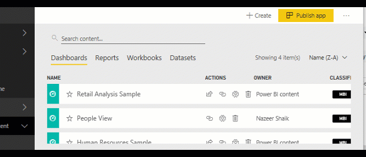
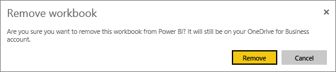
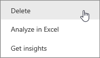
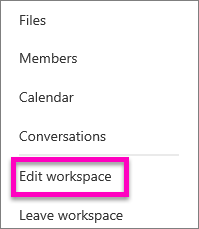
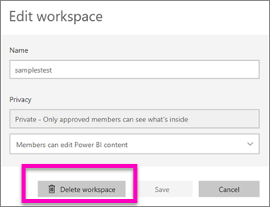
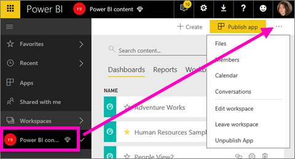

# Delete almost anything in Power BI service
This article teaches you how to delete a dashboard, report, workbook, dataset, app, visualization, and workspace in Power BI service.

## Delete a dashboard
Dashboards can be removed. Removing the dashboard does not delete the underlying dataset or any reports associated with that dashboard.

* If you are the owner of the dashboard, you can remove it. If you've shared the dashboard with colleagues, removing the dashboard from your Power BI workspace will remove the dashboard from their Power BI workspaces.
* If a dashboard is shared with you and you no longer want to see it, you can remove it.  Removing a dashboard does not remove it from anyone else's Power BI workspace.
* If a dashboard is part of an [organizational content pack](service-organizational-content-pack-disconnect.md), the only way to remove it is to remove the associated dataset.

### To delete a dashboard
1. In your workspace, select the **Dashboards** tab.
2. Locate the dashboard to delete and select the Delete icon .

    

## Delete a report
Don't worry, deleting a report does not delete the dataset that the report is based on.  And any visualizations that you pinned from the report are also safe -- they remain on the dashboard until you delete them individually.

### To delete a report
1. In your workspace, select the **Reports** tab.
2. Locate the report to delete and select the Delete icon   .   

    
3. Confirm the deletion.

   

   > [!NOTE]
   > If the report is part of a [content pack](service-organizational-content-pack-introduction.md), you will not be able to delete it using this method.  See [Remove your connection to an organizational content pack](service-organizational-content-pack-disconnect.md).
   >
   >

## Delete a workbook
Workooks can be removed. However, removing a workbook also removes all reports and dashboard tiles that contain data from this workbook.

If the workbook is stored on OneDrive for Business, deleting it from Power BI does not delete it from OneDrive.

### To delete a workbook
1. In your workspace, select the **Workbooks** tab.
2. Locate the workbook to delete and select the Delete  icon.

    
3. Confirm the deletion.

   

## Delete a dataset
Datasets can be deleted. However, deleting a dataset also deletes all reports and dashboard tiles that contain data from that dataset.

If a dataset is part of one or more [organizational content packs](service-organizational-content-pack-disconnect.md), the only way to delete it is to remove it from the content packs where it's being used, wait for it to be processed, and then try deleting it again.

### To delete a dataset
1. In your workspace, select the **Datasets** tab.
2. Locate the dataset to delete and select the ellipses (...).  

    
3. From the dropdown, select **Delete**.

   
4. Confirm the deletion.

   

## Delete an app workspace
> [!WARNING]
> When you create an app workspace, you create an Office 365 group. And when you delete an app workspace you delete that Office365 group. What this means is that the group will also be deleted from other O365 products like SharePoint and Microsoft Teams.
>
>

As the app workspace author, you can delete it. When you delete it, the associated app is also deleted for all group members and removed from your AppSource if you had published the app to your entire organization. Deleting an app workspace is different from leaving an app workspace.

### To delete an app workspace - if you are an Admin
1. From the left nav, select **Workspaces**

    
2. Select the ellipses (...) to the right of the workspace to be deleted and choose **Edit workspace**.

   
3. In the **Edit workspace** window, select **Delete workspace** > **Delete**.

    

### To remove an app workspace from your list
If you no longer want to be a member of an app workspace, you can ***leave*** it and it will be removed from your list. Leaving a workspace leaves it in place for all other workspace members.  

> [!IMPORTANT]
> If you are the only Admin for the app workspace, Power BI will not allow you to leave.
>
>

1. Start in the app workspace you'd like to remove.
2. In the top-right corner, select the ellipses (...) and choose **Leave workspace** > **Leave**.

      

   > [!NOTE]
   > The options you see in the dropdown depend on whether you are an Admin or Member of that app workspace.
   >
   >

## Delete or remove an App
Apps can be easily removed from your apps list page. But only an app Admin can permanently delete an app.

### Remove an app from your app list page
Deleting an app from your app list page does not delete the app for other members.

1. In your left nav, select **Apps** to open the apps list page.
2. Hover over the app to delete, and select the Delete   icon.

   

   If you remove an app accidentally, you have several options for getting it back.  You can ask the app creator to re-send it, you can find the original email with the link to the app, you can check your [Notifications center](service-notification-center.md) to see if the notification for that app is still listed, or you can check [your organization's AppSource](consumer/end-user-apps.md).

## Considerations and troubleshooting
This article covered how to delete the major building blocks of Power BI service. But there are more things that you can delete in Power BI.  

* [Remove your Featured dashboard](service-dashboard-featured.md)
* [Remove (unfavorite) a dashboard](service-dashboard-favorite.md)
* [Delete a report page](service-delete.md)
* [Delete a dashboard tile](service-dashboard-edit-tile.md)
* [Delete a report visualization](service-delete.md)

More questions? [Try the Power BI Community](http://community.powerbi.com/)
