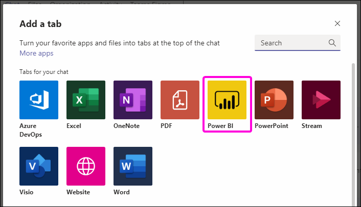
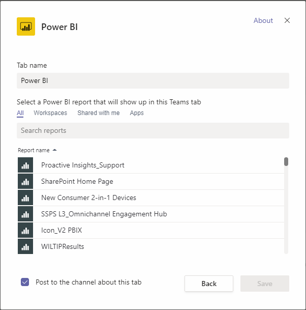

# Embed report with the Power BI tab for Microsoft Teams

With the updated Power BI tab for Microsoft Teams, you can easily embed interactive reports in Microsoft Teams channels and chats.

Use the Power BI tab for Microsoft Teams to help your colleagues find the data your team uses and to discuss the data within your team channels.

Link previews show information about the reports, dashboards, and apps when you paste a link to them into the Microsoft Teams message box. Users can more easily understand which item the link takes them to.

## Requirements

For the **Power BI tab for Microsoft Teams** to work, ensure:

- The user has a Power BI Pro license or the report is contained in a [Power BI Premium capacity (EM or P SKU)](service-premium-what-is.md) with a Power BI license.
- The Power BI tab for Microsoft Teams.
- The user must sign into Power BI service to activate their Power BI license to consume the report.
- The user must have permission to view the report.

Additionally, for the **link previews** to work, ensure:
- The user must meet the requirements to use the Power BI tab for Microsoft Teams.
- The user must sign in to the Power BI Bot service. 

## Embed your report

To embed your report into a Microsoft Teams channel or chat, add it as described below.

1. Open the desired channel or chat in Microsoft Teams and select the **+** icon.

    

2. Select the Power BI tab.

    

3. Use the provided options to pick a report from a Workspace, Shared with me, or a Power BI app

    

4. The Tab name is updated automatically to match the name of the report name, but you can change it. 

5. Press **Save**.

## Supported reports for embedding the Power BI tab

The Tab enables embedding the following reports:

- Interactive and paginated reports
- Reports in My workspace, new workspace experience, and  classic workspaces
- Reports in Power BI apps

## Getting link previews

To get a link prevew for content in the Power BI serivce, follows the steps described below.

1. Copy a link to a report, dashboard, or app in the Power BI service. For examples, use links from the browser address bar.

2. Paste the link to the Microsoft Teams message box. Sign in to the link preview service if prompted. You may need to wait a few seconds for the link preview to load.

3. The basic link preview is shown after successful sign in.

4. Use the expand icon to show the rich preview card.

5. The rich link preview card shows the link and relevant action buttons

6. Send the message.

## Grant access to reports

Embedding a report in Microsoft Teams or sending a link to an item doesn't automatically give users permission to view the report - you need to [allow users to view the report in Power BI](service-share-dashboards.md). You can use an Office 365 Group for your Team to make it easier. 

> [!IMPORTANT]
> Make sure to review who can see the report within the Power BI service and grant access to those not listed.

One way to ensure everyone on your team has access to reports is to place them in a single workspace in Power BI and give the Office 365 Group for your team access to the workspace.

## Link Previews 

Link previews are provided for the following items in Power BI:
- Reports
- Dashboards
- Apps

The link preview service requires the user to sign in. Sign out by using the Power BI icon at the bottom of the message box in Microsoft Teams and selecting sign out.

## Start a conversation

When you add a Power BI report tab to Teams, Teams automatically creates a tab conversation to accompany the report. 

- Select **Show tab conversation** in the upper-right corner.

    

    The first comment is a link to the report. Everyone in that Teams channel can see and discuss the report in the conversation.

    

## Known issues and limitations

- Power BI does not support the same localized languages that Microsoft Teams does. As a result, you may not see proper localization within the embedded report.
- Power BI dashboards can't be embedded in the Power BI Tab for Microsoft Teams.
- A user without a Power BI license or permission to the report will see a "Content is not available" message.
- You may encounter issues if using Internet Explorer 10. <!--You can look at the [browsers support for Power BI](consumer/end-user-browsers.md) and for [Office 365](https://products.office.com/office-system-requirements#Browsers-section). -->
- [URL filters](service-url-filters.md) are not supported with the Power BI tab for Microsoft Teams.
- In national clouds, the new Power BI tab is not available. An older version maybe available that does not support new workspace experience workspace or reports in Power BI apps. 
- Once the tab is saved, the tab name can't be changed through the tab settings. Use the rename option to change it.
- Single Sign-on is not supported for the link preview service.

## Next steps
- [Share a dashboard with colleagues and others](service-share-dashboards.md)  
- [Create and distribute an app in Power BI](service-create-distribute-apps.md)  
- [What is Power BI Premium?](service-premium-what-is.md)

More questions? [Try asking the Power BI Community](https://community.powerbi.com/)
