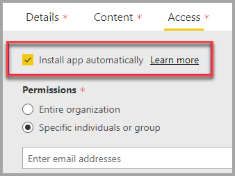

# Embed with report web part in SharePoint Online

With Power BI's new report web part for SharePoint Online, you can easily embed interactive Power BI reports in SharePoint Online pages.

When using the new **Embed in SharePoint Online** option, the embedded reports are fully secure so you can easily create secure internal portals.

## Requirements

There are a few requirements in order for **Embed in SharePoint Online** reports to work.

* You need a Power BI Pro license or a [Power BI Premium capacity (EM or P SKU)](service-premium-what-is.md#premium-capacity-nodes) with a Power BI license.
* The Power BI web part for SharePoint Online requires [Modern Pages](https://support.office.com/article/Allow-or-prevent-creation-of-modern-site-pages-by-end-users-c41d9cc8-c5c0-46b4-8b87-ea66abc6e63b).

## Embed your report

In order to embed your report into SharePoint Online, you first need to get the URL for the report and then use that URL with the new Power BI web part within SharePoint Online.

### Get a URL to your report

1. View the report within the Power BI service.

2. Select the **File** menu item.

3. Select **Embed in SharePoint Online**.

    

4. Copy URL from dialog.

    

### Add the Power BI report to a SharePoint Online page

1. Open the desired page in SharePoint Online and select **Edit**.

    

    Or, create a new modern site page by selecting **+ New** within SharePoint Online.

    

2. Select **+** and select the **Power BI** web part.

    

3. Select **Add report**.

    

4. Paste the report URL into the property pane. This report URL is the URL you copied from the steps above. The report loads automatically.

    

5. Select **Publish** to make the change visible to your SharePoint Online users.

    

## Grant access to reports

Embedding a report in SharePoint Online does not automatically give users permission to view the report. The permissions to view the report are set within the Power BI service.

> [!IMPORTANT]
> Make sure to review who can see the report within the Power BI service and grant access to those not listed.

There are two ways to provide access to the report within the Power BI service. If you are using an Office 365 Group to build your SharePoint Online team site, you list the user as a member of the **app workspace within the Power BI service** and the **SharePoint page**. For more information, see how to [manage an app workspace](service-manage-app-workspace-in-power-bi-and-office-365.md).

Alternatively, you can share a report directly with users by embedding the report within an app. There are a few steps to follow for embedding a report within an app.  

1. The author of the app is a Pro user.

2. The author creates a report in an app workspace. *To share with **Power BI free users**, the app workspace needs to be set as a **Premium workspace**.*

3. The author publishes the app then installs it. *The author needs to make sure to install the app to have access to the report URL that is used to embed in SharePoint Online.*

4. Now all end users need to install the app too. However, you can set the app to be preinstalled for end users by using the **Install app automatically** feature, which can be enabled in the [Power BI admin portal](service-admin-portal.md).

   

5. The author opens the app and goes to the report.

6. The author copies the embed report URL from the report installed by the app. *Do Not use the original report URL from the app workspace.*

7. Create a new team site in SharePoint Online.

8. Add the report URL copied from step 6 to the Power BI web part.

9. Add all end users and/or groups who are going to consume the data on the SharePoint Online page and in the Power BI app you created.

    > [!NOTE]
    > **Users or groups need access to both the SharePoint Online page and the report in the Power BI app to see the report on the SharePoint page.**

10. Now the end user can go to the team site in SharePoint Online and view the reports on the page.

## Multi-factor authentication

If your Power BI environment requires you to sign in using multi-factor authentication, you may be asked to sign in with a security device to verify your identity. This occurs if you did not sign in to SharePoint Online using multi-factor authentication but your Power BI environment requires an account validated by a security device.

> [!NOTE]
> Multi-factor authentication is not yet supported with Azure Active Directory 2.0. Users receive a message saying *error*. If the user signs in again to SharePoint Online using their security device, they may be able to view the report.

## Web part settings

Below is a description of the settings that can be adjusted for the Power BI web part for SharePoint Online.

| Property | Description |
| --- | --- |
| Page name |Sets the default page that is shown by the web part. Select a value from the drop-down. If no pages are displayed, either your report has one page, or the URL you pasted contains a page name. Remove the report section from the URL to select a specific page. |
| Display |Option to adjust how the report is fit within the SharePoint Online page. |
| Show Navigation Pane |Shows or hides the page navigation pane. |
| Show Filter Pane |Shows or hides the filter pane. |

## Reports that do not load

Your report may not load within the Power BI web part and may show the following message.

*This content isn't available.*

There are two common reasons for this message.

1. You do not have access to the report.
2. The report was deleted.

Contact the owner of the SharePoint Online page to help you resolve the issue.

## Licensing

Users viewing a report in SharePoint need either a **Power BI Pro license** or the content needs to be in a workspace that's in a **[Power BI Premium capacity (EM or P SKU)](service-admin-premium-purchase.md)**.

## Known issues and limitations

* Error: "An error occurred, please try logging out and back in and then revisiting this page. Correlation ID: undefined, http response status: 400, server error code 10001, message: Missing refresh token"
  
  If you receive this error, try one of the troubleshooting steps below.
  
  1. Sign out of SharePoint and sign back in. Be sure to close all browser windows before signing back in.

  2. If your user account requires multi-factor authentication (MFA), ensure you sign in to SharePoint using your multi-factor authentication device (phone app, smart card, etc.)
  
  3. Azure B2B Guest users accounts are not supported. Users see the Power BI logo that shows the part is loading, but it doesn't show the report.

* Power BI does not support the same localized languages that SharePoint Online does. As a result, you may not see proper localization within the embedded report.

* You may encounter issues if using Internet Explorer 10. You can look at the [browsers support for Power BI](consumer/end-user-browsers.md) and for [Office 365](https://products.office.com/office-system-requirements#Browsers-section).

* The Power BI web part is not available for [national clouds](https://powerbi.microsoft.com/clouds/).

* The classic SharePoint Server is not supported with this web part.

* [URL filters](service-url-filters.md) are not supported with the SPO web part.

## Next steps

* [Allow or prevent creation of modern site pages by end users](https://support.office.com/article/Allow-or-prevent-creation-of-modern-site-pages-by-end-users-c41d9cc8-c5c0-46b4-8b87-ea66abc6e63b)  
* [Create and distribute an app in Power BI](service-create-distribute-apps.md)  
* [Share a dashboard with colleagues and others](service-share-dashboards.md)  
* [What is Power BI Premium?](service-premium-what-is.md)
* [Embed report in a secure portal or website](service-embed-secure.md)

More questions? [Try asking the Power BI Community](http://community.powerbi.com/)