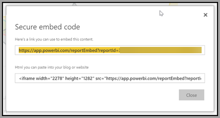
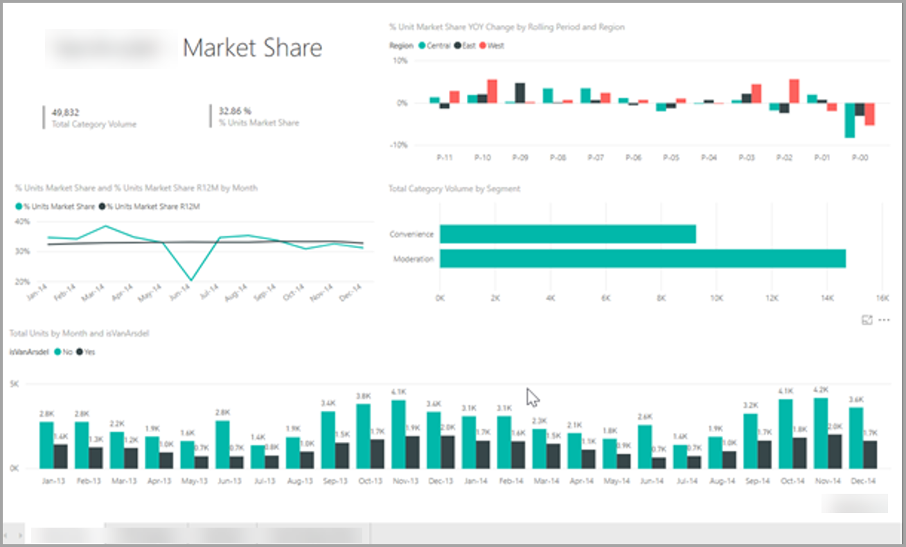
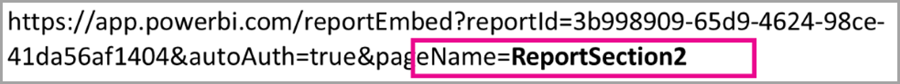
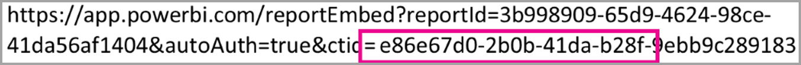

# Integrate Power BI into portals no-code secure embedding  

The new secure **Embed** option for reports in Power BI enables users to easily and securely embed reports in internal web portals, whether **cloud-based** or **hosted on-premises**, such as **SharePoint 2019**. Reports embedded in this way respect all item permissions and data security through row-level security (RLS). The feature is designed to allow no-code embedding into any portal that accepts a URL or IFrame as a means of embedding.

The **Embed** option also supports URL Filters and URL settings, which allows you to integrate with portals using a low-code approach that only requires rudimentary HTML and JavaScript experience.

## **Embed** option

1. The new **Embed** option is available on the **File** menu for reports in the Power BI service.

    

2. Select the Embed option to open a dialog that provides a link and an iFrame that is used to embed the report securely.

    

3. After you embed your URL in your web portal, or if you open the URL directly, the user is authenticated before being given access to the report. Below, the user has not signed-in to Power BI in the browser session. When they press **Sign-In**, a new browser window or tab may need to open, so ensure you check for pop-up blockers if you don't get prompted to sign in.

    

4. After the user has signed-in, the reports open, showing the data and allowing users to navigate between pages and to set filters. The report is shown only to users who have permission to view the report in Power BI. All row level security (RLS rules are also applied. Lastly, the user needs to be correctly licensed – either they need a Power BI Pro license or the report must be in a workspace that is in a Power BI Premium capacity. The user needs to sign in each time they open a new browser window, but after they’ve signed in once other reports load automatically.

    

5. When using the iFrame option, it's best to edit the HTML provided to specify the desired height and width to fit into your portal’s web page.

    

## Granting access to reports

The Embed option doesn't automatically give users permission to view the report. The permissions to view the report are set within the Power BI service.

To provide access to the report within the Power BI service, you can share the report with the users who require access to the embedded report. If you're using an Office 365 Group, you can list the user as a member of the app workspace within the Power BI service. For more information, see how to [manage an app workspace](service-manage-app-workspace-in-power-bi-and-office-365.md).

## Licensing

Users viewing the embedded report need either a Power BI Pro license or the content needs to be in a workspace that's in a [Power BI Premium capacity (EM or P SKU)](service-admin-premium-purchase.md).

## Customize your embed experience using URL settings

The embed URL supports several input settings that help you customize your user’s experiences. If you’re using the iFrame provided, make sure you update the URL in the iFrame’s src setting.

| Property  | Description  |  |  |  |
|--------------|-----------------------------------------------------------------------------------------------------------------------------------------------------------------------------------------------------------------------|---|---|---|
| pageName  | You can use the pageName query string parameter to set which page of the report to open. The pageName value corresponds to the end of the report URL when viewing a report in the Power BI Service, as shown below.   |  |  |  |
| ctid  | Enables external Guest users to view the content when logging in through Azure B2B.   |  |  |  |
| URL Filters  | You can use URL Filters in the embed URL you received from the Power BI UI to filter the content of the embed. This way you can build low-code integrations with only basic HTML and JavaScript experience.  |  |  |  |

## How to set which page to open when the report is embedded

The value provided in the pageName setting corresponds to the end of the report URL when viewing a report in the Power BI Service.

1. Open the report from the Power BI service in your web browser, and then copy the URL from the address bar.

    

2. Append the pageName setting to the URL.

    

## Supporting external guest users with Azure business to business (B2B)

If your portal is accessed by external **Guest** users, you need to update the URL provided to include your tenant information. The required information is available in the Report Link at the bottom of the Share pane.

Use the ctid parameter in the embed URL.

## When to use the **Embed** option instead of other options

The new Embed option allows you to securely embed reports from Power BI in portals that don't have a native integration with Power BI, for example with SharePoint 2019. Use it whenever you need to embed in a portal or application and you need to keep the data in the report secure.

If you’re using **SharePoint Online**, we recommend you use the **Power BI web part** in conjunction with the **Embed in SharePoint Online** option. This way you get a better experience than just using the **Embed** option, including single sign-on, more control over the embedded content.  

If you want to make you report public, and embed it in a public website then Publish to web is the right option. Never use confidential or proprietary data with **Publish to web**.

The User owns data approach is for developers seeking to have complete control over their embedded report experience. The User owns data approach requires more technical skills to accomplish. Because it supports the Power BI JavaScript API, developers can implement stunning experiences within their own applications or portals.

## Considerations and limitations

* Secure embed works for reports published to the Power BI service.

* The user needs to sign-in to view the report whenever they open a new browser window.

* Some browsers require you to refresh the page after sign-in, especially when using  InPrivate or InCognito modes.

* To achieve a single sign-on experience, use the Embed in SharePoint Online option, or build a custom integration using the User Owns Data approach. Learn more about [User owns data](developer/embed-sample-for-your-organization.md).

* The automatic authentication capability provided with the **Embed** option doesn't work with the Power BI JavaScript API. For the Power BI JavaScript API, use the User Owns Data approach to embedding. Learn more about User owns data.

## Next steps

* [Publish to Web](service-publish-to-web.md)

* [Ways to share your work](service-how-to-collaborate-distribute-dashboards-reports.md)

* [Embed with report web part in SharePoint Online](service-embed-report-spo.md)