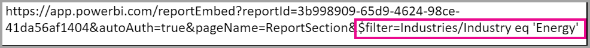

# No-code secure embedding for Power BI  

The new secure **Embed** option for reports in Power BI enables users to easily and securely embed reports in internal web portals, whether **cloud-based** or **hosted on-premises**, such as SharePoint 2019. Reports embedded in this way respect all item permissions and data security through row-level security (RLS). The feature is designed to allow no-code embedding into any portal that accepts a URL or iFrame to embed.

The **Embed** option also supports [URL Filters](service-url-filters.md) and URL settings. The **Embed** option allows you to integrate with portals using a low-code approach that requires basic HTML and JavaScript knowledge.

## How to **Embed** Power BI reports into portals

1. The new **Embed** option is available on the **File** menu for reports in the Power BI service.

    

2. Select the Embed option to open a dialog that provides a link and an iFrame that is used to embed the report securely.

    

3. After you embed your URL in your web portal, or if you open the URL directly, the user is authenticated before given access to the report. Below, the user has not signed-in to Power BI in the browser session. When they press **Sign-In**, a new browser window or tab may need to open. Check for pop-up blockers if you don't get prompted to sign in.

    

4. After the user has signed in, the report opens, showing the data and allowing users to navigate between pages and to set filters. The report is shown only to users who have permission to view the report in Power BI. All row-level security (RLS) rules are also applied. Lastly, the user needs to be correctly licensed – either they need a Power BI Pro license, or the report must be in a workspace that is in a Power BI Premium capacity. The user needs to sign in each time they open a new browser window, but after they’ve signed in once other reports load automatically.

    

5. When using the iFrame option, it's best to edit the HTML provided to specify the desired height and width to fit into your portal’s web page.

    

## Granting access to reports

The Embed option doesn't automatically permit users to view the report. The permissions to view the report are set within the Power BI service.

To provide access to the report within the Power BI service, you can share the report with the users who require access to the embedded report. If you're using an Office 365 Group, you can list the user as a member of the app workspace within the Power BI service. For more information, see how to [manage an app workspace](service-manage-app-workspace-in-power-bi-and-office-365.md).

## Licensing

Users viewing the embedded report need either a Power BI Pro license or the content needs to be in a workspace that's in a [Power BI Premium capacity (EM or P SKU)](service-admin-premium-purchase.md).

## Customize your embed experience using URL settings

The embed URL supports several input settings that help you customize your user experience. If you’re using the iFrame provided, make sure you update the URL in the iFrame’s src settings.

| Property  | Description  |  |  |  |
|--------------|-----------------------------------------------------------------------------------------------------------------------------------------------------------------------------------------------------------------------|---|---|---|
| pageName  | You can use the **pageName** query string parameter to set which page of the report to open. The **pageName** value corresponds to the end of the report URL when viewing a report in the Power BI service, as shown below.   |  |  |  |
| ctid  | Enables external Guest users to view the content when logging in through Azure B2B.   |  |  |  |
| URL Filters  | You can use [URL Filters](service-url-filters.md) in the embed URL you received from the Power BI UI to filter the content of the embed. This way you can build low-code integrations with only basic HTML and JavaScript experience.  |  |  |  |

## Set which page opens when the report is embedded

The value provided in the *pageName* setting corresponds to the end of the report URL when viewing a report in the Power BI service.

1. Open the report from the Power BI service in your web browser, and then copy the URL from the address bar.

    

2. Append the *pageName* setting to the URL.

    

## Filter report content using URL filters

For some advanced features, you can [URL Filters](service-url-filters.md) to build more experiences using the report. For example, the URL below filters the report to show data for the Energy industry.

Using the combination of **pageName** and [URL Filters](service-url-filters.md) can be powerful. You can build experiences using basic HTML and JavaScript.

For example, here’s how you can add a button to an HTML page:

```html
<button class="textLarge" onclick='show("ReportSection", "Energy");' style="display: inline-block;">Show Energy</button>
```

When pressed, the button calls a function to update the iFrame with an updated URL, which includes the filter for the Energy industry.

```javascript
function show(pageName, filterValue)

{

var newUrl = baseUrl + "&pageName=" + pageName;

if(null != filterValue && "" != filterValue)

{

newUrl += "&$filter=Industries/Industry eq '" + filterValue + "'";

}

//Assumes there’s an iFrame on the page with id=”iFrame”

var report = document.getElementById("iFrame")

report.src = newUrl;

}
```



You can add as many buttons as you’d like to create a low-code custom experience. 

## Considerations and limitations

* Doesn't support external guest users with Azure business to business (B2B).

* Secure embed works for reports published to the Power BI service.

* The user needs to sign-in to view the report whenever they open a new browser window.

* Some browsers require you to refresh the page after sign-in, especially when using  InPrivate or Incognito modes.

* To achieve a single sign-on experience, use the Embed in SharePoint Online option, or build a custom integration using the [user owns data](developer/embed-sample-for-your-organization.md) approach. Learn more about [user owns data](developer/embed-sample-for-your-organization.md).

* The automatic authentication capability provided with the **Embed** option doesn't work with the Power BI JavaScript API. For the Power BI JavaScript API, use the [user owns data](developer/embed-sample-for-your-organization.md) approach to embedding. Learn more about [user owns data](developer/embed-sample-for-your-organization.md).

## Next steps

* [Ways to share your work](service-how-to-collaborate-distribute-dashboards-reports.md)

* [URL filters](service-url-filters.md)

* [SharePoint Online report web part](service-embed-report-spo.md)

* [Publish to Web](service-publish-to-web.md)