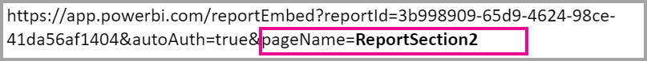

# Embed a report in a secure portal or website

With the new **Embed** option for Power BI reports, you can easily and securely embed reports in internal web portals. These portals can be **cloud-based** or **hosted on-premises**, such as SharePoint 2019. Embedded reports respect all item permissions and data security through [row-level security (RLS)](service-admin-rls.md). They provide no-code embedding into any portal that accepts a URL or iFrame. 

The **Embed** option supports [URL Filters](service-url-filters.md) and URL settings. It allows you to integrate with portals using a low-code approach requiring only basic HTML and JavaScript knowledge.

## How to **Embed** Power BI reports into portals

1. The new **Embed** option is available on the **File** menu for reports in the Power BI service.

    

2. Select the **Embed** option to open a dialog that provides a link and an iFrame you can use to embed the report securely.

    

3. Whether your URL is embedded in a web portal or opened directly, a user needs to be authenticated before given report access. The following screen appears if a user has not signed-in to Power BI in their browser session. When they select **Sign-In**, a new browser window or tab could open. Have them check for pop-up blockers if they don't get prompted to sign in.

    

4. After the user has signed in, the report opens, showing the data and allowing page navigation and filter setting. Only users who have view permission can see the report in Power BI. All [row-level security (RLS)](service-admin-rls.md) rules are also applied. Lastly, the user needs to be correctly licensed – either they need a Power BI Pro license, or the report must be in a workspace that is in a Power BI Premium capacity. The user needs to sign in each time they open a new browser window. However, once signed in, other reports load automatically.

    

5. When using an iFrame, you may need to edit the **height** and **width** to have it fit in your portal’s web page.

    

## Granting report access

The **Embed** option doesn't automatically permit users to view the report. View permissions are set in the Power BI service.

In the Power BI service, you can share the embedded report with users requiring access. If you're using an Office 365 Group, you can list the user as an app workspace member. For more information, see how to [manage your app workspace in Power BI and Office 365](service-manage-app-workspace-in-power-bi-and-office-365.md).

## Licensing

To view the embedded report, users need either a Power BI Pro license or the content needs to be in a workspace that's in a [Power BI Premium capacity (EM or P SKU)](service-admin-premium-purchase.md).

## Customize your embed experience using URL settings

The embed URL supports several input settings you can use to customize the user experience. If you’re using the iFrame provided, make sure you update the URL in the iFrame’s **src** settings.

| Property  | Description  |  |  |  |
|--------------|-----------------------------------------------------------------------------------------------------------------------------------------------------------------------------------------------------------------------|---|---|---|
| pageName  | You can use the **pageName** query string parameter to set which report page to open. You can find this value at the report URL's end when viewing a report in the Power BI service, as shown below. |  |  |  |
| URL Filters  | You can use [URL Filters](service-url-filters.md) in the embed URL you received from the Power BI UI to filter the embed content. This way you can build low-code integrations with only basic HTML and JavaScript experience.  |  |  |  |

## Set which page opens when the report is embedded

You can find the **pageName** value at the report URL's end  when viewing a report in the Power BI service.

1. Open the report from the Power BI service in your web browser, and then copy the address bar URL.

    

2. Append the **pageName** setting to the URL.

    

## Filter report content using URL filters 

You can use [URL Filters](service-url-filters.md) to provide different report views. For example, the URL below filters the report to show data for the Energy industry.

Using the combination of **pageName** and [URL Filters](service-url-filters.md) can be powerful. You can build experiences using basic HTML and JavaScript.

For example, here’s a button you can add to an HTML page:

```html
<button class="textLarge" onclick='show("ReportSection", "Energy");' style="display: inline-block;">Show Energy</button>
```

When selected, the button calls a function to update the iFrame with an updated URL, which includes the Energy industry filter.

```javascript
function show(pageName, filterValue)

{

var newUrl = baseUrl + "&pageName=" + pageName;

if(null != filterValue && "" != filterValue)

{

newUrl += "&$filter=Industries/Industry eq '" + filterValue + "'";

}

//Assumes there’s an iFrame on the page with id=”iFrame”

var report = document.getElementById("iFrame")

report.src = newUrl;

}
```


You can add as many buttons as you’d like to create a low-code custom experience. 

## Considerations and limitations

* Doesn't support external guest users with Azure business to business (B2B).

* Secure embed works for reports published to the Power BI service.

* The user needs to sign in to view the report whenever they open a new browser window.

* Some browsers require you to refresh the page after sign in, especially when using  InPrivate or Incognito modes.

* To achieve a single sign-on experience, use the Embed in SharePoint Online option, or build a custom integration using the [user owns data](developer/embed-sample-for-your-organization.md) embedding method. 

* The automatic authentication capability provided with the **Embed** option doesn't work with the Power BI JavaScript API. For the Power BI JavaScript API, use the [user owns data](developer/embed-sample-for-your-organization.md) embedding method. 

## Next steps

* [Ways to share your work in Power BI](service-how-to-collaborate-distribute-dashboards-reports.md)

* [Filter a report using query string parameters in the URL](service-url-filters.md)

* [Embed with report web part in SharePoint Online](service-embed-report-spo.md)

* [Publish to Web from Power BI](service-publish-to-web.md)