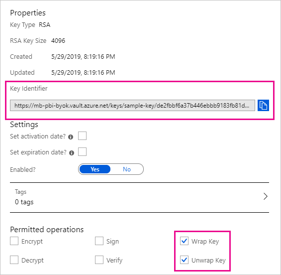

# Bring your own encryption keys for Power BI (preview)

Power BI encrypts data _at-rest_ and _in process_. By default, Power BI uses Microsoft-managed keys to encrypt your data. In Power BI Premium you can also use your own keys for data at-rest that is imported into a dataset (see [Data source and storage considerations](#data-source-and-storage-considerations) for more information). This approach is often described as _bring your own key_ (BYOK).

## Why use BYOK?

BYOK makes it easier to meet compliance requirements that specify key arrangements with the cloud service provider (in this case Microsoft). With BYOK, you provide and control the encryption keys for your Power BI data at-rest at the application level. As a result, you can exercise control and revoke your organization's keys, should you decide to exit the service. By revoking the keys, the data is unreadable to the service.

## Data source and storage considerations

To use BYOK, you must upload data to the Power BI service from a Power BI Desktop (PBIX) file. You cannot use BYOK in the following scenarios:

- Analysis Services Live Connection
- Excel workbooks (unless data is first imported into Power BI Desktop)
- Push datasets

BYOK applies only to the dataset associated with the PBIX file, not the query result caches for tiles and visuals.

## Configure Azure Key Vault

In this section you learn how to configure Azure Key Vault, a tool for securely storing and accessing secrets, like encryption keys. You can use an existing key vault to store encryption keys, or you can create a new one specifically for use with Power BI.

The instructions in this section assume basic knowledge of Azure Key Vault. For more information, see [What is Azure Key Vault?](/azure/key-vault/key-vault-whatis). Configure your key vault in the following way:

1. Add the Power BI service as a service principal for the key vault, with wrap and unwrap permissions.

1. Create an RSA key with a 4096-bit length (or use an existing key of this type), with wrap and unwrap permissions.

1. Recommended: Check that the key vault has the _soft delete_ option enabled.

### Add the service principal

1. In the Azure portal, in your key vault, under **Access policies** , select **Add New**.

1. Under **Select principal** , search for and select Microsoft.Azure.AnalysisServices.

1. Under **Key permissions** , select **Unwrap Key** and **Wrap Key**.

    

1. Select **OK** , then **Save**.

### Create an RSA key

1. In your key vault, under **Keys** , select **Generate/Import**.

1. Select a **Key Type** of RSA and an **RSA Key Size** of 4096.

    

1. Select **Create**.

1. Under **Keys** , select the key you created.

1. Select the GUID for the **Current Version** of the key.

1. Check that **Wrap Key** and **Unwrap Key** are both selected. Copy the **Key Identifier** to use when you enable BYOK in Power BI.

    

### Soft delete option

We recommend that you enable [soft-delete](/azure/key-vault/key-vault-ovw-soft-delete) on your key vault, to protect from data loss in case of accidental key – or key vault – deletion. You must use [PowerShell to enable the "soft-delete" property](/azure/key-vault/key-vault-soft-delete-powershell) on the key vault, because this option is not available from the Azure Portal yet.

With Azure Key Vault properly configured, you're ready to enable BYOK on your tenant.

## Enable BYOK on your tenant

You enable BYOK at the tenant level with [PowerShell](https://www.powershellgallery.com/packages/MicrosoftPowerBIMgmt.Admin), by first introducing to your Power BI tenant the encryption keys you created and stored in Azure Key Vault. You then assign these encryption keys per Premium capacity for encrypting content in the capacity.

### Important considerations

Before you enable BYOK, keep the following considerations in mind:

- At this time, you cannot disable BYOK after you enable it. Depending on how you specify parameters for `Add-PowerBIEncryptionKey`, you can control how you use BYOK for one or more of your capacities. However, you can't undo the introduction of keys to your tenant. For more information, see [Enable BYOK](#enable-byok).

- You cannot _directly_ move a workspace that uses BYOK from a dedicated capacity in Power BI Premium to shared capacity. You must first move the workspace to a dedicated capacity that doesn't have BYOK enabled.

### Enable BYOK

To enable BYOK, you must be a tenant administrator of the Power BI service, signed in using the `Connect-PowerBIServiceAccount` cmdlet. Then use [`Add-PowerBIEncryptionKey`](/powershell/module/microsoftpowerbimgmt.admin/Add-PowerBIEncryptionKey) to enable BYOK, as shown in the following example:

```powershell
Add-PowerBIEncryptionKey -Name'Contoso Sales' -KeyVaultKeyUri'https://contoso-vault2.vault.azure.net/keys/ContosoKeyVault/b2ab4ba1c7b341eea5ecaaa2wb54c4d2'
```

The cmdlet accepts two switch parameters that affect encryption for current and future capacities. By default, none of the switches are set:

- `-Activate`: Indicates that this key will be used for all existing capacities in the tenant.

- `-Default`: Indicates that this key is now the default for the entire tenant. When you create a new capacity, the capacity inherits this key.

If you specify `-Default`, all of the capacities created on this tenant from this point will be encrypted using the key you specify (or an updated default key). You cannot undo the default operation, so you lose the ability to create a premium capacity that doesn't use BYOK in your tenant.

You have control over how you use BYOK across your tenant. For example, to encrypt a single capacity, call `Add-PowerBIEncryptionKey` without `-Activate` or `-Default`. Then call `Set-PowerBICapacityEncryptionKey` for the capacity where you want to enable BYOK.

## Manage BYOK

Power BI provides additional cmdlets to help manage BYOK in your tenant:

- Use [`Get-PowerBICapacity`](/powershell/module/microsoftpowerbimgmt.capacities/get-powerbicapacity) to get the key that a capacity is currently using:

    ```powershell
    Get-PowerBICapacity -Scope Organization -ShowEncryptionKey
    ```

- Use [`Get-PowerBIEncryptionKey`](/powershell/module/microsoftpowerbimgmt.admin/get-powerbiencryptionkey) to get the key that your tenant is currently using:

    ```powershell
    Get-PowerBIEncryptionKey
    ```

- Use [`Get-PowerBIWorkspaceEncryptionStatus`](/powershell/module/microsoftpowerbimgmt.admin/get-powerbiworkspaceencryptionstatus) to see whether the datasets in a workspace are encrypted and whether their encryption status is in sync with the workspace:

    ```powershell
    Get-PowerBIWorkspaceEncryptionStatus -Name'Contoso Sales'
    ```

    Note that encryption is enabled at the capacity level, but you get encryption status at the dataset level for the specified workspace.

- Use [`Set-PowerBICapacityEncryptionKey`](/powershell/module/microsoftpowerbimgmt.admin/set-powerbicapacityencryptionkey) to update the encryption key for the Power BI capacity:

    ```powershell
    Set-PowerBICapacityEncryptionKey-CapacityId 08d57fce-9e79-49ac-afac-d61765f97f6f -KeyName 'Contoso Sales'
    ```

- Use [`Switch-PowerBIEncryptionKey`](/powershell/module/microsoftpowerbimgmt.admin/switch-powerbiencryptionkey) to switch (or _rotate_) the version of the key being used for encryption. The cmdlet simply updates the `-KeyVaultKeyUri` for a key `-Name`:

    ```powershell
    Switch-PowerBIEncryptionKey -Name'Contoso Sales' -KeyVaultKeyUri'https://contoso-vault2.vault.azure.net/keys/ContosoKeyVault/b2ab4ba1c7b341eea5ecaaa2wb54c4d2'
    ```