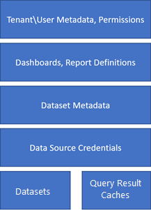

# BYOK (Preview)

Power BI encrypts data *at rest* and *in process*. By default, Power BI uses Microsoft-managed keys to encrypt your data, but in Power BI Premium you can also use your own keys for data at rest. This approach is often described as *bring your own key* (BYOK).  

TODO: Do we keep calling this feature BYOK, b/c Azure uses the phrase ["custom keys"](/azure/storage/common/storage-service-encryption-customer-managed-keys); SQL seems to use BYOK more.

Why use your own key? BYOK gives you more flexibility, so that you can create, rotate, disable, and define access controls. BYOK also enables you to audit the encryption keys used to protect your data.

TODO: previous paragraph is from Azure docs. Might need an edit, e.g. "disable" if we don't allow that yet.

## Encryption in Power BI

In this section, we provide some basic information so you can understand the BYOK process. For detailed information about encryption in Power BI, see [Power BI data storage and movement](whitepaper-powerbi-security.md#data-storage-and-movement).

The following diagram shows the components of a PBIX file that is hosted in the Power BI service.



TODO: Query cache is in a different spot in the OneNote diagram, i.e. it's not in the blob.

Data and metadata for the components are stored in two places: Azure SQL Database and Azure Blob storage. The following diagram shows the storage and encryption used by default for each component.


1. Azure SQL database, using [Transparent Data Encryption](/azure/sql-database/transparent-data-encryption-azure-sql).

2. Azure SQL database, using [Always Encrypted](/azure/sql-database/sql-database-always-encrypted-azure-key-vault). For on-premises data sources, there is also an encryption key stored on the computer where the on-premises data gateway runs.

3. Azure storage blobs, using [Azure Storage Service Encryption for data at rest](/azure/storage/common/storage-service-encryption?toc=%2fazure%2fstorage%2fblobs%2ftoc.json).

In this preview release, we support BYOK for the components in Azure Blob storage: datasets, PBIX and XLSX artifacts, and query result caches. As shown in the following diagram, we use [client side encryption](/azure/storage/common/storage-client-side-encryption) to enable BYOK.


In the next section you learn how to configure [Azure Key Vault](/azure/key-vault/key-vault-whatis), which is where you store encryption keys for BYOK.

## Configure Azure Key Vault

Azure Key Vault is a tool for securely storing and accessing secrets, like encryption keys. You can use an existing vault to store encryption keys, or you can create a new one specifically for use with Power BI. In either case, follow the configuration guidelines described in this section.

TODO: Get the specific details from the [SQL docs](https://docs.microsoft.com/en-us/azure/sql-database/transparent-data-encryption-byok-azure-sql?view=sql-server-2017#guidelines-for-configuring-tde-with-azure-key-vault) that are relevant to Power BI.

With Azure Key Vault properly configured, you're ready to enable BYOK on your tenant.

## Enable BYOK on your tenant

You enable BYOK at the tenant level, using an encryption key that you've created and stored in Azure Key Vault. You can use a single key or two keys that you rotate; only one key is active at a time for your tenant. By default, when you enable BYOK, it's used for all dedicated capacities in a tenant. You can control this behavior.

### Important considerations

Before you enable BYOK, keep the following considerations in mind:

- At this time, you cannot disable BYOK after you enable it. You can control how BYOK is used in your dedicated capacities, but you cannot turn it off.

- You cannot move a workspace that uses BYOK from a dedicated capacity in Power BI Premium to shared capacity.

### Enable BYOK

To enable BYOK, you must be a tenant administrator of the Power BI service, signed in using the `Connect-PowerBIServiceAccount` cmdlet. Then use `Add-PowerBIEncryptionKey` to enable BYOK, as shown in the following example:

  ```powershell
  Add-PowerBIEncryptionKey -Name 'Contoso Sales' -KeyVaultKeyUri 'https://contoso-vault2.vault.azure.net/keys/ContosoKeyVault/b2ab4ba1c7b341eea5ecaaa2wb54c4d2'
  ```

This cmdlet also accepts `-Default` and `-Activate` parameters, which are enabled by default:

- `-Activate`: Indicates to activate any inactivated capacities to use this key for encryption.

- `-Default`: Indicates that this key is now the default for the entire tenant. When you create a new capacity, the capacity inherits this key.

TODO: Need a better description of active/inactive.

## Manage BYOK

Power BI provides additional cmdlets to help manage BYOK in your tenant:

- Use `Get-PowerBIEncryptionKey` to get the key that your tenant is currently using:

  ```powershell
  Get-PowerBIEncryptionKey
  ```

- Use `Get-PowerBIWorkspaceEncryptionStatus` to see whether the datasets in a workspace are encrypted and whether their encryption status is in sync with the workspace:

  ```powershell
  Get-PowerBIWorkspaceEncryptionStatus -Name 'Contoso Sales'
  ```

  Note that encryption is enabled at the capacity level, but you get encryption status at the dataset level for the specified workspace.

- Use `Switch-PowerBIEncryptionKey` to switch (or *rotate*) the key currently used for encryption:

  ```powershell
  Switch-PowerBIEncryptionKey -Name 'Contoso Sales' -KeyVaultKeyUri 'https://contoso-vault2.vault.azure.net/keys/ContosoKeyVault/b2ab4ba1c7b341eea5ecaaa2wb54c4d2'
  ```

## Next steps

[Power BI data storage and movement](whitepaper-powerbi-security.md#data-storage-and-movement)
[Azure Storage Service Encryption for data at rest](/azure/storage/common/storage-service-encryption?toc=%2fazure%2fstorage%2fblobs%2ftoc.json)
[Storage Service Encryption using customer-managed keys in Azure Key Vault](/azure/storage/common/storage-service-encryption-customer-managed-keys)

TODO: Links OK, or swap out first Azure storage one with .NET link from above?
