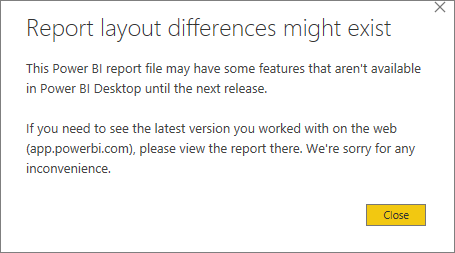

# Export a report from Power BI service to Desktop (Preview)
In Power BI Desktop, you can export (also referred to as *download*) a report to Power BI service by saving the report and selecting **Publish**. You can also export in the other direction as well, and download a report from Power BI service to Desktop. The extension for files being exported, in either direction, is *.pbix*.

There are a few limitations and considerations to keep in mind, which are discussed later in this article.

## Download the report as a .pbix
To download the .pbix file, follow these steps:

1. In **Power BI service**, open the report you want to download in [Editing view](consumer/end-user-reading-view.md).
2. From the menubar, select **File > Download report**.
   
   > [!NOTE]
   > The report must have been [created using Power BI Desktop](guided-learning/publishingandsharing.yml?tutorial-step=2) after November 23, 2016 - and updated since then - to be able to download the report. If it hasn't, the *Download Report* menu option in Power BI service is grayed out.
   > 
   > 
3. While the .pbix file is being created, a status banner displays the progress. When the file is ready, you'll be asked to open or save the .pbix file. The name of the file matches the title of the report.
   
    
   
    You now have the option of opening the .pbix file in either Power BI service (app.powerbi.com) or Power BI Desktop.     
4. To immediately open the report in Desktop, select **Open**. To save the file to a specific location, select **Save > Save-As**. If you haven't already, [install Power BI Desktop](desktop-get-the-desktop.md).
   
    When you open the report in Desktop, you may see a warning message letting you know that some features available in the Power BI service report may not be available in Desktop.
   
    

5. The report editor in Desktop looks very much like the report editor in Power BI service.  
   
    

## Considerations and troubleshooting
There are a few important considerations and limitations associated with downloading (exporting) a *.pbix* file from Power BI service.

* To download the file, you must have edit access to the report
* The report must have been created using **Power BI Desktop** and been *published* to the **Power BI service**, or the .pbix must have been *uploaded* to the service.
* Reports must be published or updated after November 23, 2016. Reports published prior to then are not downloadable.
* This feature will not work with reports originally created in the **Power BI service**, including content packs.
* You should always be using the latest version of **Power BI Desktop** when opening downloaded files. Downloaded *.pbix* files may not open in non-current versions of **Power BI Desktop**.
* If your administrator has turned off the ability to export data, this feature will not be visible in the **Power BI service**.
* Dataset with incremental refresh can't be downloaded to a *.pbix* file.

## Next steps
View the **Guy in a Cube** one-minute video about this feature:

<iframe width="560" height="315" src="https://www.youtube.com/embed/ymWqU5jiUl0" frameborder="0" allowfullscreen></iframe>

Also, here are some additional articles that can help you learn to use **Power BI service**:

* [Reports in Power BI](consumer/end-user-reports.md)
* [Power BI - Basic Concepts](consumer/end-user-basic-concepts.md)

Once you get **Power BI Desktop** installed, the following content can help you get up and running quickly:

* [Getting Started with Power BI Desktop](desktop-getting-started.md)

More questions? [Try the Power BI Community](http://community.powerbi.com/)   

