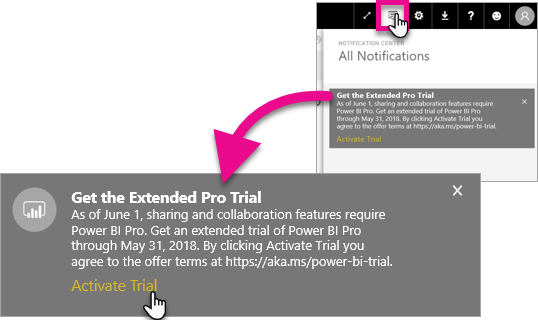

# Extended Pro Trial activation
Beginning on June 1, 2017, all eligible users will be able to opt-in to the Extended Pro Trial for the Power BI service.

<iframe width="640" height="360" src="https://www.youtube.com/embed/tPsNoPyY9aA?showinfo=0" frameborder="0" allowfullscreen></iframe>

As part of the [May 3, 2017 Power BI Premium announcement](https://powerbi.microsoft.com/blog/microsoft-accelerates-modern-bi-adoption-with-power-bi-premium/), Microsoft communicated changes to the free Power BI service effective June 1,2017. These changes include extending access to all data sources, higher workspace storage limits, and higher refresh and streaming rates to the Free service, making it equivalent to Power BI Pro.

Also announced was that sharing and collaboration features will be exclusive to Power BI Pro users, including peer-to-peer dashboard sharing, group workspaces (now called app workspaces), export to PowerPoint and analyze in Excel with Power BI apps. Export to CSV/Excel and PowerPoint were identified in the May 3 communication as a capability limited to Power BI Pro, but after receiving feedback from the broad user community the strategy has evolved to make the capability available to users of the Free service as well.

Beginning June 1, 2017 existing users of the Free service who have been active within the past year (on or before May 2, 2017) will be eligible for a free, 12-month extended trial of Power BI Pro. The offer will let users take advantage of the full capabilities of Power BI Pro for the next year as a sign of appreciation to the community and to provide users with time to adjust to the changes.

On June 1, 2017 eligible users will receive a notification when they sign into the service letting them know the changes have gone into effect with a prompt to register for the Extended Power BI Pro trial offer. A user’s IT admin does not control the in-product notifications, nor does the IT admin have the ability to register for the extended Power BI Pro trial on behalf of a user. Each eligible user must individually take action to complete this process.

Users can opt to register for the offer at any time during the 12-month period, but the Extended Pro trial will conclude for all users on May 31, 2018 regardless of when they accept the offer. At this time users will have the option to purchase Power BI Pro or be converted to the Free version of Power BI, without the sharing and collaboration capabilities, if they elect not to take action and purchase Power BI Pro.

No changes are being made to Power BI Pro. These users are not impacted and will not receive notifications when signing into the service on June 1, 2017 or after. Users who decline the extended Power BI Pro trial offer or are ineligible for the offer will continue using the Free version of Power BI without the sharing and collaboration capabilities. They can register at any time for a standard 60-day Power BI Pro trial by visiting the Power BI [website](https://powerbi.microsoft.com/get-started/).

## Eligibility for Extended Pro Trial
Your account must meet the following requirements in order to be eligible for the Extended Pro Trial offer.

* Power BI Free users active between May 3, 2016 and May 2, 2017 are eligible for an Extended Pro Trial.
* Users that have previously used or are currently on the *60-day in-product Pro trial* are still eligible for the Extended Pro Trial.

> [!NOTE]
> Users that have licenses assigned from the Power BI Pro or Power BI Pro Trial subscriptions, within Office 365, are excluded from this offer.
> 
> 

## How to activate
There are two ways to activate the Extended Pro Trial. The first is when you sign into Power BI. If you had dismissed that, you will also see an option within the notification area.

> [!NOTE]
> The in product communications are not controlled by the admin and will go out to eligible users.
> 
> 

### Experience at sign in
When you sign in to the Power BI service, and are eligible, you will get a pop-up notice. Selecting **Activate Trial** will begin the Extended Pro Trial. No further action will be needed.

You will then have the ability to access all existing shared dashboards and reports for the duration of the trial.

If you selected **Not Now**, the Extended Pro Trial can be activated any time until the end of the trial period on May 31, 2018.

### Activation at a later date
If you dismissed the pop-up by selecting **Not Now**, the Extended Pro Trial can be activated any time until the end of the trial period on May 31, 2018. This can be done in the **Notification center**.

Within the notification center, you will see a notification regarding the Extended Pro Trial. The notification will be available until the user dismisses it.

Within the notification, you can select **Activate Trial** to begin the trial. No further action will be needed.

You will then have the ability to access all existing shared dashboards and reports for the duration of the trial.

## After activation
After activation, you will see how many days are left in your trial in the top right.

You can review the terms within the [Extended Pro Trial offer terms and conditions](https://aka.ms/power-bi-trial). The Extended Pro Trial runs through May 31, 2018 for all eligible users.

## Frequently Asked Questions
**What happens to new users who signed up after May 3, 2017?**

Users who signed up to Power BI Free on or after May 3, 2017 are not eligible for the Extended Pro Trial. However, they are eligible for the standard 60-day Pro Trial.

**How do I find out who in my organization is eligible for the Extended Pro Trial?**

While there is not a direct way to discover this, you can view the Azure Active Directory Integrated Applications report for Power BI to see who are active users within your organization within the last 30 days. This may give you an idea of who may be eligible. For more information, see [Find Power BI users that have signed in](service-admin-access-usage.md).

Those active users in the eligibility period, and who are on free licenses, will receive the pop-up notification. 

> [!NOTE]
> The Azure AD report does not indicate if a user is Free or Pro within Power BI. It only reports which users have signed in to Power BI and when they logged in. If a user is listed in this report, it does not necessarily mean that they are eligible for the Extended Pro Trial.
> 
> 

**Can admins restrict a user from activating the Extended Pro Trial?**

No. Admins do not have a way to restrict users from activating the Extended Pro Trial or the in-service 60 day trial of Power BI Pro.

## Next steps
[Extended Pro Trial offer terms and conditions](https://aka.ms/power-bi-trial)  
[Power BI Service agreement for individual users](https://powerbi.microsoft.com/terms-of-service/)  
[Power BI Premium announcement](https://aka.ms/pbipremium-announcement)  
[Find Power BI users that have signed in](service-admin-access-usage.md)

More questions? [Try asking the Power BI Community](https://community.powerbi.com/)

