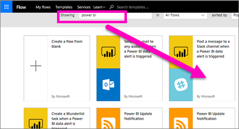
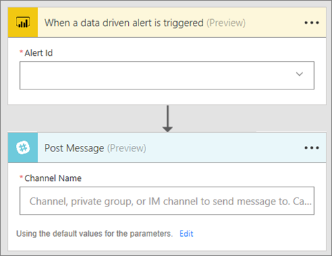
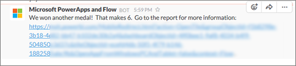

# Microsoft Flow and Power BI
## What is Microsoft Flow
[Microsoft Flow](https://flow.microsoft.com/en-us/documentation/getting-started) is a SaaS offering for automating workflows across the growing number of applications and SaaS services that business users rely on. With Flow you can automate tasks by integrating your favorite apps and services (including Power BI) to get notifications, synchronize files, collect data, and more. Repetitive tasks become easy with workflow automation.

[Get started using Flow now.](https://flow.microsoft.com/documentation/getting-started)

Watch Sirui create a Flow that sends a detailed email to colleagues when a Power BI alert is triggered. Then follow the step-by-step instructions below the video to try it out yourself.

<iframe width="560" height="315" src="https://www.youtube.com/embed/YhmNstC39Mw" frameborder="0" allowfullscreen></iframe>

## Create a flow that is triggered by a Power BI data alert
This tutorial will show you how to create two different flows; one from a template and one from scratch. To follow along, [create a data alert in Power BI](service-set-data-alerts.md) and [sign up for Microsoft Flow](https://flow.microsoft.com/en-us/#home-signup) (it's free!).

## Create a flow that uses Power BI - from a template
In this task we'll use a template to create a simple flow that is triggered by a Power BI data alert (notification).

1. Sign in to Microsoft Flow (flow.microsoft.com).
2. Select **My flows**.
   
   
3. Select **Create from template**.
   
    
4. Use the Search box to find Power BI templates and select **Post a message to a Slack channel when a Power BI data alert is triggered**.
   
    
5. Select **Use this template**.
   
   
6. If prompted, connect to Slack and Power BI by selecting **Sign in** and then following the prompts. A green checkmark lets you know that you're signed in.  After you confirm your conections, select **Continue**.
   
   

### Build the flow
This template has one trigger (Power BI data alert for new Olympic medals for Ireland) and one action (post a message to Slack). As you select a field, Flow displays dynamic content that you can include.  In this example we'll included the tile value and the tile URL in the message body.

1. From the trigger dropdown, select a Power BI data alert. Select **New medal for Ireland**. To learn how to create an alert, see [Data alerts in Power BI](service-set-data-alerts.md).
   
   
2. To post to Slack, enter a channel name and message text (you can also select the default message that Flow creates). Notice the dynamic content that we've included in the message text field.
   
   > [!NOTE]
   > Include "@" at the beginning of your channel name.  For example, if the Slack channel is named "channelA", in Flow enter "@channelA".
   > 
   > 
   
   
3. When you're done, select **Create flow** or **Save flow**.  The flow is created and evaluated.  Flow lets you know if it finds errors.
4. If errors are found, select **Edit flow** to fix them, otherwise, select **Done** to run the new flow.
   
   
5. Open your Slack account to see the message.  
   
   

## Create a Flow that uses Power BI - from scratch (blank)
In this task we'll create a simple flow from scratch that is triggered by a Power BI data alert (notification).

1. Sign in to Microsoft Flow.
2. Select **My flows** > **Create from blank**.
   
   
3. Use the Search box to find a Power BI trigger and select **Trigger a flow with a Power BI data driven aler**.

### Build your flow
1. From the dropdown, select the name of your alert.  To learn how to create an alert, see [Data alerts in Power BI](service-set-data-alerts.md).
   
    
2. Select **New step** > **Add an action**.
   
   
3. Search for **Outlook** and select **Create event**.
   
   
4. Fill in the event fields. As you select a field, Flow displays dynamic content that you can include.
   
   
5. Selet **Create flow** when done.  Flow saves and evaluates the flow. If there are no errors, select **Done** to run this flow.  The new flow is added to your **My flows** page.
   
   
6. When the flow is triggered by your Power BI data alert, you'll receive an Outlook event notification similar to this one.
   
    

### Next steps
* [Get started with Microsoft Flow](https://flow.microsoft.com/en-us/documentation/getting-started/)
* [Set data alerts in Power BI service](service-set-data-alerts.md)
* [Set data alerts on your iphone](powerbi-mobile-set-data-alerts-in-the-iphone-app.md)
* [Set data alerts in the Power BI mobile app for Windows 10](powerbi-mobile-set-data-alerts-in-the-iphone-app.md)
* More questions? [Try the Power BI Community](http://community.powerbi.com/)

