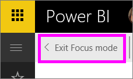
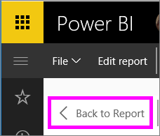

# Display a dashboard tile or report visual in Focus mode
<iframe width="560" height="315" src="https://www.youtube.com/embed/dtdLul6otYE" frameborder="0" allowfullscreen></iframe>

## What is Focus mode?
***Focus*** mode lets you expand (pop out) a dashboard tile or report visual to see more detail.  While in Focus mode, you can view and modify filters that were applied when this visual was created.  

> [!NOTE]
> Focus is different from [full screen mode](powerbi-service-display-tile-in-full-screen-mode.md).
> 
> 

1. Hover over the tile or visual and select the **Focus mode** icon .  
   
   
2. It opens and fills the entire canvas. Focus mode for dashboard tiles and report visualizations is almost identical, but there are a few differences. For example, to exit Focus mode in a report, select **Back to Report**. And, to exit Focus mode in a dashboard, select **Exit Focus mode**. For other differences, see **Considerations and Troubleshooting** below.
   
   
3. Expand the Filters pane to see all filters applied to this visual.
   
   
4. Explore further by modifying the filters and, if you discover something interesting, pin the visual to a dashboard.   
5. Leave Focus mode and return to the dashboard by selecting **< Exit Focus mode** (in the top left corner of the visual).
   
        
   
    Leave Focus mode and return to the report page by selecting **Back to Report**.    
   
    

## Go from Focus mode to Full Screen mode
Once in Focus mode, the tile or visual can then be [viewed in Full Screen (TV Mode.)](powerbi-service-display-tile-in-full-screen-mode.md) Full Screen mode displays without the distraction of menus and navigation buttons.

## Considerations and troubleshooting
* When using Focus mode with a visualization in a report, you'll be able to view and modify all filters: Visual level, Page level and Report level.    
* When using Focus mode with a visualization on a dashboard, you'll be able to view and modify only the Visual level filter.

More questions? [Try the Power BI Community](http://community.powerbi.com/)

