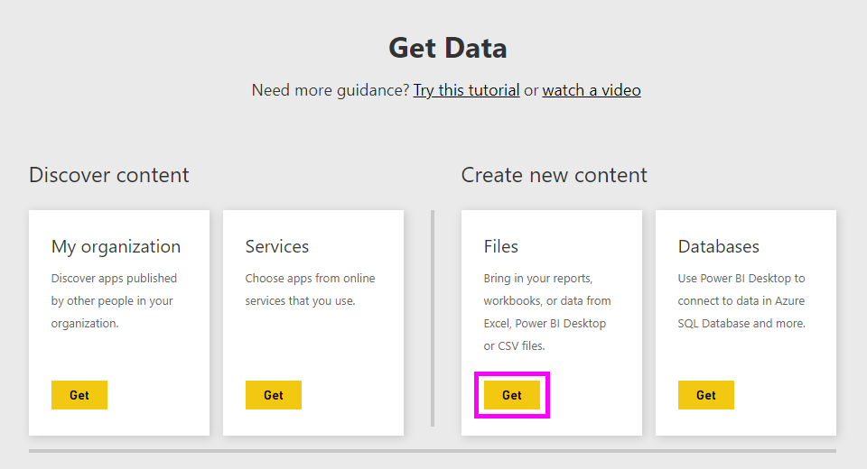
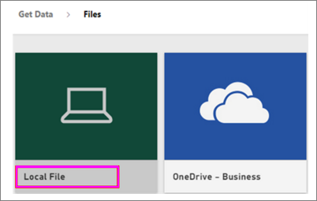
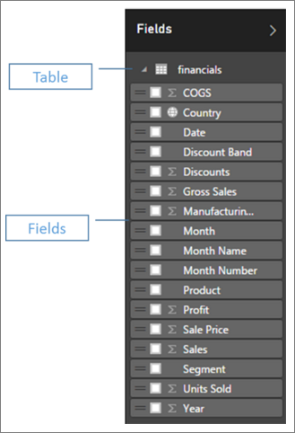
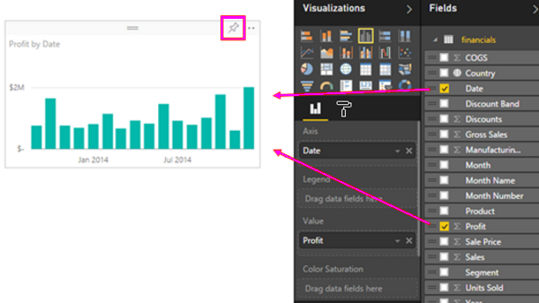
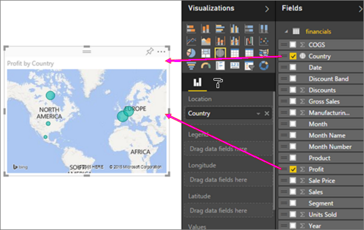
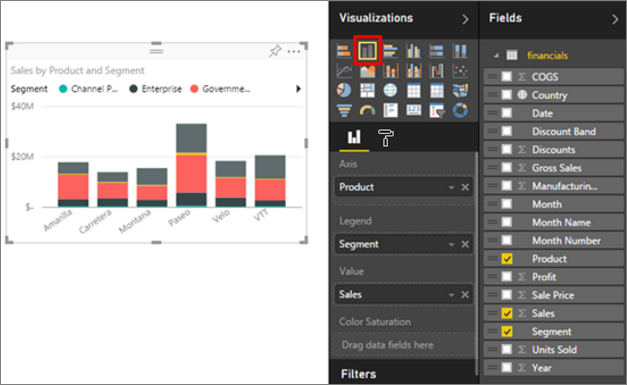
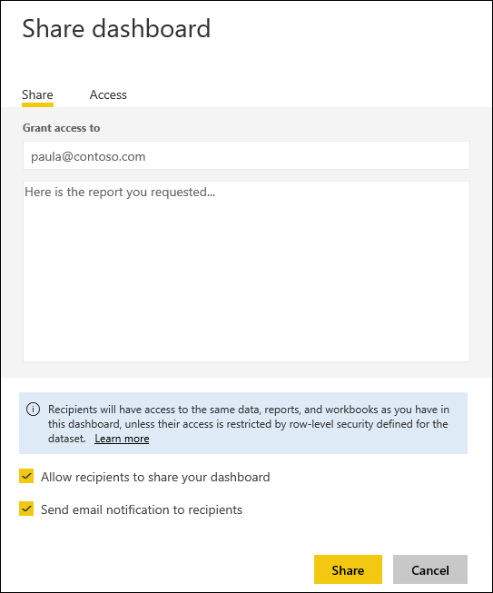

# Quickly create a report from an Excel workbook
Your manager wants to see a report on your latest sales figures combined with your last campaign impressions by the end of the day. But the latest data resides on various third-party systems and on files in your laptop. In the past, it’s taken hours to create visuals and format a report, and you’re beginning to feel anxious.

No worries. With Power BI, you can create a stunning report in no time.

In this example, we’ll upload an Excel file from a local system, create a new report, and share it with colleagues, all from within Power BI.

## Prepare your data
Let’s take a simple Excel file as an example. 

1. Before you can load your Excel file into Power BI, you must organize your data in a flat table. In a flat table, each column contains the same data type; for example, text, date, number, or currency. Your table should have a header row, but not any columns or rows that display totals.

   

2. Next, format your data as a table. In Excel, on the **Home** tab, in the **Styles** group, select **Format as Table**. 

3. Select a table style to apply to your worksheet. 

   Your Excel worksheet is now ready to load into Power BI.

   

## Upload your Excel file to the Power BI service
The Power BI service connects to many data sources, including Excel files that live on your computer. 

1. To get started, sign in to the Power BI service. If you haven’t signed up, [you can do so for free](https://powerbi.com).

2. You want to create a new dashboard. Open **My workspace** and select the **Create** icon.

   

3. Select **Dashboard**, enter a name, and then select **Create**. 

   The new dashboard displays, with no data.

   

4. At the bottom of the left navigation pane, select **Get data**. 

5. On the **Get Data** page, in the **Files** box under **Create new content**, select **Get**.

   

6. On the **Files** page, select **Local File**. Navigate to the Excel workbook file on your computer and select **Open** to load it into the Power BI service. 

7. From the **Local File** page, select **Import**.

   > [!NOTE] 
   > To follow along with the rest of this tutorial, use the [Financial sample workbook](sample-financial-download.md).
   > 

   

## Build your report
After the Power BI service imports your Excel file, you start building your report. 

1. When the **Your dataset is ready** message appears, select **View dataset**.  

   Power BI opens in Editing view and displays the report canvas. On the right side are the **Visualizations**, **Filters**, and **Fields** panes. Notice that your Excel workbook table data appears in the **Fields** pane. Under the name of the table, Power BI lists the column headings as individual fields.

   

2. Now you can begin to create visualizations. Let's say your manager wants to see profit over time. In the **Fields** pane, drag **Profit** to the report canvas. 

   By default, Power BI displays a bar chart. 

3. Drag **Date** to the report canvas. 

   Power BI updates the bar chart to show profit by date.

   

   > [!TIP]
   > If your chart doesn't look like you expect, check your aggregations. For example, in the **Value** well, right click the field you just added and ensure the data is being aggregated the way you'd like it. In this example, we're using **Sum**.
   > 

Your manager wants to know which countries are the most profitable. Impress them with a map visualization. 

1. Select a blank area on your report canvas. 

2. From the **Fields** pane, drag the **Country** and the **Profit** fields to your report canvas.

   Power BI creates a map visual with bubbles representing the relative profit of each location.

   

What about displaying a visual showing sales by product and market segment? Easy. 

1. In the **Fields** pane, select the **Sales**, **Product**, and **Segment** fields. 
   
   Power BI creates a bar chart instantly. 

2. Change the type of chart by choosing one of the icons in the **Visualizations** menu. For instance, change it to a **Stacked column chart**. 

3. To sort the chart, select the ellipsis (...) > **Sort by**.

   

Pin all of your visuals to your dashboard. You’re now ready to share it with your colleagues.

   

## Share your dashboard
Let's say you want to share your dashboard with your manager, Paula. You can share your dashboard and underlying report with any colleague who has a Power BI account. They can interact with your report, but can't save changes.

1. To share your report, at the top of the dashboard, select **Share**.

   

   Power BI displays the **Share dashboard** page. 

2. Enter the email addresses of the recipients in the **Enter email addresses** box and add a message in the box below it. 

3. To allow recipients to share your dashboard with others, select **Allow recipients to share your dashboard**. Select **Share**.

   

## Next steps

* [Get started with the Power BI service](service-get-started.md)
* [Get started with Power BI Desktop](desktop-getting-started.md)
* [Basic concepts for designers in the Power BI service](service-basic-concepts.md)

More questions? [Try the Power BI Community](http://community.powerbi.com/).

