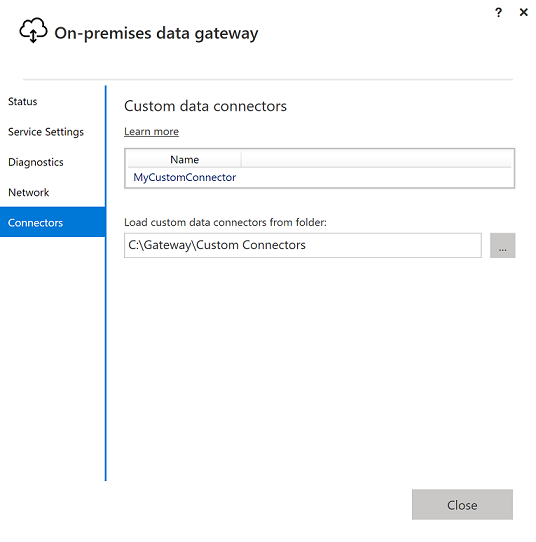
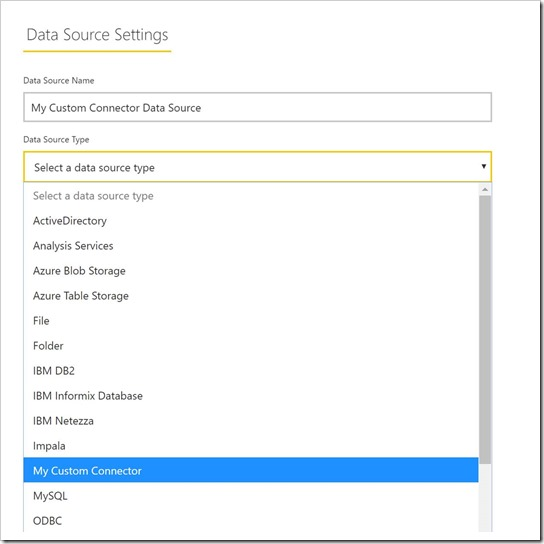

# Use custom data connectors with the on-premises data gateway

Data Connectors for Power BI enable you to connect to and access data from an application, service, or data source. You can develop custom data connectors and use them in Power BI Desktop.

To learn more about how to develop custom data connectors for Power BI, check out the [Data Connector SDK GitHub page](http://aka.ms/dataconnectors). This site includes getting started information and samples for Power BI and Power Query.

When you build reports in Power BI Desktop that use custom data connectors, you can use the on-premises data gateway to refresh those reports from the Power BI service.

## How to enable and use this capability

When you install the July 2018 version of the On-premises data gateway or a later version, you can see a **Connectors** tab in the on-premises data gateway app, with an option to choose a folder from which to load custom connectors. Make sure you pick a folder that can be accessed by the user running the gateway service (which is *NT SERVICE\PBIEgwService* by default). The gateway automatically loads the custom connector files located in that folder, and you'll see them in the list of the data connectors.

If you're using the on-premises data gateway (personal mode), you'll be able at this point to upload your Power BI report to the Power BI service and use the gateway to refresh it.

For the on-premises data gateway, you still need to create a data source for your custom connector. In the gateway settings page in the Power BI service, you should see a new option when you select the gateway cluster to allow using custom connectors with this cluster. Make sure all gateways in the cluster have the July 2018 update release or later for this option to be available. Now select that option to enable using custom connectors with this cluster.

When this option is enabled, you now see your custom connectors as available data sources that you can create under this gateway cluster. Once you create a data source using your new custom connector, you can now refresh Power BI reports using that custom connector in the Power BI service.

## Considerations and limitations

* Make sure the folder you create is accessible to the background gateway service. Typically, folders under your user’s Windows folder or system folders won’t be accessible. The on-premises data gateway app shows a message if the folder is not accessible (this doesn't apply for the personal version of the gateway)
* For custom connectors to work with the on-premises data gateway, they need to implement a “TestConnection” section in the custom connector’s code. This is not required when using custom connectors with Power BI Desktop. You can have one that works with the Desktop, but not with the gateway for this reason. Please refer to [this documentation](https://github.com/Microsoft/DataConnectors/blob/master/docs/m-extensions.md#implementing-testconnection-for-gateway-support) on how to implement a TestConnection section.

## Next steps

* [Manage your data source - Analysis Services](service-gateway-enterprise-manage-ssas.md)  
* [Manage your data source - SAP HANA](service-gateway-enterprise-manage-sap.md)  
* [Manage your data source - SQL Server](service-gateway-enterprise-manage-sql.md)  
* [Manage your data source - Oracle](service-gateway-onprem-manage-oracle.md)  
* [Manage your data source - Import/Scheduled refresh](service-gateway-enterprise-manage-scheduled-refresh.md)  

* [Configure proxy settings for the on-premises data gateway](/data-integration/gateway/service-gateway-proxy)  
* [Use Kerberos for SSO (single sign-on) from Power BI to on-premises data sources](service-gateway-sso-kerberos.md)  

More questions? [Try the Power BI Community](http://community.powerbi.com/)
