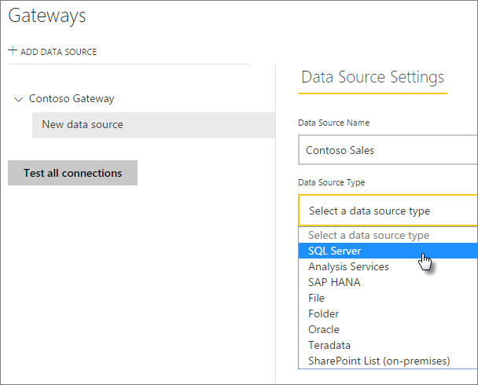

# Manage data sources

Power BI supports many on-premises data sources, and each has its own requirements. A gateway can be used for a single data source or multiple data sources. For this example, we'll show you how to add SQL Server as a data source, but the steps are similar for other data sources.

>[!NOTE]
>Most data sources management operations can be performed using APIs as well. For more information, see [Rest APIs(Gateways)](/rest/api/power-bi/gateways).

## Add a data source

>[!NOTE]
>Groups without an email can't be added.

1. In the upper-right corner of the Power BI service, select the gear icon  > **Manage gateways**.

    

2. Either select a gateway > **Add data source**, or go to Gateways > **Add data source**.

    

3. Select the **Data Source Type**.

    

4. Enter information for the data source. For this example, it's **Server**, **Database**, and other information.  

    

5. For SQL server, you would choose an **Authentication Method** of **Windows** or **Basic** (SQL Authentication). If you choose **Basic**, enter the credentials for your data source.

6. Under **Advanced settings**, optionally configure the [privacy level](https://support.office.com/article/Privacy-levels-Power-Query-CC3EDE4D-359E-4B28-BC72-9BEE7900B540) for your data source (doesn't apply to [DirectQuery](desktop-directquery-about.md)).

    

7. Select **Add**. You see *Connection Successful* if the process succeeds.

    

You can now use this data source to include data from SQL Server in your Power BI dashboards and reports.

## Remove a data source

You can remove a data source if you're no longer using it. Be aware that removing a data source breaks any dashboards and reports that rely on that data source.

To remove a data source, go to the data source then select **Remove**.

## Using the data source for scheduled refresh or DirectQuery

After you've created the data source, it will be available to use with either DirectQuery connections, or through scheduled refresh.

> [!NOTE]
>Server and database names have to match between Power BI Desktop and the data source within the on-premises data gateway.

The link between your dataset and the data source in the gateway is based on your server name and database name. These names have to match. For example, if you supply an IP address for the server name, in Power BI Desktop, you must use the IP address for the data source in the gateway configuration. If you use *SERVER\INSTANCE* in Power BI Desktop, you must use the same in the data source configured for the gateway.

If you're listed in the **Users** tab of the data source configured in the gateway, and the server and database name match, you'll see the gateway as an option to use with scheduled refresh.

> [!WARNING]
> If your dataset contains multiple data sources, each data source must be added in the gateway. If one or more data sources are not added to the gateway, you will not see the gateway as available for scheduled refresh.

### Limitations

OAuth is a supported authentication scheme only for custom connectors with the on-premises data gateway. You can't add other data sources that require OAuth. If your dataset has a data source requiring OAuth and this data source is not a custom connector, you won't be able to use the gateway for scheduled refresh.

## Manage users

After you add a data source to a gateway, you give users and email-enabled security groups access to the specific data source (not the entire gateway). The data source users list controls only who is allowed to publish reports that include data from the data source. Report owners can create dashboards, content packs, and apps, and then share those with other users.

You can also give users and security groups administrative access to the gateway.

### Add users to a data source

1. In the upper-right corner of the Power BI service, select the gear icon  > **Manage gateways**.

2. Select the data source where you want add users.

3. Select **Users**, and enter a user from your organization who you want to grant access to the selected data source. For example, in the following screen, you're adding Maggie and Adam.

    

4. Select **Add**, and the added member shows up in the box.

    

And that’s all there is to it. Remember that you need to add users to each data source that you want to grant access to. Each data source has a separate list of users, and you must add users to each data source separately.

### Remove users from a data source

On the **Users** tab for the data source, you can remove users and security groups that use this data source.

## Storing encrypted credentials in the cloud

When you add a data source to the gateway, you need to provide credentials for that data source. All queries to the data source will run using these credentials. The credentials are encrypted securely, using symmetric encryption so that they can't be decrypted in the cloud, before they're stored in the cloud. The credentials are sent to the machine running the gateway, on-premises, where they're decrypted when the data sources are accessed.

## List of available data source types

| **Data source** | **Live/DirectQuery** | **User configured manual or scheduled refresh** |
| --- | --- | --- |
| ActiveDirectory |No |Yes |
| Amazon Redshift |Yes |Yes |
| Analysis Services |Yes |Yes |
| AtScale cubes |Yes |Yes |
| Azure Blob Storage |No |Yes |
| Azure DevOps Server |No |Yes |
| Azure Table Storage |No |Yes |
| BI Connector |Yes |Yes |
| Denodo |Yes |Yes |
| Dremio |Yes |Yes |
| EmigoDataSourceConnector |No |Yes |
| Essbase |Yes |Yes |
| Exasol |Yes |Yes |
| File |No |Yes |
| Folder |No |Yes |
| Paxata |No |Yes |
| IBM DB2 |Yes |Yes |
| IBM Informix Database |No |Yes |
| IBM Netezza |Yes |Yes |
| Impala |Yes |Yes |
| Jethro ODBC |Yes |Yes |
| Kyligence Enterprise |Yes |Yes |
| MarkLogic ODBC |Yes |Yes |
| Microsoft Graph Security |No |Yes |
| MySQL |No |Yes |
| ODBC |No |Yes |
| OData |No |Yes |
| OleDb |No |Yes |
| Oracle |Yes |Yes |
| PostgreSQL |No |Yes |
| QubolePresto |Yes |Yes |
| Quick Base Connector |No |Yes |
| SAP Business Warehouse Message Server |Yes |Yes |
| SAP Business Warehouse Server |Yes |Yes |
| SAP HANA |Yes |Yes |
| SQL Server |Yes |Yes |
| SharePoint |No |Yes |
| Snowflake |Yes |Yes |
| Spark |Yes |Yes |
| SurveyMonkey |No |Yes |
| Sybase |No |Yes |
| TeamDesk.Database |No |Yes |
| Teradata |Yes |Yes |
| Vertica |Yes |Yes |
| Web |No |Yes |
| Workforce Dimensions |No |Yes |

>[!NOTE]
>In addition to on-premises data sources, sources behind a firewall, VPN, or virtual network might also need a data gateway.

## Next steps

* [Manage your data source - Analysis Services](service-gateway-enterprise-manage-ssas.md)
* [Manage your data source - SAP HANA](service-gateway-enterprise-manage-sap.md)
* [Manage your data source - SQL Server](service-gateway-enterprise-manage-sql.md)
* [Manage your data source - Oracle](service-gateway-onprem-manage-oracle.md)
* [Manage your data source - Import/Scheduled Refresh](service-gateway-enterprise-manage-scheduled-refresh.md)
* [Guidance for deploying a data gateway](service-gateway-deployment-guidance.md)

More questions? [Try the Power BI Community](http://community.powerbi.com/)
