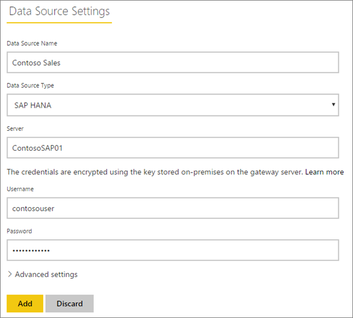
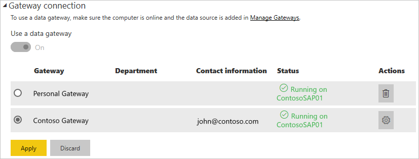

# Manage your data source - SAP HANA

Once you've [installed the on-premises data gateway](/data-integration/gateway/service-gateway-install), you'll need to [add data sources](service-gateway-data-sources.md#add-a-data-source) that can be used with the gateway. This article looks at how to work with gateways and SAP HANA data sources that are used either for scheduled refresh or for DirectQuery.

## Add a data source

For information about how to add a data source, see [Add a data source](service-gateway-data-sources.md#add-a-data-source). Select SAP HANA for the **Data Source Type**.

Once you've selected the SAP HANA data source type, you'll then fill in the **Server**, **Username**, and **Password** information for the data source.

> [!NOTE]
> All queries to the data source will run using these credentials. To learn more about how credentials are stored, see [Storing encrypted credentials in the cloud](service-gateway-data-sources.md#storing-encrypted-credentials-in-the-cloud).

Select **Add** after you've gotten everything filled in. You can now use this data source for scheduled refresh, or DirectQuery, against a SAP HANA server that is on-premises. You will see *Connection Successful* if it succeeded.

### Advanced settings

Optionally, you can configure the privacy level for your data source. This controls how data can be combined. This is only used for scheduled refresh. It does not apply to DirectQuery. To learn more about privacy levels for your data source, see [Privacy levels (Power Query)](https://support.office.com/article/Privacy-levels-Power-Query-CC3EDE4D-359E-4B28-BC72-9BEE7900B540).

## Using the data source

After you've created the data source, it will be available to use with either DirectQuery connections, or through scheduled refresh.

> [!NOTE]
> The server and database name have to match between Power BI Desktop and the data source within the on-premises data gateway.

The link between your dataset and the data source within the gateway is based on your server name and database name. These have to match. For example, if you supply an IP Address for the server name, within Power BI Desktop, you'll need to use the IP Address for the data source within the gateway configuration. If you use *SERVER\INSTANCE*, in Power BI Desktop, you'll need to use the same within the data source configured for the gateway.

This is the case for both DirectQuery and scheduled refresh.

### Using the data source with DirectQuery connections

You'll need to make sure the server and database name matches between Power BI Desktop and the configured data source for the gateway. You'll also need to make sure your user is listed in the **Users** tab of the data source in order to publish DirectQuery datasets. The selection for DirectQuery occurs within Power BI Desktop when you first import data. For more information about using DirectQuery, see [Use DirectQuery in Power BI Desktop](desktop-use-directquery.md).

After you publish, either from Power BI Desktop or **Get Data**, your reports should start working. It may take several minutes, after creating the data source within the gateway, for the connection to be usable.

### Using the data source with scheduled refresh

If you're listed in the **Users** tab of the data source configured within the gateway, and the server and database name match, you'll see the gateway as an option to use with scheduled refresh.

## Next steps

* [Troubleshooting the on-premises data gateway](/data-integration/gateway/service-gateway-tshoot)
* [Troubleshoot gateways - Power BI](service-gateway-onprem-tshoot.md)  

More questions? [Try the Power BI Community](http://community.powerbi.com/)

