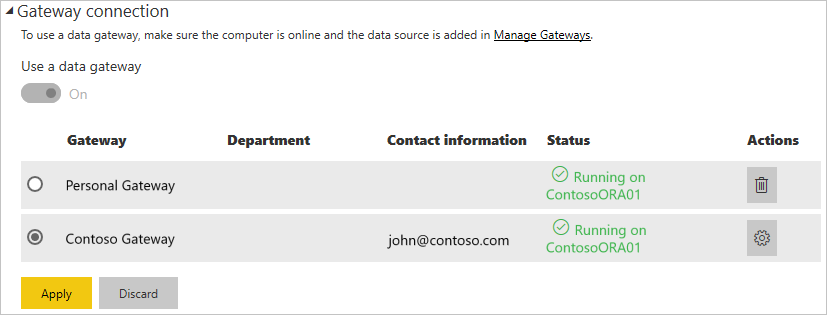

# Manage your data source - Import/Scheduled Refresh

Once you have [installed the on-premises data gateway](/data-integration/gateway/service-gateway-install), you'll need to [add data sources](service-gateway-data-sources.md#add-a-data-source) that can be used with the gateway. This article looks at how to work with gateways and data sources that are used for scheduled refresh as opposed to DirectQuery or live connections.

## Add a data source

For information about how to add a data source, see [Add a data source](service-gateway-data-sources.md#add-a-data-source).

All of the data source types listed can be used for scheduled refresh with the on-premises data gateway. Analysis Services, SQL Server, and SAP HANA can be used for either scheduled refresh, or DirectQuery/live connections.

You'll then want to fill in the information for the data source, which includes the source information and credentials used to access the data source.

> [!NOTE]
> All queries to the data source will run using these credentials. To learn more about how credentials are stored, see [Storing encrypted credentials in the cloud](service-gateway-data-sources.md#storing-encrypted-credentials-in-the-cloud).

For a list of data source types that can be used with scheduled refresh, see [List of available data source types](service-gateway-data-sources.md#list-of-available-data-source-types).

Select **Add** after you have everything filled in. You can now use this data source for scheduled refresh with your on-premises data. You'll see *Connection Successful* if it succeeded.

### Advanced settings

Optionally, you can configure the privacy level for your data source. This controls how data can be combined. This is only used for scheduled refresh. To learn more about privacy levels for your data source, see [Privacy levels (Power Query)](https://support.office.com/article/Privacy-levels-Power-Query-CC3EDE4D-359E-4B28-BC72-9BEE7900B540).

## Using the data source for scheduled refresh

After you've created the data source, it will be available to use with either DirectQuery connections or through scheduled refresh.

> [!NOTE]
> The server and database name have to match between Power BI Desktop and the data source within the on-premises data gateway.

The link between your dataset and the data source within the gateway is based on your server name and database name. These have to match. For example, if you supply an IP Address for the server name, within Power BI Desktop, you'll need to use the IP Address for the data source within the gateway configuration. If you use *SERVER\INSTANCE*, in Power BI Desktop, you'll need to use the same within the data source configured for the gateway.

If you're listed in the **Users** tab of the data source configured within the gateway, and the server and database name match, you'll see the gateway as an option to use with scheduled refresh.

> [!WARNING]
> If your dataset contains multiple data sources, each data source must be added within the gateway. If one or more data sources are not added to the gateway, you won't see the gateway as available for scheduled refresh.

## Limitations

OAuth is not a supported authentication scheme with the on-premises data gateway. You cannot add data sources that require OAuth. If your dataset has a data source requiring OAuth, you won't be able to use the gateway for scheduled refresh.

## Next steps

* [Troubleshooting the on-premises data gateway](/data-integration/gateway/service-gateway-tshoot)
* [Troubleshoot gateways - Power BI](service-gateway-onprem-tshoot.md)

More questions? [Try the Power BI Community](http://community.powerbi.com/)
