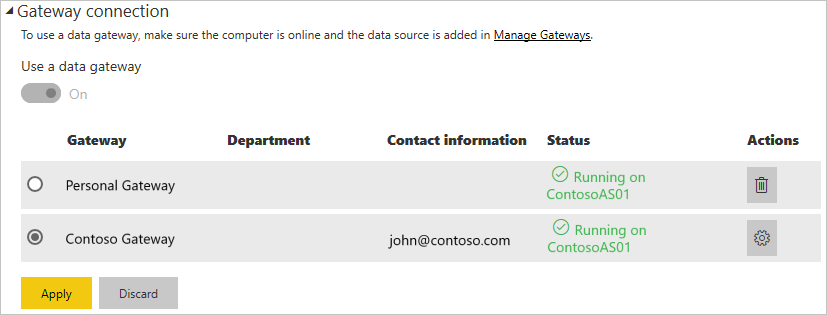

# Manage your data source - Analysis Services

Once you've [installed the on-premises data gateway](/data-integration/gateway/service-gateway-install), you'll need to [add data sources](service-gateway-data-sources.md#add-a-data-source) that can be used with the gateway. This article looks at how to work with gateways and Analysis Services data sources that are used either for scheduled refresh or for live connections.

To learn more about how to set up a live connection to Analysis Services, [watch this video](https://www.youtube.com/watch?v=GPf0YS-Xbyo&feature=youtu.be).

> [!NOTE]
> If you have an Analysis Services data source, you’ll need to install the gateway on a computer joined to the same forest/domain as your Analysis Services server.

## Add a data source

For information about how to add a data source, see [Add a data source](service-gateway-data-sources.md#add-a-data-source). Select Analysis Services for the **Data Source Type** if you're connecting to either a Multidimensional or Tabular server.


You'll then want to fill in the information for the data source, which includes the **Server** and the **Database**. The **Username** and **Password** that you enter will be used by the gateway to connect to the Analysis Services instance.

> [!NOTE]
> The Windows account you enter must have Server Administrator permissions for the instance you are connecting to. If this account’s password is set to expire, users could get a connection error if the password isn’t updated for the data source. To learn more about how credentials are stored, see [Storing encrypted credentials in the cloud](service-gateway-data-sources.md#storing-encrypted-credentials-in-the-cloud).


Select **Add** after you have everything filled in. You can now use this data source for scheduled refresh, or live connections, against an Analysis Services instance that is on premises. You will see *Connection Successful* if it succeeded.


### Advanced settings

Optionally, you can configure the privacy level for your data source. This controls how data can be combined. This is only used for scheduled refresh. It does not apply to live connections. To learn more about privacy levels for your data source, see [Privacy levels (Power Query)](https://support.office.com/article/Privacy-levels-Power-Query-CC3EDE4D-359E-4B28-BC72-9BEE7900B540).


## Usernames with Analysis Services

<iframe width="560" height="315" src="https://www.youtube.com/embed/Qb5EEjkHoLg" frameborder="0" allowfullscreen></iframe>

Each time a user interacts with a report connected to Analysis Services, the effective username is passed to the gateway and then onto your on-premises Analysis Services server. The email address, that you sign into Power BI with, is what we'll pass to Analysis Services as the effective user. This is passed in the connection property [EffectiveUserName](https://msdn.microsoft.com/library/dn140245.aspx#bkmk_auth). This email address should match a defined user principal name (UPN) within the local Active Directory Domain. The UPN is a property of an Active Directory account. That Windows account then needs to be present in an Analysis Services role. If a match cannot be found in Active Directory, the login will not be successful. To learn more about Active Directory and user naming, see [User Naming Attributes](https://msdn.microsoft.com/library/ms677605.aspx).

You can also [map your Power BI sign in name with a local directory UPN](service-gateway-enterprise-manage-ssas.md#mapping-usernames-for-analysis-services-data-sources).

## Mapping usernames for Analysis Services data sources

<iframe width="560" height="315" src="https://www.youtube.com/embed/eATPS-c7YRU" frameborder="0" allowfullscreen></iframe>

Power BI allows for mapping usernames for Analysis Services data sources. You can configure rules to map a username logged in with Power BI to a name that is passed for EffectiveUserName on the Analysis Services connection. The map user names feature is a great way to work around when your username in AAD doesn't match a UPN in your local Active Directory. For example, if your email address is nancy@contoso.onmicrsoft.com, you could map it to nancy@contoso.com, and that value would be passed to the gateway.

You can map user names for Analysis Services in two different ways:

* Manual user re-mapping
* On-premises Active Directory Property Lookup to remap AAD UPNs to Active Directory users (AD Lookup mapping)

While it's possible to perform manual mapping using the second approach, doing so would be time consuming and difficult to maintain. It's especially difficult when pattern matching doesn't suffice - such as when domain names are different between AAD and on-premises AD, or when user account names are different between AAD and AD. As such, manual mapping with the second approach is not recommended.

We describe these two approaches, in order, in the following two sections.

### Manual user name re-mapping

For Analysis Services data sources, you can configure custom User Principal Name (UPN) rules. This will help you if your Power BI service login names do not match your local directory UPN. For example, if you sign into Power BI with john@contoso.com, but your local directory UPN is john@contoso.local, you can configure a mapping rule to have john@contoso.local passed to Analysis Services.

To get to the UPN Mapping screen, do the following.

1. Go to the **gear icon** and select **Manage Gateways**.
2. Expand the gateway that contains the Analysis Services data source. Or, if you haven't created the Analysis Services data source, you can do that at this point.
3. Select the data source and then select the **Users** tab.
4. Select **Map user names**.

    

You will then see options to add rules as well as test for a given user.

> [!NOTE]
> You may inadvertently change a user that you didn't intend to. For example, if your **Replace (original value)** is <em>@contoso.com</em> and your **With (New name)** is <em>@contoso.local</em>, all users with a sign in that contains <em>@contoso.com</em> will then be replaced with <em>@contoso.local</em>. Also, if your **Replace (Original name)** is <em>dave@contoso.com</em> and your **With (New name)** is <em>dave@contoso.local</em>, a user with the sign in of v-dave@contoso.com would be sent as v-dave<em>@contoso.local</em>.

### AD lookup mapping

To perform on-premises AD property lookup to re-map AAD UPNs to Active Directory users, follow the steps in this section. To begin with, let's review how this works.

In the **Power BI service** the following occurs:

* For each query by a Power BI AAD user to an on-premises SSAS server, a UPN string is passed along, such as:
       firstName.lastName@contoso.com

> [!NOTE]
> Any manual UPN user mappings defined in the Power BI data source configuration are still applied *before* sending the user name string to the on-premises data gateway.

On the on-premises data gateway with configurable Custom User Mapping, do the following:

1. Find Active Directory to search (automatic, or configurable).
2. Look up the attribute of the AD Person (such as *Email*) based on incoming UPN string (“firstName.lastName@contoso.com”) from the **Power BI service**.
3. If the AD Lookup fails, it attempts to use the passed-along UPN as EffectiveUser to SSAS.
4. If the AD Lookup succeeds, it retrieves *UserPrincipalName* of that AD Person.
5. It passes the *UserPrincipalName* email as *EffectiveUser* to SSAS, such as <em>Alias@corp.on-prem.contoso</em>.

To configure your gateway to perform the AD Lookup:

1. [Download and install the latest gateway](/data-integration/gateway/service-gateway-install).

2. In the gateway, you need to change the **on-premises data gateway service** to run with a domain account (instead of a local service account – otherwise the AD lookup won’t work properly at runtime). Go to the [on-premises data gateway app](/data-integration/gateway/service-gateway-app) on your machine, then go to **Service settings > Change service account**. Make sure you have the recovery key for this gateway, since you'll need to restore it on the same machine unless you want to create a new gateway instead. You'll need to restart the gateway service for the change to take effect.

3. Navigate to the gateway’s installation folder, *C:\Program Files\On-premises data gateway* as an administrator, to ensure that you have write-permissions, and open the  *Microsoft.PowerBI.DataMovement.Pipeline.GatewayCore.dll.config* file.

4. Edit the following two configuration values according to *your* Active Directory attribute configurations for your AD users. The configuration values shown below are just examples – you need to specify them based on your Active Directory configuration. These configurations are case-sensitive, so make sure they match the values in Active Directory.

    

    If no value is provided for the ADServerPath configuration, the gateway uses the default Global Catalog. You can also specify multiple values for the ADServerPath. Each value must be separated by a semicolon, as in the following example.

    ```xml
    <setting name="ADServerPath" serializeAs="String">
        <value> >GC://serverpath1; GC://serverpath2;GC://serverpath3</value>
    </setting>
    ```

    The gateway parses the values for ADServerPath from left to right until it finds a match. If no match is found, then the original UPN is used. Make sure the account running the gateway service (PBIEgwService) has query permissions to all AD servers that you specify in ADServerPath.

    The gateway supports two types of ADServerPath, as in the following examples.

    **WinNT**

    ```xml
    <value="WinNT://usa.domain.corp.contoso.com,computer"/>
    ```

    **GC**

    ```xml
    <value> GC://USA.domain.com </value>
    ```

5. Restart the **on-premises data gateway** service for the configuration change to take effect.

### Working with mapping rules

To create a mapping rule, enter a value for **Original name** and **New Name** and then select **Add**.

| Field | Description |
| --- | --- |
| Replace (Original name) |The email address that you signed into Power BI with. |
| With (New Name) |The value you want to replace it with. The result of the replacement is what will be passed to the *EffectiveUserName* property for the Analysis Services connection. |


When you select an item in the list, you can choose to re-order it by using the **chevron icons**, or **Delete** the entry.


### Using wildcard (*)

You can use a wildcard for your **Replace (Original name)** string. It can only be used on its own and not with any other string part. This will allow you to take all users and pass a single value to the data source. This is useful when you want all users in your organization to use the same user in your local environment.

### Test a mapping rule

You can validate what an original name will be replaced with by entering a value for **Original name** and selecting **Test rule**.


> [!NOTE]
> Rules that are saved will take a few minutes before the service starts using them. Within the browser, the rule will work immediately.

### Limitations for mapping rules

Mapping is for the specific data source that is being configured. It's not a global settings. If you have multiple Analysis Services data sources, you'll have to map the users for each data source.

## Authentication to a live Analysis Services data source

Each time a user interacts with Analysis Services, the effective username is passed to the gateway and then onto your on-premises Analysis Services server. The user principal name (UPN), typically the email address you sign into the cloud with, is what we'll pass to Analysis Services as the effective user. The UPN is passed in the connection property EffectiveUserName. This email address should match a defined UPN within the local Active Directory domain. The UPN is a property of an Active Directory account. That Windows account then needs to be present in an Analysis Services role to have access to the server. The login will not be successful if no match is found in Active Directory.

Analysis Services can also provide filtering based on this account. The filtering can occur with either role based security, or row-level security.

## Role-based security

Models provide security based on user roles. Roles are defined for a particular model project during authoring in SQL Server Data Tools – Business Intelligence (SSDT-BI), or after a model is deployed, by using SQL Server Management Studio (SSMS). Roles contain members by Windows username or by Windows group. Roles define permissions a user has to query or perform actions on the model. Most users will belong to a role with Read permissions. Other roles are meant for administrators with permissions to process items, manage database functions, and manage other roles.

## Row-level security

Row-level security is specific to Analysis Services row-level security. Models can provide dynamic, row-level security. Unlike having at least one role in which users belong to, dynamic security is not required for any tabular model. At a high-level, dynamic security defines a user’s read access to data right down to a particular row in a particular table. Similar to roles, dynamic row-level security relies on a user’s Windows username.

A user’s ability to query and view model data are determined first by the roles their Windows user account are a member of and second, by dynamic row-level security, if configured.

Implementing role and dynamic row-level security in models are beyond the scope of this article. You can learn more at [Roles (SSAS Tabular)](https://msdn.microsoft.com/library/hh213165.aspx) and [Security Roles (Analysis Services - Multidimensional Data)](https://msdn.microsoft.com/library/ms174840.aspx) on MSDN. And, for the most in-depth understanding of tabular model security, download and read the [Securing the Tabular BI Semantic Model whitepaper](https://msdn.microsoft.com/library/jj127437.aspx).

## What about Azure Active Directory?

Microsoft cloud services use [Azure Active Directory](/azure/active-directory/fundamentals/active-directory-whatis) to take care of authenticating users. Azure Active Directory is the tenant that contains usernames and security groups. Typically, the email address a user signs in with is the same as the UPN of the account.

What is my local Active Directory’s role?

For Analysis Services to determine if a user connecting to it belongs to a role with permissions to read data, the server needs to convert the effective username passed from AAD to the gateway, and onto the Analysis Services server. The Analysis Services server passes the effective username to a Windows Active Directory domain controller (DC). The Active Directory DC then validates the effective username is a valid UPN, on a local account, and returns that user’s Windows username back to the Analysis Services server.

EffectiveUserName cannot be used on a non-domain joined Analysis Services server. The Analysis Services server must be joined to a domain to avoid any login errors.

### How do I tell what my UPN is?

You may not know what your UPN is, and you may not be a domain administrator. You can use the following command from your workstation to find out the UPN for your account.

    whoami /upn

The result will look similar to an email address, but this is the UPN that's on your domain account. If you're using an Analysis Services data source for live connections, and if this doesn't match the email address you sign into Power BI with, you may want to look at how to [map user names](#mapping-usernames-for-analysis-services-data-sources).

## Synchronize an on-premises Active Directory with Azure Active Directory

You'll want your local Active Directory accounts to match Azure Active Directory if you're going to be using Analysis Services live connections. As the UPN has to match between the accounts.

The cloud services only know about accounts within Azure Active Directory. It doesn’t matter if you added an account in your local Active Directory, if it doesn’t exist in AAD, it cannot be used. There are different ways that you can match your local Active Directory accounts with Azure Active Directory.

1. You can add accounts manually to Azure Active Directory.

   You can create an account on the Azure portal, or within the Microsoft 365 admin center, and the account name matches the UPN of the local Active Directory account.

2. You can use the [Azure AD Connect](/azure/active-directory/hybrid/how-to-connect-sync-whatis) tool to synchronize local accounts to your Azure Active Directory tenant.

   The Azure AD Connect tool provides options for directory synchronization and setting up authentication, including password hash sync, pass-through authentication, and federation. If you are not a tenant admin or a local domain administrator, you'll need to contact your IT admin to get this configured.

Using Azure AD Connect ensures that the UPN will match between AAD and your local Active Directory.

> [!NOTE]
> Synchronizing accounts with the Azure AD Connect tool will create new accounts within your AAD tenant.

## Using the data source

After you've created the data source, it will be available to use with either live connections, or through scheduled refresh.

> [!NOTE]
> The server and database name have to match between Power BI Desktop and the data source within the on-premises data gateway.

The link between your dataset and the data source within the gateway is based on your server name and database name. These have to match. For example, if you supply an IP Address for the server name, within Power BI Desktop, you'll need to use the IP Address for the data source within the gateway configuration. If you use *SERVER\INSTANCE*, in Power BI Desktop, you'll need to use the same within the data source configured for the gateway.

This is the case for both live connections and scheduled refresh.

### Using the data source with live connections

You'll need to make sure the server and database name matches between Power BI Desktop and the configured data source for the gateway. You'll also need to make sure your user is listed in the **Users** tab of the data source in order to publish live connection datasets. The selection, for live connections, occurs within Power BI Desktop when you first import data.

After you publish, either from Power BI Desktop or **Get Data**, your reports should start working. It may take several minutes, after creating the data source within the gateway, for the connection to be usable.

### Using the data source with scheduled refresh

If you're listed in the **Users** tab of the data source configured within the gateway, and the server and database name match, you'll see the gateway as an option to use with scheduled refresh.



### Limitations of Analysis Services live connections

You can use a live connection against tabular or multidimensional instances.

| **Server version** | **Required SKU** |
| --- | --- |
| 2012 SP1 CU4 or later |Business Intelligence and Enterprise SKU |
| 2014 |Business Intelligence and Enterprise SKU |
| 2016 |Standard SKU or higher |

* Cell level Formatting and translation features are not supported.
* Actions and Named Sets are not exposed to Power BI, but you can still connect to multidimensional cubes that also contain Actions or Named sets and create visuals and reports.

## Next steps

* [Troubleshooting the on-premises data gateway](/data-integration/gateway/service-gateway-tshoot)
* [Troubleshoot gateways - Power BI](service-gateway-onprem-tshoot.md)

More questions? [Try the Power BI Community](http://community.powerbi.com/)

