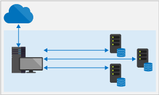

# What are On-Premises Data Gateways?

A Power BI gateway is software that you install within an on-premises network; it facilitates access to data in that network. It's like a gatekeeper that listens for connection requests, and grants them only when a users' requests meet certain criteria. This lets organizations keep databases and other data sources on their on-premises networks, yet securely use that on-premises data in Power BI reports and dashboards.

A gateway can be used for a single data source or multiple data sources. The following diagram shows a basic view, with the gateway handling requests from the cloud for three on-premises computers. We'll expand on this later in the article.

## Types of gateways

Power BI offers two gateways, each for a different scenario:

* **On-premises data gateway (personal mode)** – allows one user to connect to sources, and can’t be shared with others. Can only be used with Power BI. This gateway is well-suited to scenarios where you’re the only person who creates reports, and you don't need to share the data sources with others.

* **On-premises data gateway** – allows multiple users to connect to multiple on-premises data sources. Can be used by Power BI, PowerApps, Flow, Azure Analysis Services, and Azure Logic apps, all with a single gateway installation. This gateway is well-suited to more complex scenarios with multiple people accessing multiple data sources. 

## Using a gateway

There are four main steps for using a gateway:

1. **Install the gateway** on a local computer, using the appropriate mode
2. **Add users to the gateway**, so they can access on-premises data sources
3. **Connect to data sources**, so they can be used in reports and dashboards
4. **Refresh on-premises data**, so Power BI reports are up to date

You can install a stand-alone gateway or add a gateway to a *cluster*, which is recommended for high availability.

## How gateways work

The gateway you install runs as a Windows service, **On-premises data gateway**. This local service is registered with the Gateway Cloud Service through Azure Service Bus. The following diagram shows the flow between on-premises data and the cloud services that use the gateway.

Queries and data flow:

1. A query is created by the cloud service with the encrypted credentials for the on-premises data source. It's then sent to a queue for the gateway to process.
2. The gateway cloud service analyzes the query and pushes the request to the Azure Service Bus. Power BI manages the Service Bus for you, so there are no additional costs or configuration steps required.
3. The on-premises data gateway polls the Azure Service Bus for pending requests.
4. The gateway gets the query, decrypts the credentials, and connects to the data sources with those credentials.
5. The gateway sends the query to the data source for execution.
6. The results are sent from the data source, back to the gateway, and then onto the cloud service and your server.

## Next steps
[Install the on-premises data gateway](service-gateway-install.md)

More questions? [Try the Power BI Community](http://community.powerbi.com/)

