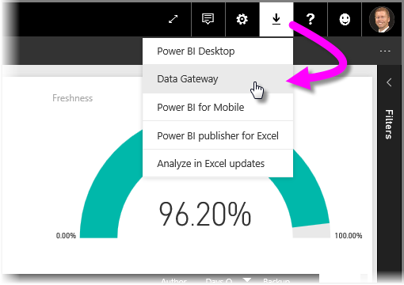
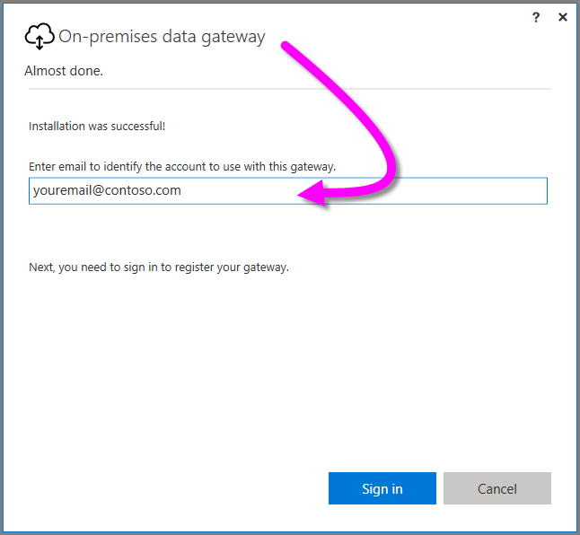
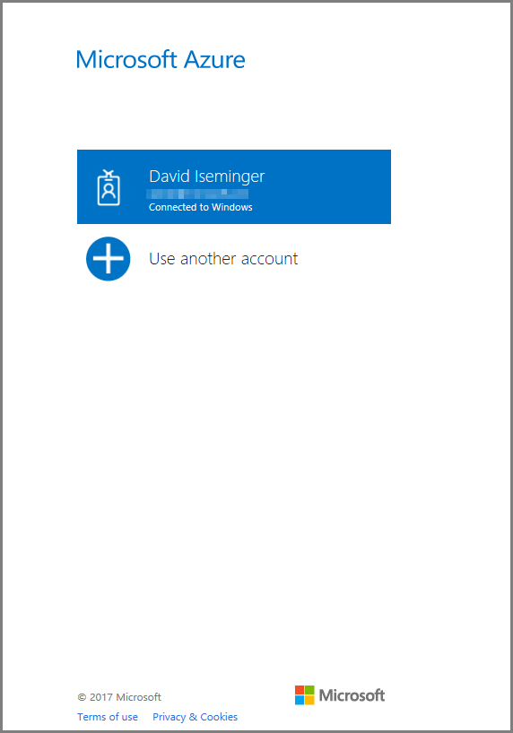
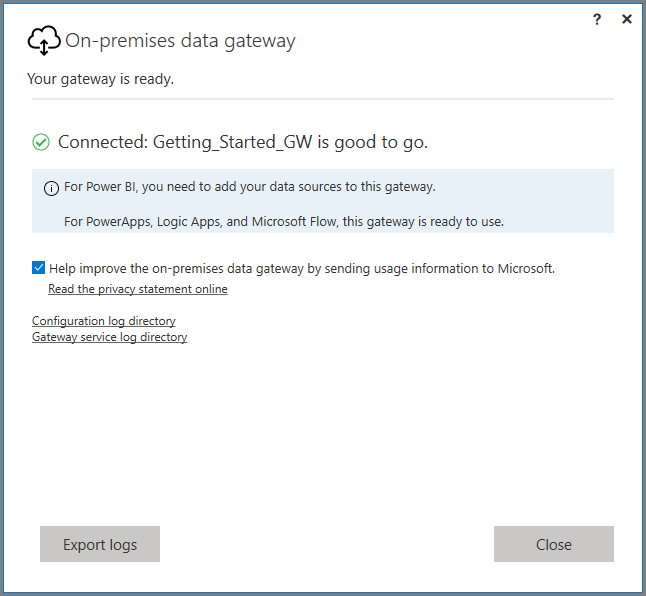
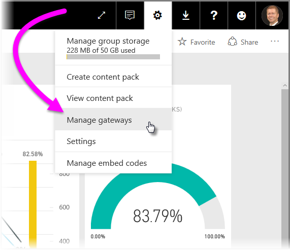
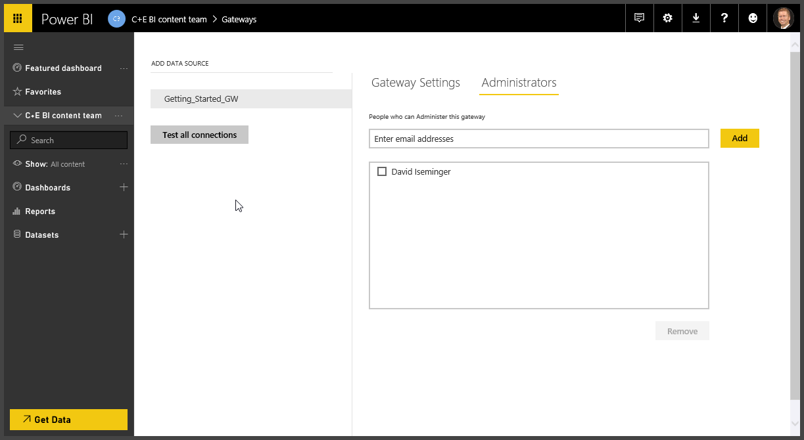
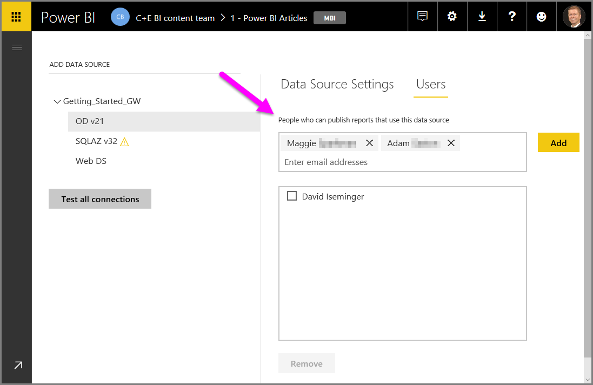

# Getting started with Power BI gateways
Welcome to the **Getting started with Power BI gateways** guide. This short walk-through gets you acquainted with what a gateway does, how it works, and how to get your own gateway installed, configured, and running.  

Gateways can be a technical subject, and since every network and enterprise is different, the complexity of gateways can be significant. To keep that complexity at bay, let’s start with the basics.

## How Power BI gateways work
A **gateway** is software that facilitates access to data that resides on a private, on-premises network, for subsequent use in a cloud service like Power BI. It’s like a gatekeeper that listens for connection requests, and grants them only when a users’ requests meet certain criteria (such as whether they’re allowed to use the gateway). This lets organizations leave databases and warehouses on their on-premises networks, yet securely use subsets of that data to create compelling reports and dashboards in Power BI.

A gateway also secures access and data by encrypting and compressing all data that passes through it, as well as any passwords used to connect to data sources. All this sounds straightforward I’m sure, but there are many details to consider.

Sometimes you want a gateway just for you – maybe you have a big Excel workbook plus three SQL databases with years of running sales and marketing data, and you want to create a Power BI dashboard that shows those sales from every angle. You’re the only person who creates reports, it’s your Excel workbook, and only you use those databases to create Power BI reports. You just need a gateway for your personal use, not to share those data sources with everyone else.

Other times, you might be in an organization with all sorts of databases from different vendors, including Analysis Services, SAP, Oracle, IBM, and various other data sources, and you need lots of people to access them, so they can create multitudes of reports. In this case, you need a gateway that lets you configure access to all those sources, and then you need to share it with many people in your organization. That’s a different kind of gateway altogether.

Fortunately, Power BI offers two gateways, fitting each of those scenarios well. These two gateway offerings from Power BI are the following:

* **On-premises data gateway (personal mode)** – allows one user to connect to sources, and can’t be shared with others. Can only be used with Power BI.
* **On-premises data gateway** – allows multiple users to connect to multiple on-premises data sources, and can be used by Power BI, PowerApps, Flow, and Azure Logic apps, all with a single gateway installation.

Both gateways perform a similar function – they facilitate access to data residing on a private on-premises network, so that data can be used in cloud-based services like Power BI. The personal gateway can be used by one person and only by Power BI, the **on-premises data gateway** can be used by many users, and many services.

There are three parts, or stages, to putting a gateway to work:

* Install the gateway
* Add users to the gateway (let them use the gateway)
* Connect to data sources

In addition, using a gateway lets you do something else that can be important:

* Refresh on-premises data, so Power BI reports can be updated with fresh data

Refreshing data means your Power BI dashboards and reports look fresh, and reflect the latest data. So when someone views a report you created with on-premises data, that report can use show the latest information, even if you created the report a while ago.

The first part, installing a gateway, is easy. Allowing users to access the gateway is easy too – you just add them in a dialog within Power BI and they’re good. Connecting to data sources can get complex, because there are so many data sources and each has its own connection requirements and nuances. And we’ll handle refresh in another guide, to keep things in this article focused on the gateway.

So let’s take the easy thing first, and walk through installing a gateway.

## Install the gateway
To install a gateway, open the Power BI service (you can use this link to launch the Power BI service in your browser, and log on) and log in with your Power BI account. In the Power BI service, select the **download icon** in the upper right corner, as shown in the following image, and select **Data Gateway**.

That takes you to a download page, where you click the **Download gateway** button to initiate the download.

This screen gives you the ultra-condensed explanation of what a gateway does. It also provides a couple important **warnings** – when you install a gateway, it actually runs on the computer on which you perform the installation. And if that computer is turned off, so is the gateway (so it won’t work when it’s not running). Also, installing on a computer using a wireless network is not best, so you should use a computer connected to a wired network.

When you’re ready, select **Next** to continue with the setup.

Here’s where you decide which gateway you’ll install – on-premises gateway, or a personal gateway. In this guide, we’ll install the **On-premises data gateway**.

There are a few things to note at this decision point:

* Both gateways require 64-bit Windows operating systems.
* Gateways can’t be installed on a domain controller.
* You can install up to two on-premises data gateways on the same computer, one running in each mode (personal and standard). 
* You cannot have more than one gateway running in the same mode on the same computer.
* You can install multiple on-premises data gateways on different computers, and manage them all from the same Power BI gateway management interface (excluding personal, see the following bullet point).
* You can only have one personal mode gateway running for each Power BI user. If you install another personal mode gateway for the same user, even on a different computer, the most recent installation replaces the existing previous installation.

When we select **Next**, the gateway installation begins. You need to specify where it will be installed, and the default location is usually best.

The installation process goes quickly, and you’re provided with a status bar.

Once you’re almost complete, you need to identify the account to use with the gateway. This should be the account (the username and password) you use to log on to Power BI; the gateway is associated with your Power BI account, and you configure gateways from within the Power BI service.

You’ll be signed in, as shown in the following image.

Once you’re signed in, you need to create a **Recovery key**. We’ll discuss those more in depth in another article, but for now, know that you’ll need it to recover or move your gateway.

When all goes well, you’ll see a window that tells you that your gateway is ready.

That’s it for the installation of an on-premises gateway. As promised, it was a pretty easy process. The next step, then, is to either **add users** or **add data sources** – you can do either first, and add either after your initial configuration.

The next section describes adding users to the gateway, and after that, we’ll discuss where to go next to add data sources to the gateway.

## Add users to a gateway
Now that we have a gateway installed, we manage the gateway from the **Power BI service**. To get to the management screen for gateways, in the Power BI service select the Gear icon in the upper-right corner, then select **Manage gateways**.

A page inside the Power BI service canvas appears, where you can manage your gateways. The **Gateway Settings** page looks like the following.

If you tap or click on **Administrators**, you see the following administrators’ management page. Note that this is just which users can *administer* the gateway, and that users of the gateway are added (or removed) from each individual data source, using a different page – which we review in the next few paragraphs.

Once you install and validate (successfully connect to) a data source, it shows up under its associated gateway in the left side of this **Manage gateways** screen, as shown in the following image. Notice that in the right pane, there are two sections you can toggle between: **Data Source Settings** and **Users**. The screen directly following is the **Data Source Settings** section.

When you select **Users**, you get a text box into which you can type users from your organization who you want to grant access to the selected data source. In the following screen, you can see that I’ve added Maggie and Adam.

When you begin typing an email address into the text box, Power BI shows a list of users whose email matches what you’re typing, enabling you to click the name and add them to the list.

You can also add email groups (aliases) to allow groups of people access, as well as individuals.

Once you select **Add**, the added members show up in the box, and you can add more if you want. Removing users is just as easy. Simply check the checkbox next to their name, and then select the **Remove** button below the box.

And that’s all there is to it. Remember that you need to add users to each data source to which you want to grant access. Each data source has a separate list of users, and you must add users to each data source separately.

## Adding data sources
Of course, to make your gateway useful you’ll want to add data sources. This is where some of the complexity of Power BI gateways is introduced – there are many different data sources available, and each has its own requirements (and often, its own required driver).

But before we send you off to another article, here’s a look at how you go about adding a data source. While you’re in the **Manage gateways** page of the **Power BI service**, select the gateway to which you want to add a data source, and select **Add Data Source** in the upper-left corner of the page, just above the list of your gateways.

When you do, the **Data Source Settings** panel appears in the right pane, as shown in the following image. There, you can name your data source (entered in the **Data Source Name** text box), and select its type from the **Data Source Type** drop-down list.

Okay, you now have a gateway installed, and you’re ready to add data sources. Great! See the resources in the following section for information about data sources, more details about using gateways, and other useful information.

## Next steps
[Using the on-premises data gateway](service-gateway-onprem.md)  
[On-premises data gateway in-depth](service-gateway-onprem-indepth.md)  
[On-premises data gateway (personal mode)](service-gateway-personal-mode.md)
[Troubleshooting the on-premises data gateway](service-gateway-onprem-tshoot.md)  

More questions? [Try the Power BI Community](http://community.powerbi.com/)

