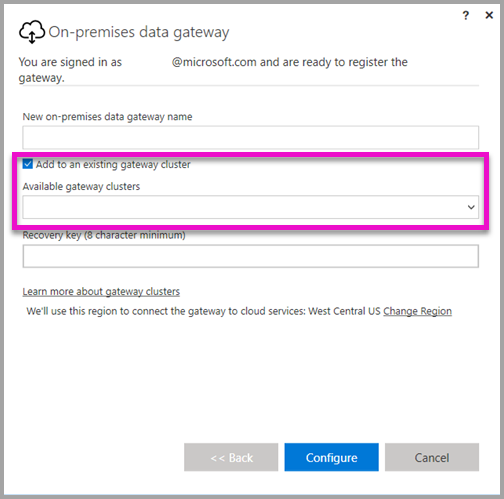
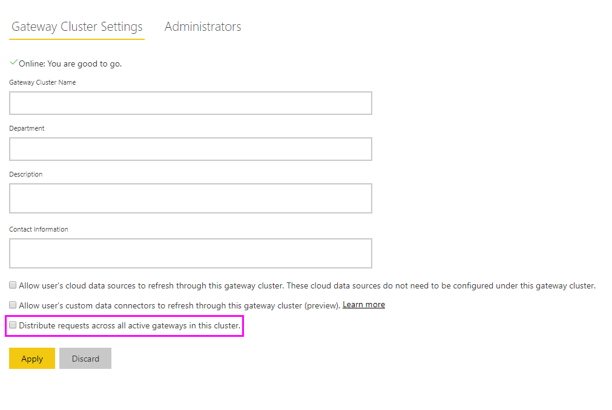

# High availability clusters for On-premises data gateway

You can create **high availability clusters** of **On-premises data gateway** installations, to ensure your organization can access on-premises data resources used in Power BI reports and dashboards. Such clusters allow gateway administrators to group gateways to avoid single points of failure in accessing on-premises data resources. The Power BI service always uses the primary gateway in the cluster, unless it’s not available. In that case, the service switches to the next gateway in the cluster, and so on.

This article describes the steps you can take to create a high availability cluster of On-premises data gateways and shares best practices when setting them up. High availability gateway clusters require the November 2017 update to On-premises data gateway, or later.

## Setting up high availability clusters of gateways

During the **On-premises data gateway** installation process, you can specify whether the gateway should be added to an existing gateway cluster. 



To add a gateway to an existing cluster, you must provide the *Recovery key* for the primary gateway instance for the cluster you want the new gateway to join. The primary gateway for the cluster must be running the gateway update from November 2017 or later. 

## Managing a gateway cluster

Once a gateway cluster consists of two or more gateways, all gateway management operations, such as adding a data source or granting administrative permissions to a gateway, apply to all gateways that are part of the cluster.

When administrators use the **Manage gateways** menu item, found under the gear icon in the **Power BI service**, they see the list of registered clusters or individual gateways, but do not see the individual gateway instances that are members of the cluster.

All new **Scheduled Refresh** requests and DirectQuery operations are automatically routed to the primary instance of a given gateway cluster. If the primary gateway instance is not online, the request is routed to another gateway instance in the cluster.

## Distribute requests traffic across all gateways in a cluster

You can choose to allow traffic to be distributed across all gateways in a cluster. In the **Manage gateways** page in the **Power BI service**, when you click on a gateway cluster in the list on the left navigation tree, you can enable the option to "Distribute requests across all active gateways in this cluster."



## PowerShell support for gateway clusters

PowerShell scripts are available in the On-premises data gateway installation folder. By default, that folder is *C:\Program Files\On-premises data gateway*. You must be using PowerShell version 5 or newer for these scripts to work correctly. The PowerShell scripts let users perform the following operations:

-   Retrieve the list of gateway clusters available for a user
-   Retrieve the list of gateway instances registered in a cluster, as well as their online or offline status
-   Modify the enable/disable status for a gateway instance within a cluster, as well as other gateway properties
-   Delete a gateway

To run the PowerShell commands in the table, you first need to take the following steps: :

1. Open a PowerShell command window, as an Administrator
2. Then run the following one-time PowerShell command (this presumes you've never run PowerShell commands on the current machine):

    ```
    Set-ExecutionPolicy -ExecutionPolicy Unrestricted -Force
    ```

3. Next, navigate to the On-premises data gateway installation folder in the PowerShell window, and import the necessary module using the following command:

    ```
    Import-Module .\OnPremisesDataGatewayHAMgmt.psm1
    ```

Once those steps are complete, you can use the commands in the following table to manage your gateway clusters.

| **Command** | **Description** | **Parameters** |
| --- | --- | --- |
| *Login-OnPremisesDataGateway* |This command allows a user to log in to manage his or her On-premises data gateway clusters.  You must run this command and log in *before* other high availability commands can work properly. Note: the AAD auth token acquired as part of a Login call is only valid for 1 hour, after which it expires. You can re-run the Login command to acquire a new token.| AAD username and password (provided as part of the command execution, not initial invocation)|
| *Get-OnPremisesDataGatewayClusters* | Retrieves the list of gateway clusters for the logged in user. | Optionally, you can pass formatting parameters to this command for better readability, such as *Format-Table -AutoSize -Wrap* |
| *Get-OnPremisesDataClusterGateways* | Retrieves the list of gateways within the specified cluster, as well as additional information for each gateway (online/offline status, machine name, so on) | *-ClusterObjectID xyz*  (where *xyz* is replaced with an actual cluster object ID value, which can be retrieved using the *Get-OnPremisesDataGatewayClusters* command)|
| *Set-OnPremisesDataGateway* | Lets you set property values for a given gateway within a cluster, including the ability to Enable/Disable a specific gateway instance  | *-ClusterObjectID xyz* (*xyz*, should be replaced with an actual cluster object ID value, which can be retrieved using the *Get-OnPremisesDataGatewayClusters* command) *-GatewayObjectID abc*  (*abc* should be replaced with an actual gateway object ID value, which can be retrieved using the *Get-OnPremisesDataClusterGateways* command, given a cluster object ID) |
| *Get-OnPremisesDataGatewayStatus* | Lets you retrieve the status for a given gateway instance within a cluster  | *-ClusterObjectID xyz* (*xyz* should be replaced with an actual cluster object ID value, which can be retrieved using the *Get-OnPremisesDataGatewayClusters* command)  *-GatewayObjectID abc*  (*abc* should be replaced with an actual gateway object ID value, which can be retrieved using the *Get-OnPremisesDataClusterGateways* command, given a cluster object ID) |
| *Remove-OnPremisesDataGateway*  | Lets you remove a gateway instance from a cluster - note that the primary gateway in the cluster cannot be removed until all other gateways in the cluster are removed.| *-ClusterObjectID xyz* (*xyz* should be replaced with an actual cluster object ID value, which can be retrieved using the *Get-OnPremisesDataGatewayClusters* command)  *-GatewayObjectID abc*  (*abc* should be replaced with an actual gateway object ID value, which can be retrieved using the *Get-OnPremisesDataClusterGateways* command, given a cluster object ID) |

## Next steps

-   [Manage your data source - Analysis Services](service-gateway-enterprise-manage-ssas.md)  
-   [Manage your data source - SAP HANA](service-gateway-enterprise-manage-sap.md)  
-   [Manage your data source - SQL Server](service-gateway-enterprise-manage-sql.md)  
-   [Manage your data source - Oracle](service-gateway-onprem-manage-oracle.md)  
-   [Manage your data source - Import/Scheduled refresh](service-gateway-enterprise-manage-scheduled-refresh.md)  
-   [On-premises data gateway in-depth](service-gateway-onprem-indepth.md)  
-   [On-premises data gateway (personal mode)](service-gateway-personal-mode.md)
-   [Configuring proxy settings for the On-premises data gateway](service-gateway-proxy.md)  
-   [Use Kerberos for SSO (single sign-on) from Power BI to on-premises data sources](service-gateway-sso-kerberos.md)  

More questions? [Try the Power BI Community](http://community.powerbi.com/)
