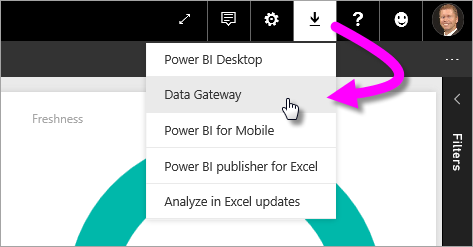
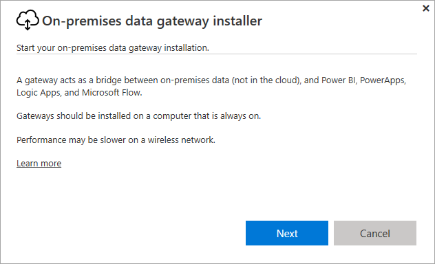
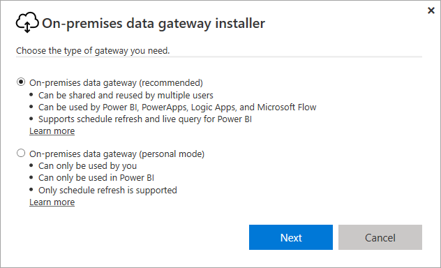
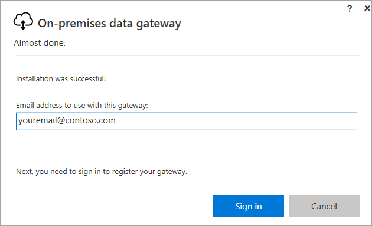
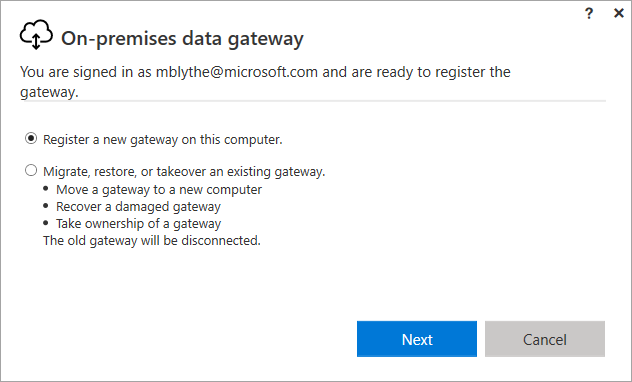
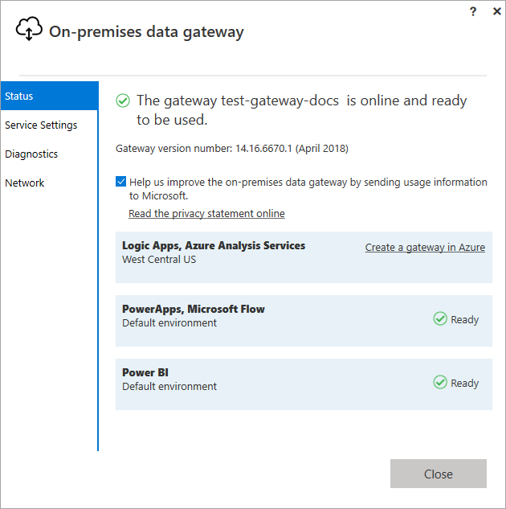
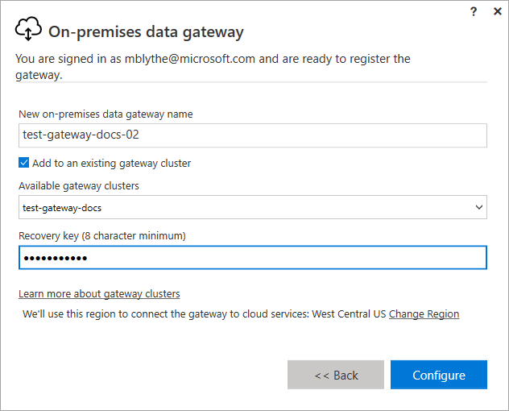

# Install a gateway for Power BI

A Power BI gateway is software that you install within an on-premises network; it facilitates access to data in that network. As described in the [overview](service-gateway-getting-started.md), you can install a gateway in personal mode or standard mode (recommended). In standard mode, you can install a stand-alone gateway or add a gateway to a *cluster*, which is recommended for high availability. In this article, we show you how to install a standard gateway, then add another gateway to create a cluster.

If you're not signed up for Power BI, [sign up for a free trial](https://app.powerbi.com/signupredirect?pbi_source=web) before you begin.

## Download and install a gateway

The gateway runs on the computer where you install it, so ensure that you install on a computer that is always on. For better performance and reliability, we recommend that the computer is on a wired network, rather than a wireless one.

1. In the Power BI service in the upper right corner, select the **download icon**  > **Data Gateway**.

    

2. On the download page, select the **DOWNLOAD GATEWAY** button.

3. Select **Next**.     

    

4. Select **On-premises data gateway (recommended)** > **Next**.

    

5. Keep the default install path, and accept the terms > **Install**.

    

6. Enter the account you use to sign in to Power BI > **Sign in**.

    

    The gateway is associated with your Power BI account, and you manage gateways from within the Power BI service. You're now signed in to your account.

7. Select **Register a new gateway on this computer** > **Next**.

    

8. Enter a name for the gateway (must be unique across the tenant) and a recovery key. You need this key if you ever want to recover or move your gateway. Select **Configure**.

    

    Notice the option **Add to an existing gateway cluster**. We'll use this option in the next section of the article.

9. Review the information in the final window. Notice that the gateway is available for Power BI, and also PowerApps and Flow, because I use the same account for all three. Select **Close**.

    

Now you've successfully installed a gateway, you can add another gateway to create a cluster.

## Add another gateway to create a cluster

You can install only one standard gateway on a computer, so you must install the second gateway for the cluster on a different computer. This also makes sense in practical terms because you want redundancy in the cluster.

1. Download the gateway to a different computer, and install it.

2. After you've signed in to your Power BI account, register the gateway. Select **Add to an existing cluster**. Under **Available gateway clusters**, select the first gateway you installed (the *primary gateway*), and enter the recover key for that gateway. Select **Configure**.

    

During the **On-premises data gateway** installation process, you can specify whether the gateway should be added to an existing gateway cluster.

In order to add a gateway to an existing cluster, you must provide the *Recovery key* for the primary gateway instance for the cluster you want the new gateway to join. The primary gateway for the cluster must be running the gateway update from November 2017 or later. 

## Next steps

[Manage a Power BI gateway](service-gateway-manage.md)

More questions? [Try the Power BI Community](http://community.powerbi.com/)