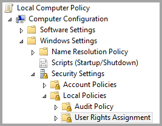

# Use Kerberos for SSO (single sign-on) from Power BI to on-premises data sources
You can get seamless single sign-on connectivity, enabling Power BI reports and dashboards to update from on-premises data, by configuring your on-premises data gateway with Kerberos. The On-premises data gateway facilitates single sign-on (SSO) using DirectQuery, which it uses to connect to on-premises data sources.

The following data sources are currently supported, SQL Server, SAP HANA, and Teradata, all based on [Kerberos Constrained Delegation](https://technet.microsoft.com/library/jj553400.aspx).

* SQL Server
* SAP HANA
* Teradata

When a user interacts with a DirectQuery report in the Power BI Service, each cross-filter, slice, sorting, and report editing operation can result in queries executing live against the underlying on-premises data source.  When single sign-on is configured for the data source, queries execute under the identity of the user interacting with Power BI (that is, through the web experience or Power BI mobile apps). Thereby, each user sees precisely the data for which they have permissions in the underlying data source – with single sign-on configured, there is no shared data caching across different users.

## Running a query with SSO - steps that occur
A query that runs with SSO consists of three steps, as shown in the following diagram.

> **Note:** SSO for Oracle is not enabled yet, but is under development and coming soon.
> 
> 

Here are additional details about those steps:

1. For each query, the **Power BI service** includes the *user principal name* (UPN) when sending a query request to the configured gateway.
2. The gateway needs to map the Azure Active Directory UPN to a local Active Directory identity.
   
   a.  If AAD DirSync (also known as *AAD Connect*) is configured, then the mapping works automatically in the gateway.
   
   b.  Otherwise, the gateway can look up and map the Azure AD UPN to a local user by performing a lookup against the local Active Directory domain.
3. The gateway service process impersonates the mapped local user, opens the connection to the underlying database and sends the query. The gateway does not need to be installed on the same machine as the database.
   
   a.    The user impersonation and connection to the database is only successful if the gateway service account is a domain account (or service SID), and if Kerberos constrained delegation was configured for the database to accept Kerberos tickets from the gateway service account.  
   
   > **Note:** Regarding the service sid, if AAD DirSync / Connect is configured and user accounts are synchronized, the gateway service does not need perform local AD lookups at runtime, and you can use the local Service SID (instead of requiring a domain account) for the gateway service.  The Kerberos constrained delegation configuration steps outlined in this document are the same (just applied based on the service SID, instead of domain account).
   > 
   > 

## Errors from an insufficient Kerberos configuration
If the underlying database server and gateway are not configured properly for **Kerberos Constrained Delegation**, you may receive the following error message:

And the technical details associated with the error message may look like the following:

The result is that the because of insufficient Kerberos configuration, the gateway could not impersonate the originating user properly, and the database connection attempt failed.

## Preparing for Kerberos Constrained Delegation
Several items must be configured in order for Kerberos Constrained Delegation to work properly, including *Service Principal Names* (SPN) and delegation settings on service accounts.

### Pre-requisite 1: Install & configure the On-premises data gateway
This release of the On-premises data gateway supports an in-place upgrade, as well as settings take-over of existing gateways.

### Pre-requisite 2: Run the Gateway Windows service as a domain account
In a standard installation, the gateway runs as a machine-local service account (specifically, *NT Service\PBIEgwService*) such as what's shown in the following image:

To enable **Kerberos Constrained Delegation**, the gateway must run as a domain account, unless your AAD is already synchronized with your local Active Directory (using AAD DirSync/Connect). For this account change to work correctly, you have two options:

* If you started with a previous version of the On-premises data gateway, follow precisely all five steps in sequence (including running the gateway configurator in step 3) described in the following article:
  
  * [Changing the gateway service account to a domain user](https://powerbi.microsoft.com/documentation/powerbi-gateway-proxy/#changing-the-gateway-service-account-to-a-domain-user)
  * If you already installed the Preview version of the On-premises data gateway, there is a new UI-guided approach to switch service accounts directly from within the gateway’s configurator. See the **Switching the gateway to a domain account** section near the end of this article.

> Note: If AAD DirSync / Connect is configured and user accounts are synchronized, the gateway service does not need to perform local AD lookups at runtime, and you can use the local Service SID (instead of requiring a domain account) for the gateway service. The Kerberos Constrained Delegation configuration steps outlined in this article are the same as that configuration (they are simply applied based on the service SID, instead of domain account).
> 
> 

### Pre-requisite 3: Have domain admin rights to configure SPNs (SetSPN) and Kerberos Constrained Delegation settings
While it is technically possible for a domain administrator to temporarily or permanently allow rights to someone else to configure SPNs and Kerberos delegation, without requiring domain admin rights, that's not the recommended approach. In the following section, the configuration steps necessary for **Pre-requisite 3** in detail.

## Configuring Kerberos Constrained Delegation for the gateway and data source
To properly configure the system, we need to configure or validate the following two items:

1. If needed, configure an SPN for the gateway service domain account (if none are created yet).
2. Configure delegation settings on the gateway service domain account.

Note that you must be a domain administrator to perform those two configuration steps.

The following sections describe these steps in turn.

### Configure an SPN for the gateway service account
First, determine whether an SPN was already created for the domain account used as the Gateway service account, but following these steps:

1. As a domain administrator, launch **Active Directory Users and Computers**
2. Right-click on the domain, select **Find**, and type in the account name of the Gateway service account
3. In the search result, right-click on the Gateway service account and select **Properties**.
   
   * If the **Delegation** tab is visible on the **Properties** dialog, then an SPN was already created and you can jump ahead to the next subsection about configuring Delegation settings.

If there is no **Delegation** tab on the **Properties** dialog, you can manually create an SPN on that account which adds the **Delegation** tab (that is the easiest way to configure delegation settings). Creating an SPN can be done using the [setspn tool](https://technet.microsoft.com/library/cc731241.aspx) that comes with Windows (you need domain admin rights to create the SPN).

For example, imagine the gateway service account is “PBIEgwTest\GatewaySvc”, and the machine name with the gateway service running is called **Machine1**. To set the SPN for the gateway service account for that machine in this example, you would run the following command:

With that step completed, we can move on to configuring delegation settings.

### Configure delegation settings on the Gateway service account
The second configuration requirement is the delegation settings on the Gateway service account. There are multiple tools you can use to perform these steps. In this article, we'll use **Active Directory Users and Computers**, which is a Microsoft Management Console (MMC) snap-in that you can use to administer and publish information in the directory, and available on domain controllers by default. You can also enable it through **Windows Feature** configuration on other machines.

We need to configure **Kerberos Constrained Delegation** with protocol transiting. With constrained delegation, you must be explicit with which services you want to delegate to – for example, only your SQL Server or your SAP HANA server will accept delegation calls from the Gateway service account.

This section assumes you have already configured SPNs for your underlying data sources (such as SQL Server, SAP HANA, Teradata, so on). To learn how to configure those data source server SPNs, please refer to technical documentation for the respective database server. You can also look at the blog post that describes [*What SPN does your app require?*](https://blogs.msdn.microsoft.com/psssql/2010/06/23/my-kerberos-checklist/)

In the following steps we assume an on-premises environment with two machines: a gateway machine and a database server (SQL Server database), and for the sake of this example we'll also assume the following settings and names:

* Gateway machine name: **PBIEgwTestGW**
* Gateway service account: **PBIEgwTest\GatewaySvc** (account display name: Gateway Connector)
* SQL Server data source machine name: **PBIEgwTestSQL**
* SQL Server data source service account: **PBIEgwTest\SQLService**

Given those example names and settings, the configuration steps are the following:

1. With domain administrator rights, launch **Active Directory Users and Computers**.
2. Right-click on the gateway service account (**PBIEgwTest\GatewaySvc**) and select **Properties**.
3. Select the **Delegation** tab.
4. Select **Trust this computer for delegation to specified services only.**
5. Select **Use any authentication protocol.**
6. Under the **Services to which this account can present delegated credentials:** select **Add**.
7. In the new dialog, select **Users or Computers**.
8. Enter the service account for the SQL Server Database service (**PBIEgwTest\SQLService**) and select **OK**.
9. Select the SPN that you created for the database server. In our example, the SPN will begin with **MSSQLSvc**. If you added both the FQDN and the NetBIOS SPN for your database service, select both. You may only see one.
10. Select **OK**. You should see the SPN in the list now.
11. Optionally, you can select **Expanded** to show both the FQDN and NetBIOS SPN in
12. The dialog will look similar to the following if you checked **Expanded**.
    
    
13. Select **OK**.
    
    Finally, on the machine running the gateway service (**PBIEgwTestGW** in our example), the gateway service account must be granted the local policy “Impersonate a client after authentication”. You can perform/verify this with the Local Group Policy Editor (**gpedit**).
14. On the gateway machine, run: *gpedit.msc*
15. Navigate to **Local Computer Policy > Computer Configuration > Windows Settings > Security Settings > Local Policies > User Rights Assignment**, as shown in the following image.
    
    
16. From the list of policies under **User Rights Assignment**, select **Impersonate a client after authentication**.
    
    
    
    Right-click and open the **Properties** for **Impersonate a client after authentication** and check the list of accounts. It must include the gateway service account (**PBIEgwTest\GatewaySvc**).
17. From the list of policies under **User Rights Assignment**, select **Act as part of the operating system (SeTcbPrivilege)**. Ensure that the gateway service account is included in the list of accounts as well.
18. Restart the **On-premises Data Gateway** service process.

## Running a Power BI report
After all the configuration steps outlined earlier in this article have been completed, you can use the **Manage Gateway** page in Power BI to configure the data source, and under its **Advanced Settings**, enable SSO, then publish reports and datasets binding to that data source.

This configuration will work in most cases. However, with Kerberos there can be different configurations depending on your environment. If the report still won't load, you'll need to contact your domain administrator to investigate further.

## Switching the gateway to a domain account
Earlier in this article, we discussed switching the gateway from a local service account to run as a domain account, using the **On-premises data gateway** user interface. Here are the steps necessary to do so.

1. Launch the **On-premises Data Gateway** configuration tool.
   
   
2. Select the **Sign-in** button on the main page, and sign in with your Power BI account.
3. After sign-in is completed, select the **Service Settings** tab.
4. Click **Change account** to start the guided walk-through, as shown in the following figure.
   
   

## More Information
For more information about the **On-premises data gateway** and **DirectQuery**, check out the following resources:

* [On-premises data gateway](service-gateway-onprem.md)
* [DirectQuery in Power BI](powerbi-desktop-directquery-about.md)
* [Data sources supported by DirectQuery](powerbi-desktop-directquery-data-sources.md)
* [DirectQuery and SAP BW](powerbi-desktop-directquery-sap-bw.md)
* [DirectQuery and SAP HANA](powerbi-desktop-directquery-sap-hana.md)

