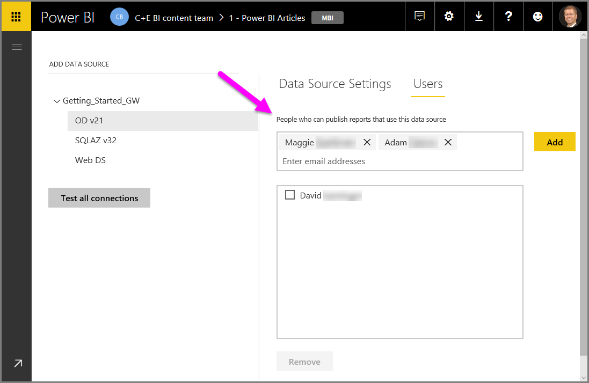
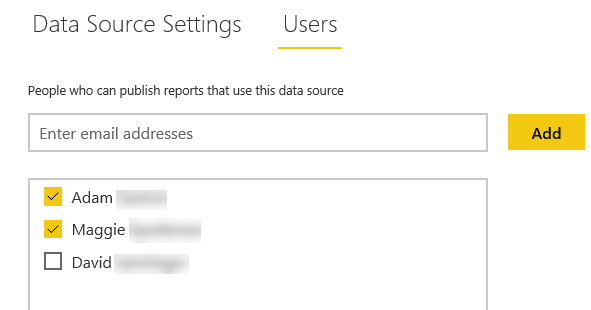
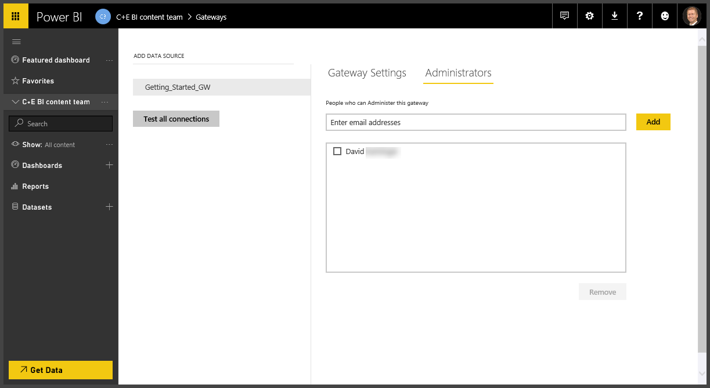

# Manage users and administrators

After you add a data source to a gateway, you give users and security groups access to the specific data source (not the entire gateway). The data source users list controls only who is allowed to publish reports that include data from the data source. Report owners can create dashboards, content packs, and apps, and then share them with other users.

You can also give users and security groups administrative access to the gateway.

## Add users to a data source

To add users to a data source using the Power BI service:

1. In the upper-right corner of the Power BI service, select the gear icon  > **Manage gateways**.

2. Select the data source where you want to add users.

3. Select **Users**, and enter a user from your organization who you want to grant access to the selected data source. For example, in the following example screen you're adding Maggie and Adam.

    

4. Select **Add**, and the added member shows up in the box.

    

And that’s all there is to it. Remember that you need to add users to each data source that you want to grant access to. Each data source has a separate list of users, and you must add users to each data source separately.

## Remove users from a data source

To remove users from a data source in the Power BI service, on the **Users** tab for the data source, remove users and security groups that use this data source.

## Add and remove administrators

To add and remove admins in the Power BI service, on the **Administrators** tab for the gateway, add and remove users (or security groups) that can administer the gateway.

## Next steps

* [Guidance for deploying a data gateway](service-gateway-deployment-guidance.md)

More questions? [Try the Power BI Community](http://community.powerbi.com/)
