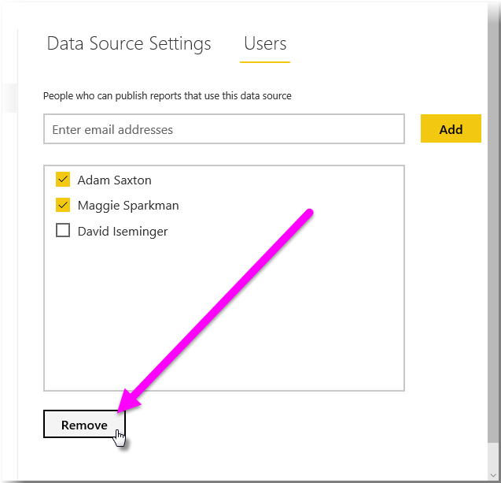
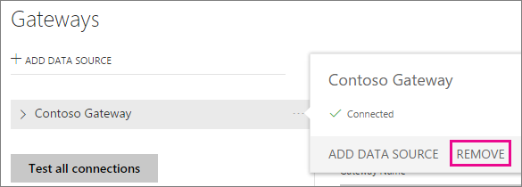

# Manage a Power BI gateway

After you [install a Power BI data gateway](service-gateway-install.md), you can manage it through the **Manage gateways** area of the Power BI service, and with PowerShell scripts. This article focuses on the Power BI service. If you've just installed a gateway, we recommend that you next [add a data source](#add-a-data-source), and then [add users](#add-users-to-a-data-source) so they can access the data source.

## Manage data sources

Power BI supports many on-premises data sources, and each has its own requirements. For this example, we'll show you how to add SQL Server as a data source, but the steps are similar for other data sources.

### Add a data source

1. In the upper-right corner of the Power BI service, select the gear icon  > **Manage gateways**.

    

2. Either select a gateway > **Add data source**, or go to Gateways > **Add data source**.

    

3. Select the **Data Source Type**.

    

4. Enter information for the data source. For this example, it's **Server**, **Database**, and other information.  

    

5. For SQL Server, you would choose an **Authentication Method** of **Windows** or **Basic** (SQL Authentication).  If you choose **Basic**, enter the credentials for your data source.

6. Under **Advanced settings**, optionally configure the [privacy level]((https://support.office.com/article/Privacy-levels-Power-Query-CC3EDE4D-359E-4B28-BC72-9BEE7900B540)) for your data source (does not apply to [DirectQuery](desktop-directquery-about.md)).

    

7. Select **Add**. You see *Connection Successful* if the process succeeds.

    

You can now use this data source to include data from SQL Server in your Power BI dashboards and reports.

## Remove a data source

You can remove a data source if you're no longer using it. Be aware that removing a datasource breaks any dashboards and reports that rely on that data source.

To remove a Data Source, go to the data source then select **Remove**.

## Manage users and administrators

After you add a data source to a gateway, you give users and security groups access to the specific data source (not the entire gateway). The data source users list controls only who is allowed to publish reports that include data from the data source. Report owners can create dashboards, content packs, and apps, and then share those with other users.

You can also give users and security groups administrative access to the gateway.

### Add users to a data source

1. In the upper-right corner of the Power BI service, select the gear icon  > **Manage gateways**.

2. Click or tap **Administrators** to see which users can *administer* the gateway. Right now, it should show only your Power BI account. [TODO] - need to figure out data source first.

    

3. Select **Users**, and enter a user from your organization who you want to grant access to the selected data source. In the following screen, you can see that I’ve added Maggie and Adam.

    

4. Select **Add**, and the added member shows up in the box.

    

And that’s all there is to it. Remember that you need to add users to each data source to which you want to grant access. Each data source has a separate list of users, and you must add users to each data source separately.

## Remove users from a data source

On the **Users** tab for the data source, you can add, and remove, users, or security groups, that can use this data source.

## Add and remove administrators

On the **Administrators** tab for the gateway, add and remove users (or security groups) that can administer the gateway.

## Manage a gateway cluster

Once you create a cluster of two or more gateways, all gateway management operations, such as adding a data source or granting administrative permissions to a gateway, apply to all gateways that are part of the cluster. 

When administrators use the **Manage gateways** menu item, found under the gear icon in the **Power BI service**, they see the list of registered clusters or individual gateways, but do not see the individual gateway instances that are members of the cluster.

All new **Scheduled Refresh** requests and DirectQuery operations are automatically routed to the primary instance of a given gateway cluster. If the primary gateway instance is not online, the request is routed to another gateway instance in the cluster.

## Migrate, recover, or take over a gateway

Select the gateway that you want to migrate, recover, or take over a gateway and supply the recovery key that was used to first create the gateway.

## Restart a gateway

The gateway runs as a Windows service. Like any Windows service, there multiple ways to start and stop it. Here is how you can do it from the command prompt.

1. On the machine where the gateway is running, launch a command prompt with Administrator priveleges

2. Enter `net stop PBIEgwService` to stop the service.

3. Enter `net start PBIEgwService` to restart the service.

## Remove a gateway

You can remove a gateway if you're no longer using it. But be aware that removing a gateway deletes all the data sources under it. This in turn breaks any dashboards and reports that rely on those data sources.

1. In the upper-right corner of the Power BI service, select the gear icon  > **Manage gateways**.

2. Select the gateway > **Remove**
   
   

## Next steps

[Guidance for deploying a data gateway](service-gateway-deployment-guidance.md)

More questions? [Try the Power BI Community](http://community.powerbi.com/)

## FODDER

But before we send you off to another article, here’s a look at how you go about adding a data source. While you’re in the **Manage gateways** page of the **Power BI service**, select the gateway to which you want to add a data source, and select **Add Data Source** in the upper-left corner of the page, just above the list of your gateways.

When you do, the **Data Source Settings** panel appears in the right pane, as shown in the following image. There, you can name your data source (entered in the **Data Source Name** text box), and select its type from the **Data Source Type** drop-down list.

Okay, you now have a gateway installed, and you’re ready to add data sources. Great! See the resources in the following section for information about data sources, more details about using gateways, and other useful information.

================

### Credentials and privacy settings

> [!NOTE]
> When using DirectQuery, the gateway only supports **SQL Server 2012 SP1** and subsequent versions.
> [!NOTE]
> All queries to the data source will run using these credentials, unless Kerberos Single Sign On (SSO) is configured and enabled for the data source. With SSO, import datasets use the stored credentials, but DirectQuery datasets use the current Power BI user to execut the queries using SSO. For more information, see the main On-premises data gateway article to learn more about how [credentials](service-gateway-onprem.md#credentials) are stored, or the article describing how to [use Kerberos for SSO (single sign-on) from Power BI to on-premises data sources](service-gateway-kerberos-for-sso-pbi-to-on-premises-data.md).
> 
> 
