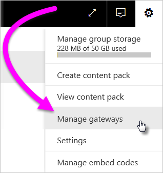
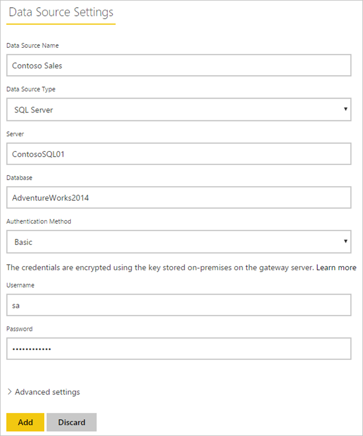
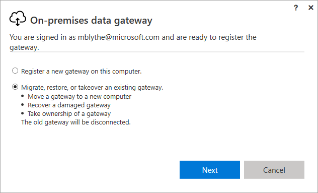
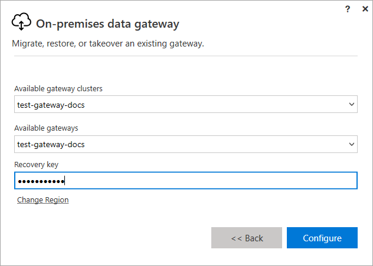

# Manage a Power BI on-premises gateway

After you [install a Power BI data gateway](service-gateway-install.md), you manage it based on your requirements. In this topic, you learn how to: add and remove data sources and users; restart a gateway; and migrate, restore, take over, and remove a gateway.

You can manage a gateway through the **Manage gateways** area of the Power BI service, in the gateway app on your local computer, and with PowerShell scripts. This article focuses on the Power BI service.

If you've just installed a gateway, we recommend that you next [add a data source](#add-a-data-source), and then [add users](#add-users-to-a-data-source) so they can access the data source.

## Manage data sources

Power BI supports many on-premises data sources, and each has its own requirements. A gateway can be used for a single data source or multiple data sources. For this example, we'll show you how to add SQL Server as a data source, but the steps are similar for other data sources.

### Add a data source

1. In the upper-right corner of the Power BI service, select the gear icon  > **Manage gateways**.

    

2. Either select a gateway > **Add data source**, or go to Gateways > **Add data source**.

    

3. Select the **Data Source Type**.

    

4. Enter information for the data source. For this example, it's **Server**, **Database**, and other information.  

    

5. For SQL Server, you would choose an **Authentication Method** of **Windows** or **Basic** (SQL Authentication).  If you choose **Basic**, enter the credentials for your data source.

6. Under **Advanced settings**, optionally configure the [privacy level](https://support.office.com/article/Privacy-levels-Power-Query-CC3EDE4D-359E-4B28-BC72-9BEE7900B540)) for your data source (does not apply to [DirectQuery](desktop-directquery-about.md)).

    

7. Select **Add**. You see *Connection Successful* if the process succeeds.

    

You can now use this data source to include data from SQL Server in your Power BI dashboards and reports.

### Remove a data source

You can remove a data source if you're no longer using it. Be aware that removing a data source breaks any dashboards and reports that rely on that data source.

To remove a data source, go to the data source then select **Remove**.

## Manage users and administrators

After you add a data source to a gateway, you give users and security groups access to the specific data source (not the entire gateway). The data source users list controls only who is allowed to publish reports that include data from the data source. Report owners can create dashboards, content packs, and apps, and then share those with other users.

You can also give users and security groups administrative access to the gateway.

### Add users to a data source

1. In the upper-right corner of the Power BI service, select the gear icon  > **Manage gateways**.

2. Select the data source where you want add users.

3. Select **Users**, and enter a user from your organization who you want to grant access to the selected data source. In the following screen, you can see that I'm adding Maggie and Adam.

    

4. Select **Add**, and the added member shows up in the box.

    

And that’s all there is to it. Remember that you need to add users to each data source to which you want to grant access. Each data source has a separate list of users, and you must add users to each data source separately.

### Remove users from a data source

On the **Users** tab for the data source, you can remove users and security groups that use this data source.

### Add and remove administrators

On the **Administrators** tab for the gateway, add and remove users (or security groups) that can administer the gateway.

## Manage a gateway cluster

Once you create a cluster of two or more gateways, all gateway management operations, such as adding a data source or granting administrative permissions to a gateway, apply to all gateways that are part of the cluster. 

When administrators use the **Manage gateways** menu item, found under the gear icon in the **Power BI service**, they see the list of registered clusters or individual gateways, but do not see the individual gateway instances that are members of the cluster.

All new **Scheduled Refresh** requests and DirectQuery operations are automatically routed to the primary instance of a given gateway cluster. If the primary gateway instance is not online, the request is routed to another gateway instance in the cluster.

## Share a gateway

You can't *share* a gateway per se, but you can add administrators to the gateway, and you can add users to the gateway's data sources. 

After you install a gateway, you are by default the administrator of that gateway. As shown earlier, you can add other people as administrators. These administrators can add data sources, configure, and remove the gateway.

You can also assign users to the data sources you create under each of your gateways. Users can then use those data sources to refresh Power BI reports. They can't, however, change any of the data sources or the gateway settings.

## Migrate, restore, or take over a gateway

Run the gateway installer on the computer where you want to migrate, restore, or take over the gateway.

1. Download the gateway and install it.

2. After you've signed in to your Power BI account, register the gateway. Select **Migrate, restore or take over an existing gateway** > **Next**.

    

3. Select from the available clusters and gateways, and enter the recover key for the selected gateway. Select **Configure**.

    

## Restart a gateway

The gateway runs as a Windows service. Like any Windows service, there multiple ways to start and stop it. Here is how you can do it from the command prompt.

1. On the machine where the gateway is running, launch a command prompt with Administrator privileges

2. Enter `net stop PBIEgwService` to stop the service.

3. Enter `net start PBIEgwService` to restart the service.

## Remove a gateway

You can remove a gateway if you're no longer using it. But be aware that removing a gateway deletes all the data sources under it. This in turn breaks any dashboards and reports that rely on those data sources.

1. In the upper-right corner of the Power BI service, select the gear icon  > **Manage gateways**.

2. Select the gateway > **Remove**
   
   

## Next steps

[Guidance for deploying a data gateway](service-gateway-deployment-guidance.md)

More questions? [Try the Power BI Community](http://community.powerbi.com/)
