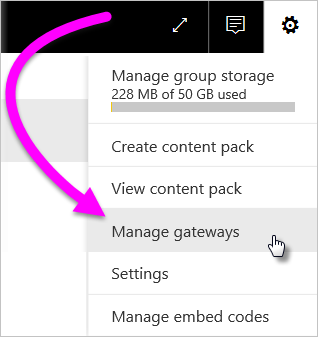
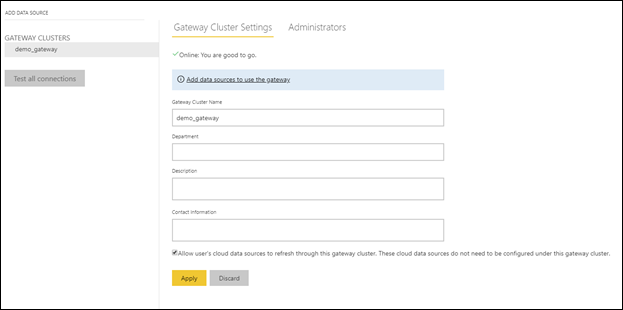
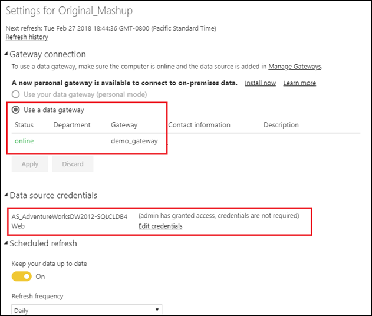

# Merge or append on-premises and cloud data sources

The On-premises data gateway enables you to merge or append on-premises and cloud data sources in the same query. This is helpful when you want to mashup data from multiple sources without having to use separate queries.

## Prerequisites

- A [gateway installed](service-gateway-install.md) on a local computer.
- A Power BI Desktop file with queries that combine on-premises and cloud data sources.

1. In the upper-right corner of the Power BI service, select the gear icon  > **Manage gateways**.

    

2. Select the gateway you want to configure.

3. Under **Gateway Cluster Settings**, select **Allow user's cloud data sources to refresh through this gateway cluster** > **Apply**.

    

4. Under this gateway cluster, add any [on-premises data sources](service-gateway-enterprise-manage-scheduled-refresh.md#add-a-data-source) used in your queries. You don't need to add the cloud data sources here.

5. Upload to the Power BI service your Power BI Desktop file with the queries that combine on-premises and cloud data sources.

6. On the **Dataset settings** page for the new dataset:

   - For the on-premises source, select the gateway associated with this data source.

   - Under **Data source credentials**, edit the cloud data source credentials as necessary.

     

7. With the cloud credentials set, you can now refresh the dataset using the **Refresh now** option, or schedule it to refresh periodically.

## Next steps

To learn more about data refresh for gateways, see [Using the data source for scheduled refresh](service-gateway-enterprise-manage-scheduled-refresh.md#using-the-data-source-for-scheduled-refresh).