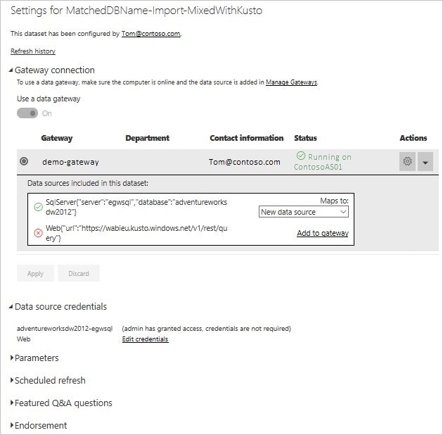

# Merge or append on-premises and cloud data sources

The On-premises data gateway enables you to merge or append on-premises and cloud data sources in the same query. This is helpful when you want to mashup data from multiple sources without having to use separate queries.

1. Ensure you have a [gateway installed](service-gateway-install.md).

2. In the upper-right corner of the Power BI service, select the gear icon  > **Manage gateways**.

    

2. Select the gateway you want to configure.

2. Under **Gateway Cluster Settings**, select **Allow user's cloud data sources to refresh through this gateway cluster...**.

    

3. Under this gateway cluster, add any on-premises data sources used in your queries, as described in [Add a data source](service-gateway-enterprise-manage-scheduled-refresh#add-a-data-source). You don't need to add the cloud data sources here.

4. Upload to the Power BI service your Power BI Desktop file with the queries that combine on-premises and cloud data sources.

5. On the **Dataset settings** page for the new dataset, notice the following:

    - For the on-premises source, you can pick the gateway that has this source defined, like you normally do.
    - For the cloud source, you can edit its credentials under **Data source credentials**, like you normally do.

    

6. With the cloud credentials set, you can now refresh the dataset using the **Refresh now** option, or schedule it to refresh periodically.

## Next steps

To learn more about data refresh for gateways, see [Using the data source for scheduled refresh](service-gateway-enterprise-manage-scheduled-refresh#using-the-data-source-for-scheduled-refresh).